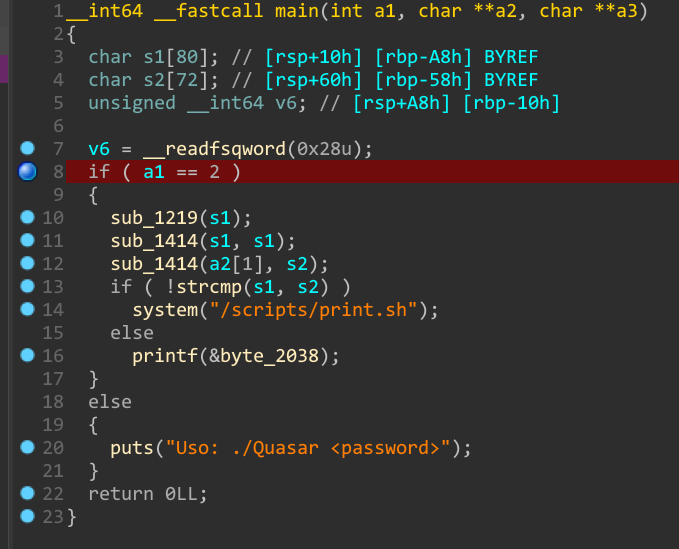
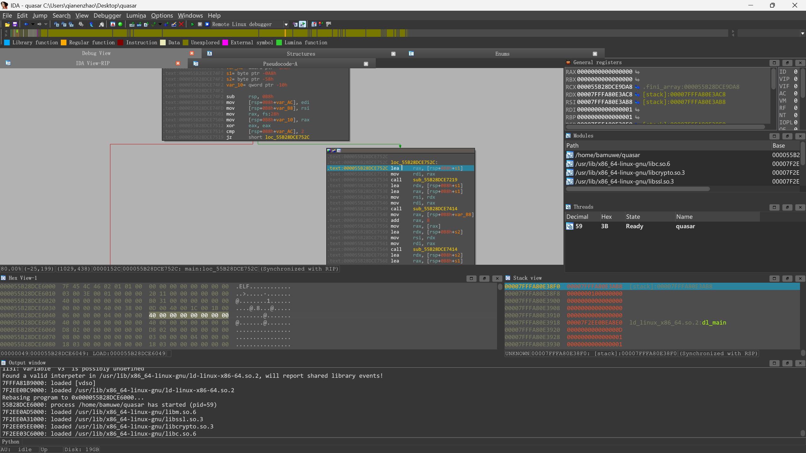
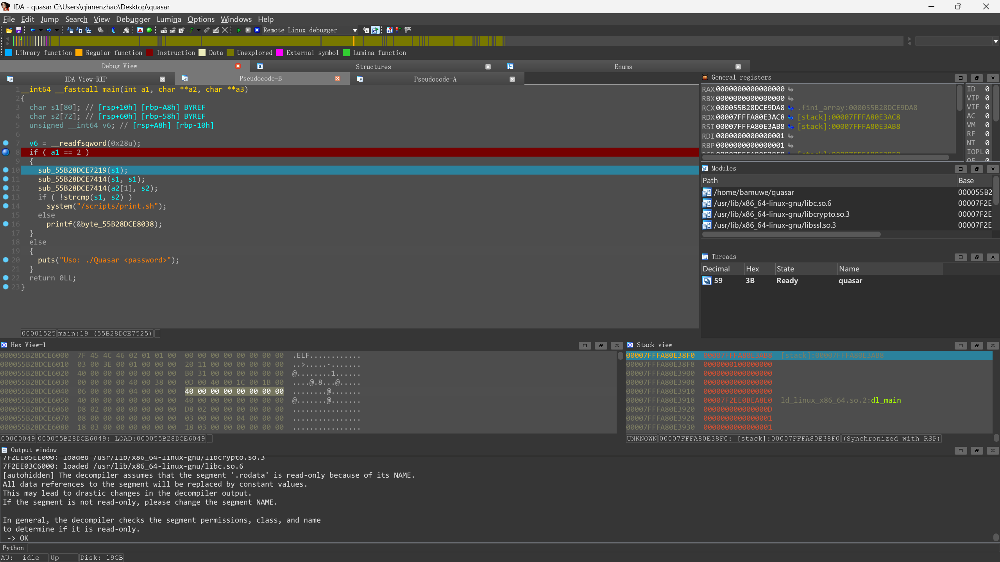
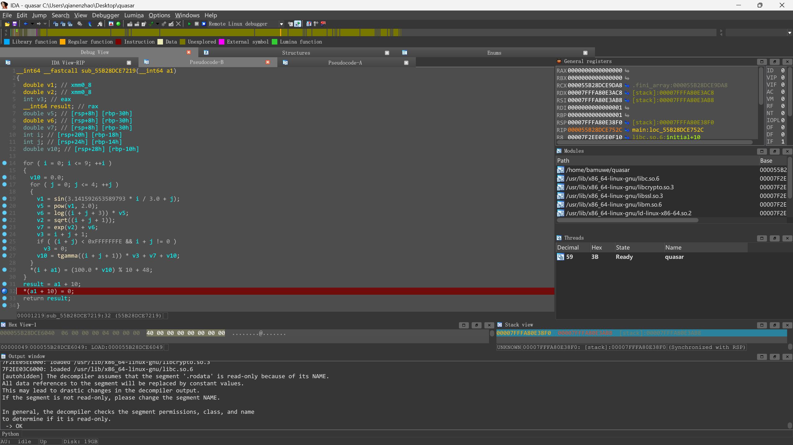
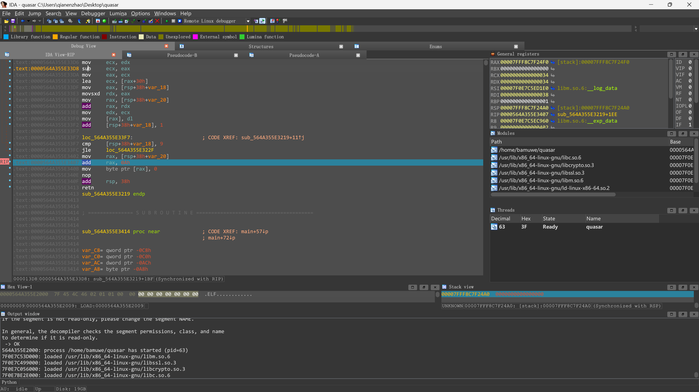
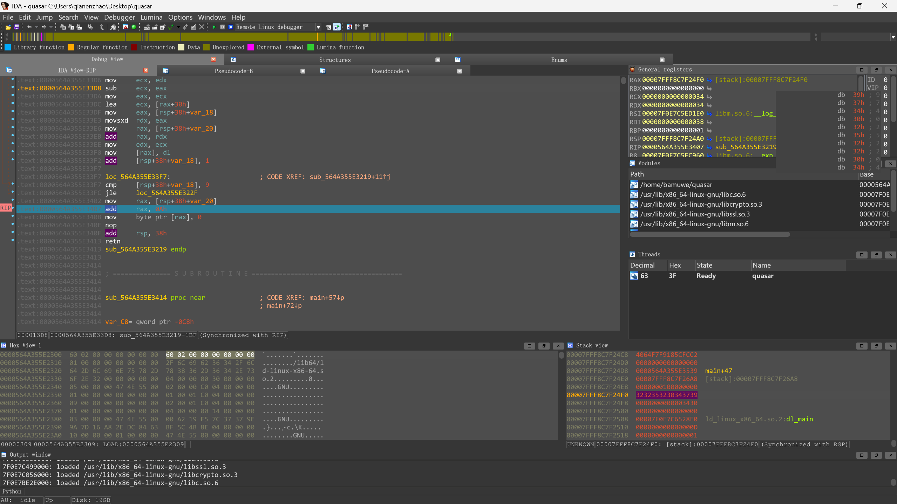

```shell
bamuwe@bamuwe:~$ file quasar
quasar: ELF 64-bit LSB pie executable, x86-64, version 1 (SYSV), dynamically linked, interpreter /lib64/ld-linux-x86-64.so.2, BuildID[sha1]=00a219f57c37379e9a7d16a82edc8463bf5c4b8e, for GNU/Linux 4.4.0, stripped
```

> 64位程序

```c
__int64 __fastcall main(int a1, char **a2, char **a3)
{
  char s1[80]; // [rsp+10h] [rbp-A8h] BYREF
  char s2[72]; // [rsp+60h] [rbp-58h] BYREF
  unsigned __int64 v6; // [rsp+A8h] [rbp-10h]

  v6 = __readfsqword(0x28u);
  if ( a1 == 2 )			//判断命令行输入参数个数是否等于2
  {
    sub_1219(s1);			//生成s1
    sub_1414(s1, s1);					//对s1进行加密
    sub_1414(a2[1], s2);				//对s2(~输入)进行相同的加密
    if ( !strcmp(s1, s2) )			//检查点
      system("/scripts/print.sh");
    else
      printf(&byte_2038);
  }
  else
  {
    puts("Uso: ./Quasar <password>");
  }
  return 0LL;
}
```

> `main`函数伪代码

`s1`没有现成的数据,我们需要得到程序运行过程中生成的`s1`,简单分析发现`s1`在`sub_1219(s1);`函数中生成

```c
__int64 __fastcall sub_1219(__int64 a1)
{
  double v1; // xmm0_8
  double v2; // xmm0_8
  int v3; // eax
  __int64 result; // rax
  double v5; // [rsp+8h] [rbp-30h]
  double v6; // [rsp+8h] [rbp-30h]
  double v7; // [rsp+8h] [rbp-30h]
  int i; // [rsp+20h] [rbp-18h]
  int j; // [rsp+24h] [rbp-14h]
  double v10; // [rsp+28h] [rbp-10h]

  for ( i = 0; i <= 9; ++i )
  {
    v10 = 0.0;
    for ( j = 0; j <= 4; ++j )
    {
      v1 = sin(3.141592653589793 * i / 3.0 + j);
      v5 = pow(v1, 2.0);
      v6 = log((i + j + 3)) * v5;
      v2 = sqrt((i + j + 1));
      v7 = exp(v2) + v6;
      v3 = i + j + 1;
      if ( (i + j) < 0xFFFFFFFE && i + j != 0 )
        v3 = 0;
      v10 = tgamma((i + j + 1)) * v3 + v7 + v10;
    }
    *(i + a1) = (100.0 * v10) % 10 + 48;
  }
  result = a1 + 10;
  *(a1 + 10) = 0;
  return result;
}
```

我嘞个逗,这么多数学函数~

一个双重循环,进行一系列复杂的数学计算后得出`a1`

但是我们不关心他是怎么算的,只要得到最后出来的结果就可以了,第一层循环循环$10$次,每次会得到一个`result`值,拼接起来就是我们要的答案,因为后续会删除`*(a1 + 10) = 0;`,所以要一步步去看

操作:



1. 先在第八行打个断点,用来绕过输入参数的检测

2. `ctrl+n`设置一个锚点,使程序转跳到我们要的地方

   



3. 在函数中设置一个合适的断点,方便读取数据

   

我们知道数据在`result`中,要怎么去读取呢?



查看相应的汇编代码可以知道,数据都存在`rax`当中也就是说,我们只要读取到`rax`相应栈上的值就可以了

好巧,右上角就有一个可以看的窗口



得到答案了$9740252204$

?为什么不分析接下来两个函数呢?因为剩下两个函数是对输入和校验值进行相同的加密操作,只要得到的校验值对了,后面都是一样的

by the way,操作有很多种方式

such as :

第一个命令行参数通过修改寄存器可以跳过

最后的值也可以在上图右上角栈空间里读出,但是要注意大小端的问题

不看汇编的话伪代码中调试每次赋值完看一次`rax`也可以

总结:虚 张 声 势