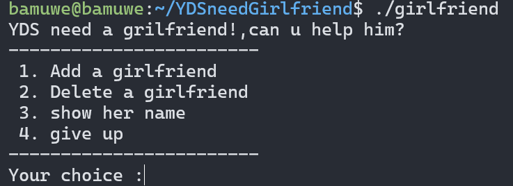

所谓UAF漏洞是指**程序在运行时通过悬空指针(悬空指针是指仍然指向已被释放内存空间的指针)访问已经被释放的内存**.

```shell
bamuwe@bamuwe:~/YDSneedGirlfriend$ ldd girlfriend
        linux-vdso.so.1 (0x00007ffd09fec000)
        /home/bamuwe/pwn_tools/glibc-all-in-one/libs/2.23-0ubuntu3_amd64/libc.so.6 (0x00007f415da00000)
        /home/bamuwe/pwn_tools/glibc-all-in-one/libs/2.23-0ubuntu3_amd64/ld-2.23.so => /lib64/ld-linux-x86-64.so.2 (0x00007f415dfc3000)
```



```c
int backdoor()
{
  puts("YDS get N+ girlfriend!");
  return system("/bin/sh");
}
```

> backdoor()函数

```shell
YDS need a grilfriend!,can u help him?
------------------------
 1. Add a girlfriend
 2. Delete a girlfriend
 3. show her name
 4. give up
------------------------
Your choice :1
Her name size is :10
Her name is :admin
Success !Wow YDS get a girlfriend!
------------------------
 1. Add a girlfriend
 2. Delete a girlfriend
 3. show her name
 4. give up
------------------------
Your choice :1
Her name size is :10
Her name is :bdmin
Success !Wow YDS get a girlfriend!
------------------------
 1. Add a girlfriend
 2. Delete a girlfriend
 3. show her name
 4. give up
------------------------
Your choice :2
Index :0
Success
------------------------
 1. Add a girlfriend
 2. Delete a girlfriend
 3. show her name
 4. give up
------------------------
Your choice :1
Her name size is :10
Her name is :cdmin
Success !Wow YDS get a girlfriend!
------------------------
 1. Add a girlfriend
 2. Delete a girlfriend
 3. show her name
 4. give up
------------------------
Your choice :3
Index :0
cdmin
```

先是申请了`chunk0`,`chunk1`,再`delete chunk0`，这时候`chunk0`进入`fastbins`,但指向`chunk0`的指针并没有被清空，仍然指向`chunk0`的内存地址，申请一个和`chunk0`同样大小的`chunk3`，通过`fastbin`的机制，就会把`chunk0`的内存地址分配给`chunk3`，此时有两个指针指向了同一块内存地址，也就是说，根据程序逻辑，既可以通过`chunk3`的指针向这块内存添加内容，又可以通过`chunk0`的指针读取内容，按照以上逻辑，向这块`chunk`的`fd`位置写入`backdoor()`地址，再读取，就可以`getshell`

```c
unsigned __int64 del_girlfriend()
{
  int v1; // [rsp+Ch] [rbp-14h]
  char buf[8]; // [rsp+10h] [rbp-10h] BYREF
  unsigned __int64 v3; // [rsp+18h] [rbp-8h]

  v3 = __readfsqword(0x28u);
  printf("Index :");
  read(0, buf, 4uLL);
  v1 = atoi(buf);
  if ( v1 >= 0 && v1 < count )
  {
    if ( *(&girlfriendlist + v1) )
    {
      free(*(*(&girlfriendlist + v1) + 1));
      free(*(&girlfriendlist + v1));
      puts("Success");
    }
  }
  else
  {
    puts("Out of bound!");
  }
  return __readfsqword(0x28u) ^ v3;
}
```

> 没有清除指针


> Fastbin是glibc堆管理中的一种技术，用于加速小块堆内存的分配和释放。它适用于小于等于64字节的大小的堆块。
>
> 基本原理如下：
>
> 1. **分配阶段**：
>    - 当程序请求小块内存时，glibc会先检查fastbin链表中是否存在合适大小的空闲堆块。
>    - 如果存在，则直接将该空闲堆块分配给程序，并将链表中的对应节点移除。
>    - 如果不存在，则将该请求大小的堆块从堆中分配出去。
> 2. **释放阶段**：
>    - 当程序释放小块内存时，glibc会将该堆块放入fastbin链表中，而不是立即释放到操作系统。
>    - 如果释放的堆块大小与fastbin链表中的某个大小匹配，则将该堆块放入对应的fastbin链表中。
>    - 如果释放的堆块大小与fastbin链表中的某个大小不匹配，则将该堆块直接释放到堆中，而不放入fastbin链表。
> 3. **使用阶段**：
>    - 下次程序再次请求合适大小的内存时，glibc会优先从fastbin链表中取出空闲堆块，而不是直接从堆中分配。
>    - 如果fastbin链表中没有合适大小的空闲堆块，则从堆中分配。
>
> Fastbin的使用可以减少频繁地向操作系统请求内存和释放内存的开销，提高内存分配和释放的效率。然而，由于fastbin链表中的堆块并没有被完全清空，因此也存在一定的安全风险，可能导致堆溢出等漏洞。因此，在编写安全性要求高的程序时，需要谨慎使用fastbin机制。

