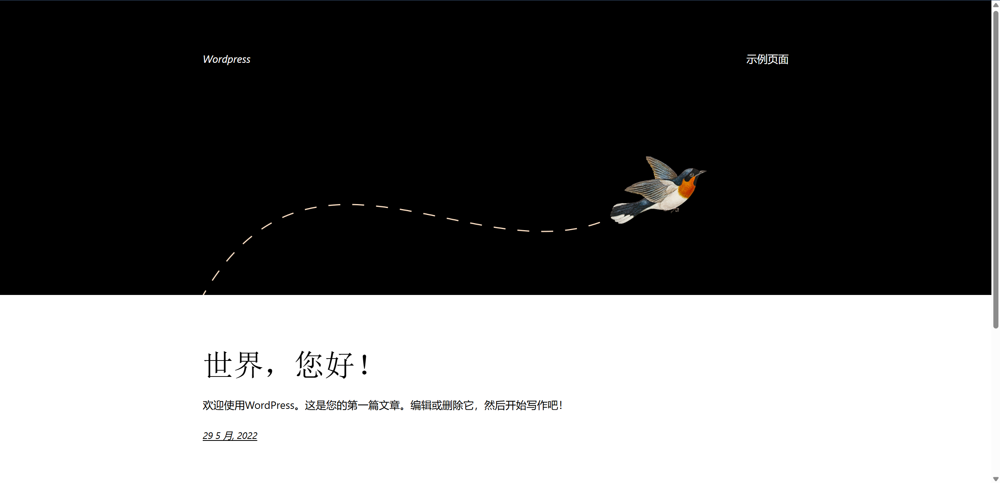

# 浅谈Web应用指纹识别

Web应用指纹识别是指通过分析Web应用公开暴露的技术特征，识别出该应用所使用的技术栈、框架、服务器类型、版本信息等关键组件。这种技术在渗透测试中非常重要，因为它有助于安全测试人员选择最合适的攻击向量和漏洞利用方式，同时在实战中也有助我们寻找相关站点，扩大攻击面，增加攻击容错。

本文主要出于**寻找同源/同框架站点**的目的分析Web应用指纹，所以与常规红队行动信息收集侧重点有所不同。接下来将从两部分分析web应用指纹识别。

## P1: 如何寻找网站特征？

---

提取Web应用指纹的思路非常清晰，找到关键特征即可。例如张三是一位长头发的男生，在茫茫人群中，我们要如何快速地跟别人描述，让他一眼就可以找到张三呢？显而易见，“长头发的男生”就是一个区别于其他人的明显特征。同理，对于网站，我们也可以使用这样的方法。例如一个wordpress站点



这是他的首页，我们对其进行目录扫描，就可以发现一些独特的目录，例如 `wp-content` ， `wp-admin` 等…….


由此我们就可以判断这是一个wordpress站点，这是一个略微复杂的案例，针对不同的站点，我们可以选用不同的办法来帮助我们快速判断。

## P2: 识别当前网站指纹

---

### 常见的指纹识别方法

在梳理识别方法之前，我们可以回忆一下对于一个网站，我们能得到什么信息，header，body…….这些我们能得到的信息都可以成为特征的出处。我们将介绍几个常见的特征思路，并且附上相应的搜索语法，本文主要以**Fofa**和**Google**语法为例，因为搜索语法的相关篇幅较长，详细介绍附在文末，同时出于学习目的，关于自动化识别的部分将会比较省略。

### 1. 网站图标

网站图标是一个重要的标志，大部分同源的网站，尤其是品牌、框架这一类比较有辨识度的都会选择使用同一个**icon**，在一些攻防演练中，网站中出现的**icon**也是判断靶标归属的重要规则之一。


- **Fofa**: `icon_hash=""`

### 2. 网站标题

在实际运营中，标题往往是代表站点信息，这往往是不会改变的，我们只需要获得 `title` 的内容即可。


- **Fofa**: `title=""`

### 3. 网站响应头信息

一些应用会在请求头/响应头中加入字段，这可以作为我们判断的依据。

| No.1 | `X-Powered-By:Jboss` |  jboss的指纹 |
| --- | --- | --- |
| No.2 | `X-Drupal-Cache:`  | drupal的指纹 |
| No.3 | `Server:nginx`   | nginx的指纹 |
| No.4 | `Set-Cookie:PHPSESSID` | php的指纹 |
- **Fofa**: `header=""`

### 4. 特殊文件

因为开发或者开源需要，开发者往往会添加一些其他人可能想知道的信息，这些信息往往会存在特定文件中，比如 **README.md，LICENCE**等，顺着这个思路，我们也可以发现 **robots.txt**或者 **sitemap.xml**文件也会暴露网站的路径，帮助我们识别目标站点。


robots.txt

- **Google**: `inurl:""`

### 6. 前端技术

1. 最直接的方法就是查看网站源代码，查找明显的关键词，如：`React`, `Vue`, `Angular`, `Next.js`, `Bootstrap`, `Tailwind`, `jQuery` 等。
查找 `<script>` 标签引入的外部 JS 文件路径，比如：`cdn.jsdelivr.net/npm/vue@3`。
查找 `<link>` 标签中是否包含 `Bootstrap`、 `Tailwind` 等常用 CSS 框架。
2. 使用开发者工具
加载的 JavaScript 文件名称和路径（例如：`main.[hash].js` 是 Webpack 的典型产物）。
`React DevTools` 或 `Vue DevTools` 插件也能识别出目标页面是否用了对应框架。
3. 观察 HTTP 响应头
    
    某些框架或工具会在响应头中暴露线索，比如：
    
    - `x-powered-by: Next.js`
    - `server: Netlify`
    - `x-generator: WordPress.com`

### 7. CDN信息

一些网站使用了CDN会在header字段里出现，可以查看是否使用CDN，如`cloudflare`、`360cdn`、`365cyd`、`yunjiasu`等

- **Fofa**: `header=""`

### 8. WAF信息

是否使用waf，如`Topsec`、`Jiasule`、`Yundun`等；

### 9. IP及域名信息

ip与域名也是一种收集的思路，单个ip绑定多个域名，多个域名绑定单个ip，都是可以去思考的点。

- **Fofa**: `ip=""`, `domain=""`

### 10. 端口与服务信息

1. 可以搜集网站开启的端口，例如tomcat默认端口8080，宝塔中间件默认端口888。
2. 服务也是可以关注的点，同一个开发团队往往会选用同样的中间件或者技术栈
- **Fofa**: `port=""` ,`server=""`

### 11. 特定文件的MD5

一些网站的**特定图片文件、js文件、CSS**等静态文件，如 `favicon.ico`、 `css`、 `logo.ico` 、 `js`等文件一般不会修改，通过爬虫对这些文件进行抓取并比对md5值，如果和规则库中的Md5一致则说明是同一CMS。这种方式速度比较快，误报率相对低一些，但也不排除有些二次开发的CMS会修改这些文件。

- **Fofa**:`js_md5=""`

### 12. 正常页面或错误网页中包含的内容

网页包含的特殊内容，比如一段特别的介绍文字


- **Fofa**： `body=""`

### 13. URL包含的信息

1. 许多应用有自己独特的路径命名，例如`wordpress`的路径往往是`wp-XXX`，`mybbcms`的路径往往是`bb-XXX` 。
2. 部分国人自开发的应用会使用拼音命名路径，这也可以提取为特征。
3. 前端项目的组件排列也可以作为判断，例如#home/home/index这样有明显特征的情况
- **Google**：`inurl:""`

### 14. 中间件信息

1. 查看响应头
2. 通过页面特征识别（默认页面/错误页面）
- **Fofa**:`header=""` ,`title=""`
- **Google**: `intitle:"Apache2 Ubuntu Default Page”` ，`inurl:"/manager/html" intitle:"Apache Tomcat"`

### 15. 开发语言

1. url后缀判断
    
    
    | 后缀 | 推测语言 |
    | --- | --- |
    | `.php` | PHP |
    | `.jsp`, `.jspx`, `.do`, `.action` | Java |
    | `.aspx`, `.ashx` | ASP.NET |
    | `.py`, `.cgi` | Python（Flask/Django） |
    | `.rb`, `.erb` | Ruby on Rails |
    | `.js` + API 结构 | Node.js 可能 |
2. 响应头判断Server 字段，X-Powered-By 字段
3. 页面内容特征识别
    
    
    | `jsessionid=` | Java |
    | --- | --- |
    | `_VIEWSTATE=` | ASP.NET |
    | `.php?`参数结构或报错页 | PHP |
    | `csrfmiddlewaretoken` | Django（Python） |
    | `express-session` | cookie → Node.js |
- **Google**:
    
    查找 PHP 报错页面
    `intext:"Warning: include()" filetype:php`
    查找 [ASP.NET](http://asp.net/) 报错页
    `intitle:"Server Error in '/' Application"`
    查找 Java 报错页
    `intext:"java.lang.NullPointerException"`
    查找 Flask 应用（Python）
    `intext:"Werkzeug powered traceback"`
    

### 16. COOKIE信息

| Cookie 名称 | 推测后端语言/框架 |
| --- | --- |
| `PHPSESSID` | PHP |
| `JSESSIONID` | Java (Tomcat, Spring) |
| `ASP.NET_SessionId` | ASP.NET |
| `connect.sid` | Node.js (Express/Connect) |
| `sessionid` | Django（Python） |
| `_rails_session` | Ruby on Rails |
| `laravel_session` | Laravel (PHP框架) |

### 17. HTML源码信息

html源代码中包含**注释、js、css**等信息，通过访问这些信息来判断和确认cms系统框架。

在源代码中常常会包含 `powered by` 、`bulit upon`、 `running`等特征，可以判断特征以及版本号等信息。

HTML也会包含一些其他信息，例如 `author` 、 `copyright` 等

```bash
title
meta
    - keyword
    - description
    - generator
    - author
    - copyright
script
html
real_url (真实跳转链接)
```

- **Fofa**: `body=""` ，`js_name=""`

### 18. 操作系统信息

1. 基于 TCP/IP 协议栈的指纹识别（TTL / Window Size）
    
    
    | 操作系统 | TTL 典型值 | 窗口大小（Window Size） |
    | --- | --- | --- |
    | Linux | 64 | 5840/14600 |
    | Windows | 128 | 8192/65535 |
    | FreeBSD | 64 | 65535 |
    | Cisco / Router | 255 | 4128 |
    
    `ping -c 1 [target.com](http://target.com/)
    traceroute [target.com](http://target.com/)`
    
2. 分析 HTTP 响应头和页面内容
    - `Server` 字段可能泄漏 OS 或 Web 服务平台
    - `.asp`, `.aspx` → Windows Server + IIS
    - `.php`, `.cgi`, `.pl` → 常见于 Linux + Apache/Nginx
- `port="445" && protocol="smb"`

### 应用指纹识别自动化工具

参考这篇文章，给出了许多实用工具。

[TideFinger/Web指纹识别技术研究与优化实现.md at master · TideSec/TideFinger](https://github.com/TideSec/TideFinger/blob/master/Web%E6%8C%87%E7%BA%B9%E8%AF%86%E5%88%AB%E6%8A%80%E6%9C%AF%E7%A0%94%E7%A9%B6%E4%B8%8E%E4%BC%98%E5%8C%96%E5%AE%9E%E7%8E%B0.md)

## P3. 寻找同源站点

---

### Google Hack

<略>

[https://cloud.tencent.com/developer/article/2150789](https://cloud.tencent.com/developer/article/2150789)

### FOFA

FOFA的资产是以IP和端口为单位，不是以IP为单位。所以存在同IP不同端口的数据。

主要分为检索字段以及运算符，所有的查询语句都是由这两种元素组成的。

| 逻辑运算符 |  |
| --- | --- |
| = | 匹配，=""时，可查询不存在字段或者值为空的情况。 |
| == | 完全匹配，==""时，可查询存在且值为空的情况。 |
| && | 与 |
| `!=` | 不匹配，!=""时，可查询值不为空的情况。 |
| *= | 确认查询优先级，括号内容优先级最高。 |
- 检索字段
    - 基础类
        
        
        | 基础类（General） |  |  |  |  |  |
        | --- | --- | --- | --- | --- | --- |
        | 语法 | 例句 | 用途说明 | = | != | *= |
        | ip | [ip="1.1.1.1"](https://fofa.info/result?qbase64=aXA9IjEuMS4xLjEi) | 通过单一IPv4地址进行查询 | ✓ | ✓ | - |
        |  | [ip="220.181.111.1/24"](https://fofa.info/result?qbase64=aXA9IjIyMC4xODEuMTExLjEvMjQi) | 通过IPv4 C段进行查询 | ✓ | ✓ | - |
        |  | [ip="2600:9000:202a:2600:18:4ab7:f600:93a1"](https://fofa.info/result?qbase64=aXA9IjI2MDA6OTAwMDoyMDJhOjI2MDA6MTg6NGFiNzpmNjAwOjkzYTEi) | 通过单一Ipv6地址进行查询 | ✓ | ✓ | - |
        | port | [port="6379"](https://fofa.info/result?qbase64=cG9ydD0iNjM3OSI=) | 通过端口号进行查询 | ✓ | ✓ | ✓ |
        | domain | [domain="qq.com"](https://fofa.info/result?qbase64=ZG9tYWluPSJxcS5jb20i) | 通过根域名进行查询 | ✓ | ✓ | ✓ |
        | host | [host=".fofa.info"](https://fofa.info/result?qbase64=aG9zdD0iLmZvZmEuaW5mbyI=) | 通过主机名进行查询 | ✓ | ✓ | ✓ |
        | os | [os="centos"](https://fofa.info/result?qbase64=b3M9ImNlbnRvcyI=) | 通过操作系统进行查询 | ✓ | ✓ | ✓ |
        | server | [server="Microsoft-IIS/10"](https://fofa.info/result?qbase64=c2VydmVyPSJNaWNyb3NvZnQtSUlTLzEwIg==) | 通过服务器进行查询 | ✓ | ✓ | ✓ |
        | asn | [asn="19551"](https://fofa.info/result?qbase64=YXNuPSIxOTU1MSI=) | 通过自治系统号进行搜索 | ✓ | ✓ | ✓ |
        | org | [org="LLC Baxet"](https://fofa.info/result?qbase64=b3JnPSJMTEMgQmF4ZXQi) | 通过所属组织进行查询 | ✓ | ✓ | ✓ |
        | is_domain | [is_domain=true](https://fofa.info/result?qbase64=aXNfZG9tYWluPXRydWU=) | 筛选拥有域名的资产 | ✓ | - | - |
        |  | [is_domain=false](https://fofa.info/result?qbase64=aXNfZG9tYWluPWZhbHNl) | 筛选没有域名的资产 | ✓ | - | - |
        | is_ipv6 | [is_ipv6=true](https://fofa.info/result?qbase64=aXNfaXB2Nj10cnVl) | 筛选是ipv6的资产 | ✓ | - | - |
        |  | [is_ipv6=false](https://fofa.info/result?qbase64=aXNfaXB2Nj1mYWxzZQ==) | 筛选是ipv4的资产 | ✓ | - | - |
    - 标记类
        
        
        | 语法 | 例句 | 用途说明 | = | != | *= |
        | --- | --- | --- | --- | --- | --- |
        | app | [app="Microsoft-Exchange"](https://fofa.info/result?qbase64=YXBwPSJNaWNyb3NvZnQtRXhjaGFuZ2Ui) | 通过FOFA整理的规则进行查询 | ✓ | - | - |
        | fid | [fid="sSXXGNUO2FefBTcCLIT/2Q=="](https://fofa.info/result?qbase64=ZmlkPSJzU1hYR05VTzJGZWZCVGNDTElULzJRPT0i) | 通过FOFA聚合的站点指纹进行查询 | ✓ | ✓ | - |
        | product | [product="NGINX"](https://fofa.info/result?qbase64=cHJvZHVjdD0iTkdJTlgi) | 通过FOFA标记的产品名进行查询 | ✓ | ✓ | - |
        | category | [category="服务"](https://fofa.info/result?qbase64=Y2F0ZWdvcnk9IuacjeWKoSI=) | 通过FOFA标记的分类进行查询 | ✓ | ✓ | - |
        | type | [type="service"](https://fofa.info/result?qbase64=dHlwZT0ic2VydmljZSI=) | 筛选协议资产 | ✓ | - | - |
        |  | [type="subdomain"](https://fofa.info/result?qbase64=dHlwZT0ic3ViZG9tYWluIg==) | 筛选服务（网站类）资产 | ✓ | - | - |
        | cloud_name | [cloud_name="Aliyundun"](https://fofa.info/result?qbase64=Y2xvdWRfbmFtZT0iQWxpeXVuZHVuIg==) | 通过云服务商进行查询 | ✓ | ✓ | ✓ |
        | is_cloud | [is_cloud=true](https://fofa.info/result?qbase64=aXNfY2xvdWQ9dHJ1ZQ==) | 筛选是云服务的资产 | ✓ | - | - |
        |  | [is_cloud=false](https://fofa.info/result?qbase64=aXNfY2xvdWQ9ZmFsc2U=) | 筛选不是云服务的资产 | ✓ | - | - |
        | is_fraud | [is_fraud=true](https://fofa.info/result?qbase64=aXNfZnJhdWQ9dHJ1ZQ==) | 筛选是仿冒垃圾站群的资产 （专业版及以上） | ✓ | - | - |
        |  | [is_fraud=false](https://fofa.info/result?qbase64=aXNfZnJhdWQ9ZmFsc2U=) | 筛选不是仿冒垃圾站群的资产（已默认筛选） | ✓ | - | - |
        | is_honeypot | [is_honeypot=true](https://fofa.info/result?qbase64=aXNfaG9uZXlwb3Q9dHJ1ZQ==) | 筛选是蜜罐的资产 （专业版及以上） | ✓ | - | - |
        |  | [is_honeypot=false](https://fofa.info/result?qbase64=aXNfaG9uZXlwb3Q9ZmFsc2U=) | 筛选不是蜜罐的资产（已默认筛选） | ✓ | - | - |
    - 协议类
        
        
        | 协议类 （type=service) |  |  |  |  |  |
        | --- | --- | --- | --- | --- | --- |
        | 语法 | 例句 | 用途说明 | = | != | *= |
        | protocol | [protocol="quic"](https://fofa.info/result?qbase64=cHJvdG9jb2w9InF1aWMi) | 通过协议名称进行查询 | ✓ | ✓ | ✓ |
        | banner | [banner="users"](https://fofa.info/result?qbase64=YmFubmVyPSJ1c2VycyI=) | 通过协议返回信息进行查询 | ✓ | ✓ | - |
        | banner_hash | [banner_hash="8945471267541271602"](https://fofa.info/result?qbase64=YmFubmVyX2hhc2g9Ijg5NDU0NzEyNjc1NDEyNzE2MDIi) | 通过协议响应体计算的hash值进行查询 （个人版及以上） | ✓ | ✓ | - |
        | banner_fid | [banner_fid="zRpqmn0FXQRjZpH8MjMX55zpMy9SgsW8"](https://fofa.info/result?qbase64=YmFubmVyX2ZpZD0ielJwcW1uMEZYUVJqWnBIOE1qTVg1NXpwTXk5U2dzVzgi) | 通过协议返回信息结构计算的指纹值进行查询。 （个人版及以上） | ✓ | ✓ | - |
        | base_protocol | [base_protocol="udp"](https://fofa.info/result?qbase64=YmFzZV9wcm90b2NvbD0idWRwIg==) | 查询传输层为udp协议的资产 | ✓ | ✓ | - |
        |  | [base_protocol="tcp"](https://fofa.info/result?qbase64=YmFzZV9wcm90b2NvbD0idGNwIg==) | 查询传输层为tcp协议的资产 | ✓ | ✓ | - |
    - 网站类
        
        
        | 网站类（type=subdomain） |  |  |  |  |  |
        | --- | --- | --- | --- | --- | --- |
        | 语法 | 例句 | 用途说明 | = | != | *= |
        | title | [title="beijing"](https://fofa.info/result?qbase64=dGl0bGU9ImJlaWppbmci) | 通过网站标题进行查询 | ✓ | ✓ | ✓ |
        | header | [header="elastic"](https://fofa.info/result?qbase64=aGVhZGVyPSJlbGFzdGljIg==) | 通过响应标头进行查询 | ✓ | ✓ | - |
        | header_hash | [header_hash="1258854265"](https://fofa.info/result?qbase64=aGVhZGVyX2hhc2g9IjEyNTg4NTQyNjUi) | 通过http/https响应头计算的hash值进行查询 （个人版及以上） | ✓ | ✓ | ✓ |
        | body | [body="网络空间测绘"](https://fofa.info/result?qbase64=Ym9keT0i572R57uc56m66Ze05rWL57uYIg==) | 通过HTML正文进行查询 | ✓ | ✓ | - |
        | body_hash | [body_hash="-2090962452"](https://fofa.info/result?qbase64=Ym9keV9oYXNoPSItMjA5MDk2MjQ1MiI=) | 通过HTML正文计算的hash值进行查询 | ✓ | ✓ | - |
        | js_name | [js_name="js/jquery.js"](https://fofa.info/result?qbase64=anNfbmFtZT0ianMvanF1ZXJ5LmpzIg==) | 通过HTML正文包含的JS进行查询 | ✓ | ✓ | ✓ |
        | js_md5 | [js_md5="82ac3f14327a8b7ba49baa208d4eaa15"](https://fofa.info/result?qbase64=anNfbWQ1PSI4MmFjM2YxNDMyN2E4YjdiYTQ5YmFhMjA4ZDRlYWExNSI=) | 通过JS源码进行查询 | ✓ | ✓ | ✓ |
        | cname | [cname="ap21.inst.siteforce.com"](https://fofa.info/result?qbase64=Y25hbWU9ImFwMjEuaW5zdC5zaXRlZm9yY2UuY29tIg==) | 通过别名记录进行查询 | ✓ | ✓ | ✓ |
        | cname_domain | [cname_domain="siteforce.com"](https://fofa.info/result?qbase64=Y25hbWVfZG9tYWluPSJzaXRlZm9yY2UuY29tIg==) | 通过别名记录解析的主域名进行查询 | ✓ | ✓ | ✓ |
        | icon_hash | [icon_hash="-247388890"](https://fofa.info/result?qbase64=aWNvbl9oYXNoPSItMjQ3Mzg4ODkwIg==) | 通过网站图标的hash值进行查询 | ✓ | ✓ | - |
        | status_code | [status_code="402"](https://fofa.info/result?qbase64=c3RhdHVzX2NvZGU9IjQwMiI=) | 筛选服务状态为402的服务（网站）资产 | ✓ | ✓ | - |
        | icp | [icp="京ICP证030173号"](https://fofa.info/result?qbase64=aWNwPSLkuqxJQ1Dor4EwMzAxNzPlj7ci) | 通过HTML正文包含的ICP备案号进行查询 | ✓ | ✓ | ✓ |
        | sdk_hash | [sdk_hash=="Mkb4Ms4R96glv/T6TRzwPWh3UDatBqeF"](https://fofa.info/result?qbase64=c2RrX2hhc2g9PSJNa2I0TXM0Ujk2Z2x2L1Q2VFJ6d1BXaDNVRGF0QnFlRiI=) | 通过网站嵌入的第三方代码计算的hash值进行查询 （商业版及以上） | ✓ | ✓ | - |
    - 地理位置
        
        
        | 语法 | 例句 | 用途说明 | = | != | *= |
        | --- | --- | --- | --- | --- | --- |
        | country | [country="CN"](https://fofa.info/result?qbase64=Y291bnRyeT0iQ04i) | 通过国家的简称代码进行查询 | ✓ | ✓ | - |
        |  | [country="中国"](https://fofa.info/result?qbase64=Y291bnRyeT0i5Lit5Zu9Ig==) | 通过国家中文名称进行查询 | ✓ | ✓ | - |
        | region | [region="Zhejiang"](https://fofa.info/result?qbase64=cmVnaW9uPSJaaGVqaWFuZyI=) | 通过省份/地区英文名称进行查询 | ✓ | ✓ | - |
        |  | [region="浙江"](https://fofa.info/result?qbase64=cmVnaW9uPSLmtZnmsZ8i) | 通过省份/地区中文名称进行查询（仅支持中国地区） | ✓ | ✓ | - |
        | city | [city="Hangzhou"](https://fofa.info/result?qbase64=Y2l0eT0iSGFuZ3pob3Ui) | 通过城市英文名称进行查询 | ✓ | ✓ | - |
    - 证书类
        
        
        | 语法 | 例句 | 用途说明 | = | != | *= |
        | --- | --- | --- | --- | --- | --- |
        | cert | [cert="baidu"](https://fofa.info/result?qbase64=Y2VydD0iYmFpZHUi) | 通过证书进行查询 | ✓ | ✓ | - |
        | cert.subject | [cert.subject="Oracle Corporation"](https://fofa.info/result?qbase64=Y2VydC5zdWJqZWN0PSJPcmFjbGUgQ29ycG9yYXRpb24i) | 通过证书的持有者进行查询 | ✓ | ✓ | ✓ |
        | cert.issuer | [cert.issuer="DigiCert"](https://fofa.info/result?qbase64=Y2VydC5pc3N1ZXI9IkRpZ2lDZXJ0Ig==) | 通过证书的颁发者进行查询 | ✓ | ✓ | ✓ |
        | cert.subject.org | [cert.subject.org="Oracle Corporation"](https://fofa.info/result?qbase64=Y2VydC5zdWJqZWN0Lm9yZz0iT3JhY2xlIENvcnBvcmF0aW9uIg==) | 通过证书持有者的组织进行查询 | ✓ | ✓ | ✓ |
        | cert.subject.cn | [cert.subject.cn="baidu.com"](https://fofa.info/result?qbase64=Y2VydC5zdWJqZWN0LmNuPSJiYWlkdS5jb20i) | 通过证书持有者的通用名称进行查询 | ✓ | ✓ | ✓ |
        | cert.issuer.org | [cert.issuer.org="cPanel, Inc."](https://fofa.info/result?qbase64=Y2VydC5pc3N1ZXIub3JnPSJjUGFuZWwsIEluYy4i) | 通过证书颁发者的组织进行查询 | ✓ | ✓ | ✓ |
        | cert.issuer.cn | [cert.issuer.cn="Synology Inc. CA"](https://fofa.info/result?qbase64=Y2VydC5pc3N1ZXIuY249IlN5bm9sb2d5IEluYy4gQ0Ei) | 通过证书颁发者的通用名称进行查询 | ✓ | ✓ | ✓ |
        | cert.domain | [cert.domain="huawei.com"](https://fofa.info/result?qbase64=Y2VydC5kb21haW49Imh1YXdlaS5jb20i) | 通过证书持有者的根域名进行查询 | ✓ | ✓ | ✓ |
        | cert.is_equal | [cert.is_equal=true](https://fofa.info/result?qbase64=Y2VydC5pc19lcXVhbD10cnVl) | 筛选证书颁发者和持有者匹配的资产 （个人版及以上） | ✓ | - | - |
        |  | [cert.is_equal=false](https://fofa.info/result?qbase64=Y2VydC5pc19lcXVhbD1mYWxzZQ==) | 筛选证书颁发者和持有者不匹配的资产 （个人版及以上） | ✓ | - | - |
        | cert.is_valid | [cert.is_valid=true](https://fofa.info/result?qbase64=Y2VydC5pc192YWxpZD10cnVl) | 筛选证书是有效证书的资产 （个人版及以上） | ✓ | - | - |
        |  | [cert.is_valid=false](https://fofa.info/result?qbase64=Y2VydC5pc192YWxpZD1mYWxzZQ==) | 筛选证书是无效证书的资产 （个人版及以上） | ✓ | - | - |
        | cert.is_match | [cert.is_match=true](https://fofa.info/result?qbase64=Y2VydC5pc19tYXRjaD10cnVl) | 筛选证书和域名匹配的资产 （个人版及以上） | ✓ | - | - |
        |  | [cert.is_match=false](https://fofa.info/result?qbase64=Y2VydC5pc19tYXRjaD1mYWxzZQ==) | 筛选证书和域名不匹配的资产 （个人版及以上） | ✓ | - | - |
        | cert.is_expired | [cert.is_expired=true](https://fofa.info/result?qbase64=Y2VydC5pc19leHBpcmVkPXRydWU=) | 筛选证书已过期的资产 （个人版及以上） | ✓ | - | - |
        |  | [cert.is_expired=false](https://fofa.info/result?qbase64=Y2VydC5pc19leHBpcmVkPWZhbHNl) | 筛选证书未过期的资产 （个人版及以上） | ✓ | - | - |
        | jarm | [jarm="2ad2ad0002ad2ad22c2ad2ad2ad2ad2eac92ec34bcc0cf7520e97547f83e81"](https://fofa.info/result?qbase64=amFybT0iMmFkMmFkMDAwMmFkMmFkMjJjMmFkMmFkMmFkMmFkMmVhYzkyZWMzNGJjYzBjZjc1MjBlOTc1NDdmODNlODEi) | 通过JARM指纹进行查询 | ✓ | ✓ | ✓ |
        | tls.version | [tls.version="TLS 1.3"](https://fofa.info/result?qbase64=dGxzLnZlcnNpb249IlRMUyAxLjMi) | 通过tls的协议版本进行查询 | ✓ | ✓ | - |
        | tls.ja3s | [tls.ja3s="15af977ce25de452b96affa2addb1036"](https://fofa.info/result?qbase64=dGxzLmphM3M9IjE1YWY5NzdjZTI1ZGU0NTJiOTZhZmZhMmFkZGIxMDM2Ig==) | 通过tls的ja3s指纹进行查询 | ✓ | ✓ | ✓ |
        | cert.sn | [cert.sn="356078156165546797850343536942784588840297"](https://fofa.info/result?qbase64=Y2VydC5zbj0iMzU2MDc4MTU2MTY1NTQ2Nzk3ODUwMzQzNTM2OTQyNzg0NTg4ODQwMjk3Ig==) | 通过证书序列号进行查询 | ✓ | ✓ | - |
        | cert.not_after.after | [cert.not_after.after="2025-03-01"](https://fofa.info/result?qbase64=Y2VydC5ub3RfYWZ0ZXIuYWZ0ZXI9IjIwMjUtMDMtMDEi) | 筛选某证书到期日期后的证书 | ✓ | - | - |
        | cert.not_after.before | [cert.not_after.before="2025-03-01"](https://fofa.info/result?qbase64=Y2VydC5ub3RfYWZ0ZXIuYmVmb3JlPSIyMDI1LTAzLTAxIg==) | 筛选某证书到期日期前的证书 | ✓ | - | - |
        | cert.not_before.after | [cert.not_before.after="2025-03-01"](https://fofa.info/result?qbase64=Y2VydC5ub3RfYmVmb3JlLmFmdGVyPSIyMDI1LTAzLTAxIg==) | 筛选某证书生效日期后的证书 | ✓ | - | - |
        | cert.not_before.before | [cert.not_before.before="2025-03-01"](https://fofa.info/result?qbase64=Y2VydC5ub3RfYmVmb3JlLmJlZm9yZT0iMjAyNS0wMy0wMSI=) | 筛选某证书生效日期前的证书 | ✓ | - | - |
    - 时间类型
        
        
        | 语法 | 例句 | 用途说明 | = | != | *= |
        | --- | --- | --- | --- | --- | --- |
        | after | [after="2023-01-01"](https://fofa.info/result?qbase64=YWZ0ZXI9IjIwMjMtMDEtMDEi) | 筛选某一时间之后有更新的资产 | ✓ | - | - |
        | before | [before="2023-12-01"](https://fofa.info/result?qbase64=YmVmb3JlPSIyMDIzLTEyLTAxIg==) | 筛选某一时间之前有更新的资产 | ✓ | - | - |
        | after&before | [after="2023-01-01" && before="2023-12-01"](https://fofa.info/result?qbase64=YWZ0ZXI9IjIwMjMtMDEtMDEiICYmIGJlZm9yZT0iMjAyMy0xMi0wMSI=) | 筛选某一时间区间有更新的资产 | ✓ | - | - |
    - 独立IP语法（不可叠加语法查询）
        
        
        | 语法 | 例句 | 用途说明 | = | != | *= |
        | --- | --- | --- | --- | --- | --- |
        | port_size | [port_size="6"](https://fofa.info/result?qbase64=cG9ydF9zaXplPSI2Ig==) | 筛选开放端口数量等于6个的独立IP （个人版及以上） | ✓ | ✓ | - |
        | port_size_gt | [port_size_gt="6"](https://fofa.info/result?qbase64=cG9ydF9zaXplX2d0PSI2Ig==) | 筛选开放端口数量大于6个的独立IP （个人版及以上） | ✓ | - | - |
        | port_size_lt | [port_size_lt="12"](https://fofa.info/result?qbase64=cG9ydF9zaXplX2x0PSIxMiI=) | 筛选开放端口数量小于12个的独立IP （个人版及以上） | ✓ | - | - |
        | ip_ports | [ip_ports="80,161"](https://fofa.info/result?qbase64=aXBfcG9ydHM9IjgwLDE2MSI=) | 筛选同时开放不同端口的独立IP | ✓ | - | - |
        | ip_country | [ip_country="CN"](https://fofa.info/result?qbase64=aXBfY291bnRyeT0iQ04i) | 通过国家的简称代码进行查询独立IP | ✓ | - | - |
        | ip_region | [ip_region="Zhejiang"](https://fofa.info/result?qbase64=aXBfcmVnaW9uPSJaaGVqaWFuZyI=) | 通过省份/地区英文名称进行查询独立IP | ✓ | - | - |
        | ip_city | [ip_city="Hangzhou"](https://fofa.info/result?qbase64=aXBfY2l0eT0iSGFuZ3pob3Ui) | 通过城市英文名称进行查询独立IP | ✓ | - | - |
        | ip_after | [ip_after="2021-03-18"](https://fofa.info/result?qbase64=aXBfYWZ0ZXI9IjIwMjEtMDMtMTgi) | 筛选某一时间之后有更新的独立IP | ✓ | - | - |
        | ip_before | [ip_before="2019-09-09"](https://fofa.info/result?qbase64=aXBfYmVmb3JlPSIyMDE5LTA5LTA5Ig==) | 筛选某一时间之前有更新的独立IP | ✓ | - | - |
    

---

## P4. 实战演练

---


[https://www.2i1i.com/](https://www.2i1i.com/)


判断是wordpress站点


判断中间件为nginx


对iconhash进行搜索得到更多内容


对网站内容进行搜索，搜出来了其他的域名


可以发现，网站的结构，内容都有所不同，但是title都一样，所以可以利用这个title继续搜索


这里可以看到有很多证书绑定的域名是一致的，也可以反向查询证书绑定的域名。

"](../assets/img/2025-04-23-浅谈Web应用指纹识别/image%2012.png)

cert="[www.0do.cn](http://www.0do.cn/)"

## P5. 参考文章

- [https://hackeyes.github.io/2021/04/17/fofa语法/](https://hackeyes.github.io/2021/04/17/fofa%E8%AF%AD%E6%B3%95/)
- [https://www.freebuf.com/sectool/268246.html](https://www.freebuf.com/sectool/268246.html)
- [https://fofa.info/help_articles/list](https://fofa.info/help_articles/list)
- [https://zhuanlan.zhihu.com/p/673765679](https://zhuanlan.zhihu.com/p/673765679)
- [https://github.com/TideSec/TideFinger/blob/master/Web指纹识别技术研究与优化实现.md](https://github.com/TideSec/TideFinger/blob/master/Web%E6%8C%87%E7%BA%B9%E8%AF%86%E5%88%AB%E6%8A%80%E6%9C%AF%E7%A0%94%E7%A9%B6%E4%B8%8E%E4%BC%98%E5%8C%96%E5%AE%9E%E7%8E%B0.md)
- [https://cloud.tencent.com/developer/article/1429137](https://cloud.tencent.com/developer/article/1429137)
- [https://cloud.tencent.com/developer/article/2150789](https://cloud.tencent.com/developer/article/2150789)
- [https://www.ddosi.org/b94/](https://www.ddosi.org/b94/)