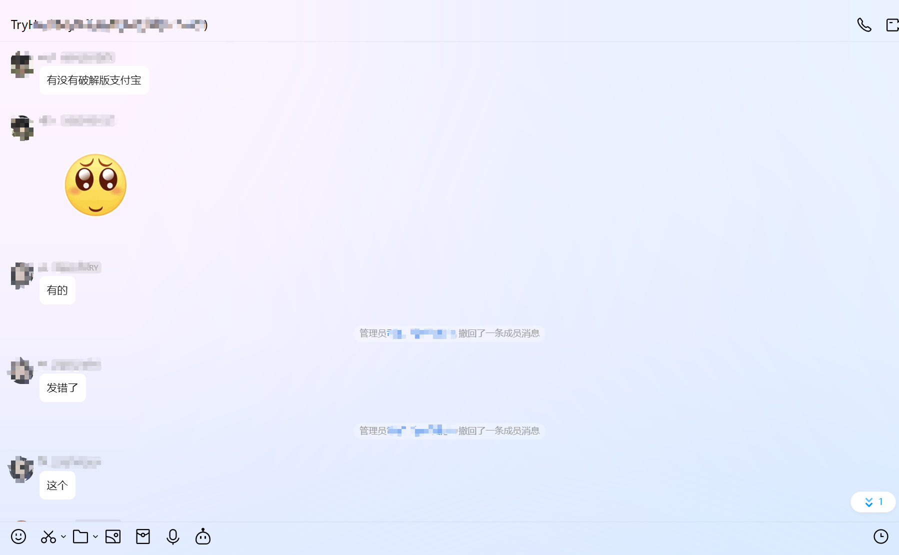

样本hash：
`65a9fed72a3bc6b32930290788d4f98b326743c7a19c106125aa8dbc0e341fc4`

---

晚上水群，群里有大手子问有没有破解版支付宝，当然是有了，这不一会儿就有兄弟发出来了。借着这个样本，学习一下基础**Xor**加密免杀手法。



## 样本分析


放进**die**可以看到是一个字节**小端序**的控制台程序。新鲜的样本，二话不说先放到断网的虚拟机里跑一下。


可以看到卡巴斯基并没有报毒，说明没有显式加载的**shellcode**，使用**cmd**可以看到有错误提示，明显是没有成功加载**shellcode**，更像是一个**loader**，接下来我们尝试逆向分析。


没有任何的反调试，没有任何加壳，就是最原始的裸奔状态，降低了许多分析的难度。


放到**pebear**里看看，也没有导入特别的**dll**。搜索字符串看看能不能获得特别的作者信息。样本在本地机器上编译时，如果没有做特殊配置，默认是会把本地文件路径一起编译进去的，可以通过字符串发现，但是很可惜~~（并非可惜）~~这里没有发现有用的信息。


继续回到**ida**中分析，上面我们发现这个样本有使用很多`puts`函数，打印了许多运行日志，如果能还原这些日志，对我们分析肯定是事半功倍，我们可以借助**ida**强大的解析能力，使用**alt+a**快捷键，选择**ctype**就可以完美还原这些字符。


如此一来，这个程序就变得非常清晰，非常可观了。


这个程序核心的逻辑如下：

- 申请一段内存空间。
- 从文件**a1.txt**读取加密过的**shellcode**。
- 异或解密**shellcode**
- 将解密后的**shellcode**加载到先前申请的内存空间中。
- 将该内存空间转化成函数，达到执行**shellcode**的目的。

涉及到的**WindowsApi**有：

- `VirtualAlloc`
- `VirtualFree`

这也是一个最基础的**xor**加载的模板，关于**xor**加密，是使用最简单，实现最轻的，使其成为恶意软件的流行选择。它比 **AES** 和 **RC4** 更快，并且不需要任何额外的库或使用 **Windows API**。此外，它是一种双向加密算法，允许将相同的函数用于加密和解密。

## 样本仿写

使用**rust**语言尽量仿写还原这个样本，挺有意思的。


## 一些基础的问题

Q. 为什么需要对**shellcode**进行加密？

这和杀毒软件的检测规则有关，大多数**av**会对程序进行静态扫描，如果程序内有与病毒库中特征码所契合的部分，就会认为这是一个恶意程序，相应的可以了解下**YARA**技术，就是通过特征码的匹配实现对恶意程序的甄别。对**shellcode**进行加密变形就可以有效的规避静态扫描。

[YARA](https://zh.wikipedia.org/wiki/YARA)

[恶意软件研究人员的瑞士军刀-yara - 🔰雨苁ℒ🔰](https://www.ddosi.org/b409/)

Q. 为什么我用了**Xor**加密还是不能够免杀？

**Xor**作为对称加密，使用同样的**shellcode**，同样的**key**生成的数据也是相同的，当这些特征都被提取贮存到特征库中，渐渐就会失去免杀效果，以下是一些其他措施帮助你强化你的**Xor**免杀：

- 下面的代码执行了一个小的更改，并通过使 `i` 成为密钥的一部分来增加密钥的密钥空间。现在密钥空间大得多，暴力破解密钥就更困难了。

```c
/*
	- pShellcode : Base address of the payload to encrypt 
	- sShellcodeSize : The size of the payload 
	- bKey : A single arbitrary byte representing the key for encrypting the payload
*/
VOID XorByiKeys(IN PBYTE pShellcode, IN SIZE_T sShellcodeSize, IN BYTE bKey) {
	for (size_t i = 0; i < sShellcodeSize; i++) {
		pShellcode[i] = pShellcode[i] ^ (bKey + i);
	}
}
```

- 上面的代码片段仍然可以进一步强化。下面的代码片段使用密钥执行加密过程，重复使用密钥的每个字节，使其更难破解密钥。

```c
/*
	- pShellcode : Base address of the payload to encrypt 
	- sShellcodeSize : The size of the payload 
	- bKey : A random array of bytes of specific size
	- sKeySize : The size of the key
*/
VOID XorByInputKey(IN PBYTE pShellcode, IN SIZE_T sShellcodeSize, IN PBYTE bKey, IN SIZE_T sKeySize) {
	for (size_t i = 0, j = 0; i < sShellcodeSize; i++, j++) {
		if (j > sKeySize){
			j = 0;
		}
		pShellcode[i] = pShellcode[i] ^ bKey[j];
	}
}
```

> 代码来自 [maldevacademy.com](http://maldevacademy.com/)
> 

更多关于Xor免杀的细则: [https://maldev.bamuwe.xyz/17.Payload Encryption - XOR/](https://maldev.bamuwe.xyz/17.Payload%20Encryption%20-%20XOR/)