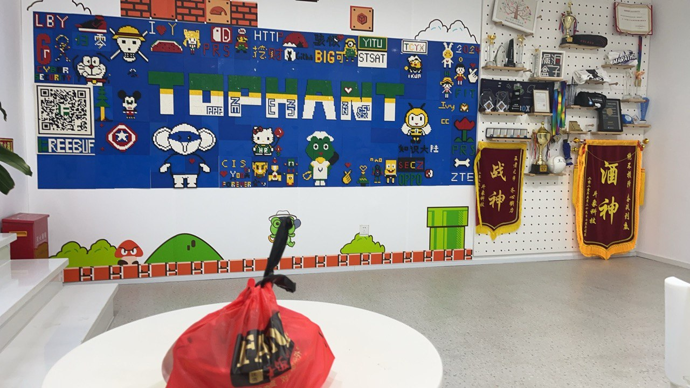
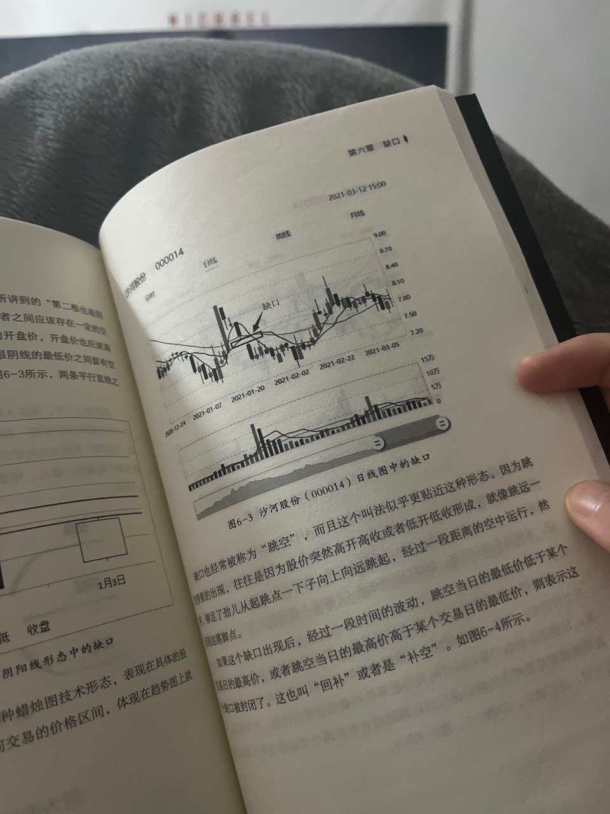
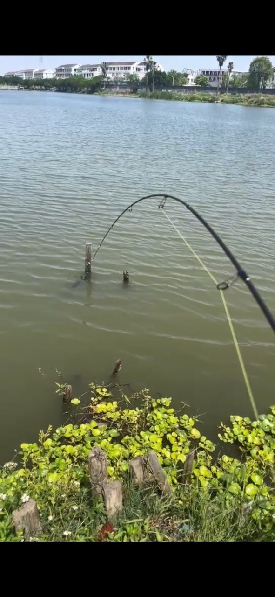
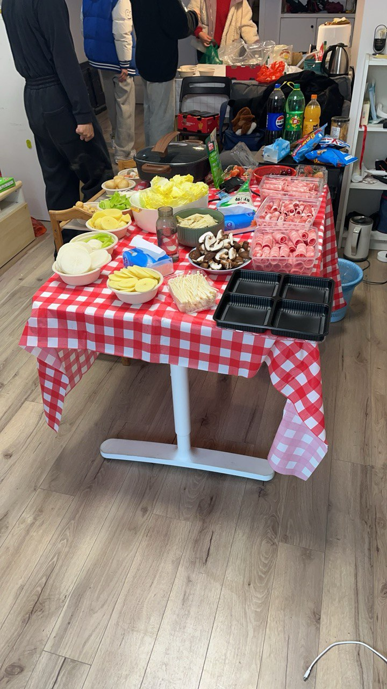

现在是2026年1月1日，朋友圈的跨年文案还在一条接一条地刷屏。平时我不太关注这些，但想了想，确实应该写点什么来纪念这一年，避免显得空洞。

写两句就好——现在是一点半多，给自己留个二十分钟。

今年是毕业后的第一个年头，六月份毕业。若要用一个词概括这一年，我想了很久，觉得“摇摆”挺贴切的。回头看，上半年工作给人的实感更强，好像做了很多事；下半年一眨眼就过去了。也许是夏天持续得太久，季节感有点错乱。

下面按“工作 / 学习 / 投资”三个方面简单回顾。

## 工作

先说工作。2024 年 6 月，我到了上海斗象科技实习，这是我的第一份工作，进的是蓝队运营部，主要做日常运营和设备管理，偶尔参与应急响应。对我来说工作相对简单，常常一天一两个小时就能把事儿做完，所以有很多时间和同事聊技术和生活。

在这里我认识了 Mr.free 和 Master.Lin（化名），现在还会偶尔聊聊，很好。尽管工作清闲，但我一度没想明白接下来是要专升本还是直接工作，这个选择让我很犹豫。我一直在回避，时间到了 10 月 29 日左右，我选择离职回去备考。时间记得很清楚是因为那时有些生活片段印象深刻：24 年 10 月 30 日有一场 Asen 的 live house 演出，我当时很想去但没成行；那段时间通勤常听王以太的新专辑，40 分钟一趟就循环听……（扯远了）。总之，那时我开始第一次明显的摇摆：我可能会更偏向直接上班，但周围的人都说“没有学历不行”，于是“去提升学习”成了普遍建议。说法未必错，但那违背了我内心的真实意愿，于是我就拖着不愿意做决定。其实后来我明白了一个道理，这些事，不论你选择什么，都有理由去后悔。

接下来我回到家全心备考，自学专升本。专升本的题目并不难，我做了几套试卷，感觉英语阅读错一两个题就是常态。选择自学，部分原因也来自对自己坚持力的不自信——如果报了班，可能会有更多“不能放弃的理由”。现在回想起来，其实一开始我的想法就有了很强的指向性。

## 学习与 Web3

到了二月，我又一次接触 Web3，学 Solidity 并参与一些圈子和讨论群。那段时间认识了 Master.kk，他带我入门做交易。交易更像是师徒传承的活儿——需要人带你走上正确的道路。

说到收益，既没有大赚也没有大亏。交易会作为长期计划继续下去——要说它是不是世界上最难的职业之一，我觉得也不为过。

三月某天，我接到 G 老师电话，被叫去公安报道，借此我又放弃了专升本，直接进入了新的工作岗位。在公安期间，工作重点是打击涉及电信诈骗的网站，并为民警提供技术支持。单位有宿舍和食堂，生活节奏也让我放松了不少——去了一段时间后体重直线上升，leader 请大家喝奶茶让我都开始担心会不会长胖，哈哈。

轻松归轻松，也是需要打出成果的，我们也打了几个窝点机器，学习到的还是蛮多的，尤其是在免杀和钓鱼技术上成长明显。那段时间我还有很多空余时间来继续交易和健身。

## 休整与反思

到了七月，因为一些不可抗力的原因我又回到家中，这段经历更像实习后的休整期。家人不断催促要按部就班地读书、找工作、结婚，这些外界压力让我有些迷茫，这些焦虑也会传递，哪有那么多好事情都给你占了。

那段时间我并没有做太多具体事情，除了和 KK 继续学交易。顺带一提先前的 5 月份是收入最好的一个月（Binance 的阿尔法活动），这也给了我一些信心。这段时间我也在摇摆，我真的需要一份工作么？我考虑做全职交易，真的，思考了挺久的，总体来说，这段时间让我开始尝试从学生思维向职场人思维过渡，意识到心态调整比技能更重要。

## 最近的选择与适应

十月我接了一份南京的工作，偏向红队方向，更符合我的职业规划。薪资低于预期，但我觉得可能确实是先需要一份工作，不管是为了应付家里也好，为了储蓄也好。那段时间摇摆得比较厉害，常有“工作毫无意义”的感受，感觉很多事情都很混乱。但同事们都很友好，我们私下也会一起吃饭。

我有这样的困惑，教会的小伙伴给我推荐了《为谁辛苦为谁忙》，我拿到书已一个多月但还没读，惭愧。不过，慢慢地，我开始找到工作和生活的平衡，也能在解决技术问题、研究新漏洞中找到价值感。最近我还开始准备考取一些证书——学习、得反馈、再看到证书，成就感不错，2026 年会把考证列为目标之一。

## 新年展望

简单写下新年的三件主要目标：

1. 考证
2. 储蓄
3. 英语

希望不要订得太具体，先把方向放好，持续去做。
这篇文章用AI修改了语气和行文风格，读起来可能有点奇怪，但总是要做些什么让事情和真实发生一些偏移不是吗。

> “不要效法这个世界，只要心意更新而变化，叫你们察验何为　神的善良、纯全、可喜悦的旨意。”
（罗马书 12:2 和合本）
